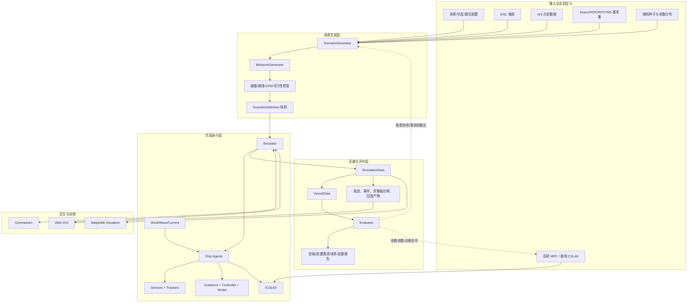
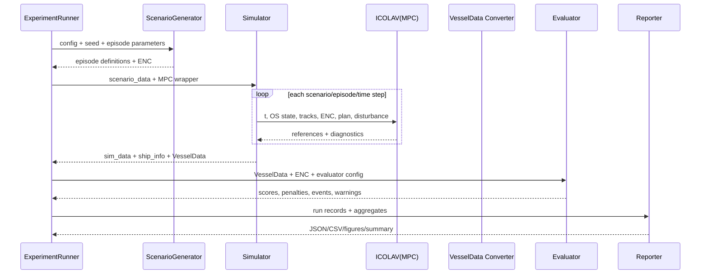
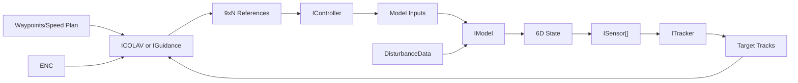
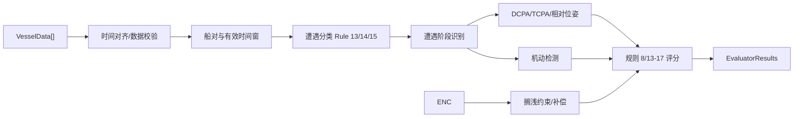

# COLAV-Simulator 核心功能架构与实现拆分

> 文档定位：论文目标架构、当前仓库事实、目标实现边界、验证闭环的统一基线  
> 基线日期：2026-07-27  
> 实现快照：`codex/colav-paper-closed-loop` 隔离 worktree；主工作区未同步覆盖
> 核心目标：为自研 MPC 船舶避碰算法提供可复现、可批量、可量化评价的仿真验证环境

## 0. 结论先行

论文定义的核心不是单独的仿真动画或 Web 控制台，而是闭环：

```text
场景生成 -> 仿真执行 -> COLREGS/安全评价 -> 结果反馈 -> 新场景或算法调整
```

当前隔离实现分支已打通论文功能闭环：

```text
ScenarioGenerator
  -> Sensor/Tracker
  -> ICOLAV
  -> Guidance/Control
  -> ShipModel/ENC
  -> VesselData
  -> Evaluator
  -> Report/Web
```

已完成：版本化实验契约、真实单步仿真会话、离线/Web 共用执行器、重建
Evaluator、失败保留批量执行、论文双场景、Web 实时监控和证据下载。
Rule 14 首个算法能力闭环也已完成：`head_on` 下
Nominal/VO/SB-MPC × God/KF 六组合通过，Web 可区分真实 solve 与 hold-last。

仍有四个验收断点：

1. **论文数值复现未确认**：未取得官方 Evaluator、完整原始场景参数和 Table I/II 舍入流程；当前只能标记 `functional_reproduction`。
2. **RRT/RLMPC 集成门未全部通过**：RRT 已真实执行但固定论文场景返回 `INFEASIBLE`；RLMPC 缺少 CasADi/Acados 依赖。
3. **全基准矩阵受数据阻塞**：Imazu 缺少 `Trondelag.gdb`，AIS 场景配置不完整，尚未执行完整 30-seed 矩阵。
4. **自研 MPC 尚未提供**：`module:factory -> ICOLAV` 接口已冻结，算法闭环和最终对比尚未开始。

因此当前完成状态为：**M0-M4 功能闭环完成，M5-M6 部分完成；不宣称论文数值复现或算法验证完成。**

## 1. 依据、范围与状态标记

### 1.1 依据

| 来源 | 本文用途 |
|---|---|
| [CCTA 2023 论文](../Simulation_Framework_and_Software_Environment_for_Evaluating_Automatic_Ship_Collision_Avoidance_Algorithms.pdf) | 定义场景生成器、仿真器、评估器和反馈闭环 |
| [colav-simulator](https://github.com/ntnu-itk-autonomous-ship-lab/colav-simulator) | 当前 Python 框架、`Ship` 插件接口、Gym、ENC、仿真数据 |
| [pybind_im_and_psbmpc](https://github.com/ntnu-itk-autonomous-ship-lab/pybind_im_and_psbmpc) | PSB-MPC 与意图模型的 C++/Python 适配 |
| [rrt-rs](https://github.com/ntnu-itk-autonomous-ship-lab/rrt-rs) | RRT/RRT*/PQ-RRT* 路径规划和行为生成 |
| [rlmpc](https://github.com/ntnu-itk-autonomous-ship-lab/rlmpc) | NMPC、抗搁浅、SAC、VAE 研究实现 |
| [vimmjipda](https://github.com/ntnu-itk-autonomous-ship-lab/vimmjipda) | 雷达多目标跟踪及其 `colav-simulator` 适配 |
| 当前仓库源码、配置和测试 | 判定“已实现、部分实现、缺失”，不以设计意图代替代码事实 |

论文中的 Evaluator 评分方法继续引用 Inger Berge Hagen 2022 年博士论文。当前公开仓库未包含官方 Evaluator。本分支按稳定公共接口实现了可运行的重建后端，用于功能闭环和相对比较；未公开公式、阈值和阶段定义不从论文表格反推，数值验收仍等待官方实现。

### 1.2 本文范围

包含：

- 论文核心闭环；
- 自研 MPC 所需输入、输出、生命周期和失败语义；
- 随机、标准、AIS、ENC、多船、不确定性场景；
- 船舶动力学、控制、导引、感知、跟踪、扰动；
- 批量仿真、评价、对比、回放、报告；
- Gym 和 Web UI 在总体架构中的位置；
- 当前实现盘点、缺口、优先级和验收条件。

不把下列内容作为当前第一阶段目标：

- 高保真 CFD、推进器、波浪载荷或硬件在环；
- 完整 ECDIS/航海业务系统；
- 以 Web 动画观感替代算法评价；
- 未明确需要的分布式仿真或 GPU 并行框架。

### 1.3 状态标记

| 标记 | 含义 |
|---|---|
| `已实现` | 当前主源码存在对应能力 |
| `部分实现` | 有代码路径，但接口、数据、算法真实性或验收证据不完整 |
| `外部可选` | 依赖外部仓库、编译产物、许可证或单独配置 |
| `缺失` | 论文要求存在，当前仓库没有可运行实现 |
| `待核验` | 有实现声明，但尚无端到端通过证据 |
| `功能完成` | 功能链和接口通过测试，但不代表论文数值一致 |
| `数值未确认` | 有重建实现，尚未与官方工具或论文表格完成数值校准 |
| `受阻` | 代码入口存在，但依赖、数据或固定场景门未通过 |

### 1.4 本次梳理的运行证据

2026-07-27 在隔离 worktree 执行：

```text
python -m pytest -q
32 passed, 1 skipped

ruff check ...
All checks passed

node --check web_gui/app.js
passed
```

唯一 skip：缺少遗留 `simdata.pkl` 的显式兼容测试。VIMMJIPDA 已改为项目配置或显式路径，不再依赖 `$HOME` 硬编码。

```text
Web desktop: 1440x900，无水平溢出、浏览器错误或空 Canvas
Web mobile: 390x844，无水平溢出、浏览器错误或空 Canvas
Web single-step: step=2, sim_time=0.1 s
PSB-MPC: 0.2 s 短烟测 FINISHED；完整 500 s 进程因 Eigen assertion 退出 134
VIMMJIPDA: FINISHED，无 fallback
RRT*: FAILED/INFEASIBLE，失败证据完整，无 LOS 冒充
RLMPC: DEPENDENCY_UNAVAILABLE，No module named 'casadi'
```

证据索引见 `Baseline-Evidence.md`、`Implementation-Traceability.md`、
`Integration-Evidence.md` 和 `Evaluator-Audit.md`。

## 2. 系统目标与完成定义

### 2.1 顶层目标

给定一个遵循标准接口的自研 MPC 避碰算法，系统应能够：

1. 生成或加载带 ENC、AIS、目标船行为和不确定性的场景；
2. 用一致的船模、感知、跟踪和仿真时钟执行算法；
3. 在单场景、Monte Carlo、标准场景集上批量运行；
4. 记录算法输入、输出、求解状态、船舶真值、目标估计和事件；
5. 评价碰撞、搁浅、COLREGS、航行效率、控制品质和实时性；
6. 对比基线算法与不同 MPC 参数；
7. 保存可复现的配置、种子、版本、结果和失败场景；
8. 通过 Web UI 或离线图表观察同一份真实仿真数据。

### 2.2 最终“完成”定义

只有同时满足下列条件，才算完成论文核心功能：

- `ScenarioGenerator` 可生成并重放所需场景；
- 自研 MPC 通过 `ICOLAV` 接入真实 `Ship.plan()`；
- `Simulator` 执行 `track_obstacles -> plan -> forward`；
- 输出转换为 `VesselData`；
- `Evaluator.evaluate()` 产生规则 8、13-17、安全及惩罚结果；
- 批量运行产生机器可读明细和统计汇总；
- 相同配置、代码版本、依赖版本、随机种子可重现实验；
- Web UI 若启用，只消费或控制上述真实主链；
- 不允许把 fallback 结果标记为目标算法成功结果。

## 3. 总体架构

### 3.1 论文闭环与目标系统



### 3.2 分层原则

| 层 | 责任 | 禁止事项 |
|---|---|---|
| 实验定义层 | 配置、种子、版本、算法参数、场景集 | 在算法内部硬编码场景特例 |
| 场景层 | 生成静态且可重放的场景定义 | 混入仿真器运行状态 |
| Agent 层 | 封装单船模型、控制、感知、跟踪、COLAV | 绕过统一状态/参考量契约 |
| 仿真层 | 统一时钟、执行顺序、终止条件、记录 | 直接实现某个特定 MPC |
| 评价层 | 从事实数据计算指标和报告 | 从 GUI 显示值反推评价结果 |
| 交互层 | 控制实验、显示实时/离线数据 | 维护第二套物理和场景真值 |

### 3.3 核心模块边界

| 编号 | 模块 | 当前主要文件 | 状态 |
|---|---|---|---|
| M01 | 配置与数据契约 | `scenario_config.py`、`experiment/contracts.py` | 功能完成；迁移和 tracker seed 注入部分实现 |
| M02 | ENC 与地图几何 | `seacharts`、`common/map_functions.py` | 已实现 |
| M03 | 场景生成 | `scenario_generator.py`、`scenarios/paper*` | 功能完成；Imazu/AIS 数据受阻 |
| M04 | 行为/计划生成 | `behavior_generator.py`、`integrations/rrt.py` | 部分实现；RRT 固定场景未过门 |
| M05 | 船舶 Agent 与子系统 | `core/ship.py`、`core/*.py` | 已实现 |
| M06 | 感知与跟踪 | `core/sensing.py`、`core/tracking/trackers.py` | God/KF Rule 14 通过；VIMMJIPDA 仅 G1 |
| M07 | COLAV 算法接入 | `core/colav/colav_interface.py`、`diagnostics.py` | VO/SB-MPC G3 与 PlannerTrace 完成；外部/自研待接入 |
| M08 | 仿真编排 | `simulator.py`、`experiment/session.py` | 功能完成；并行执行缺失 |
| M09 | 仿真数据标准化 | `common/vessel_data.py`、`experiment/persistence.py` | 功能完成；迁移/质量报告部分实现 |
| M10 | COLREGS/安全评价 | `evaluation/encounter.py`、`evaluator.py` | Rule 14 共享语义完成，论文数值未确认 |
| M11 | 批量实验与报告 | `experiment/runner.py`、`batch.py` | 功能实现；续跑/最差场景挖掘缺失 |
| M12 | Gym 环境 | `gym/` | 已实现 |
| M13 | Matplotlib 可视化 | `viz/visualizer.py` | 已实现 |
| M14 | Web 控制与监控 | `gui_server/main.py`、`web_gui/` | Rule 14 能力展示完成；其他规则待复制 |
| M15 | 生态算法适配 | `integrations/`、外部仓库 | 部分实现；VIM 短闭环通过，PSB/RRT/RLMPC 受阻 |

## 4. 统一数据与接口契约

这是后续实现自研 MPC、Evaluator、Web UI 的共同基线。任何模块都不能自行解释坐标或数组顺序。

### 4.1 坐标、角度与单位

| 数据 | 契约 |
|---|---|
| 仿真局部坐标 | North-East，单位 m |
| `x` | Northing |
| `y` | Easting |
| 速度 | m/s |
| 运行时角度 | rad |
| 配置文件中的 COG | deg，解析后转 rad |
| 角速度 | rad/s |
| `VesselData.xy` | East-North；从仿真数据转换时必须显式换序 |
| ENC | UTM zone 必须与源 `.gdb` 一致 |

必须在所有 Web/API 字段中明确 `north/east` 或提供坐标元数据。禁止只写含义不明的 `x/y` 后由前端猜测。

### 4.2 场景配置契约

当前 `ScenarioConfig` 的核心字段：

```text
name
save_scenario
t_start / t_end / dt_sim
type
utm_zone
map_data_files / map_origin_enu / map_size / map_buffer / map_tolerance
new_load_of_map_data
ais_data_file / ship_data_file / allowed_nav_statuses
episode_generation
n_random_ships 或 n_random_ships_range
ship_list
stochasticity
rl
```

当前正式场景类型：

| 枚举 | 含义 | 本船义务 |
|---|---|---|
| `SS` | 单船 | 无船间避碰 |
| `HO` | 对遇 | Rule 14 |
| `OT_ing` | 本船追越 | Rule 13，让路 |
| `OT_en` | 本船被追越 | Rule 13，直航 |
| `CR_GW` | 交叉相遇 | Rule 15，让路 |
| `CR_SO` | 交叉相遇 | Rule 15，直航 |
| `MS` | 多船、未预先限定两船关系 | 按实际遭遇识别 |

当前代码**没有**独立 `R` 随机场景枚举，也没有笼统 `OT`/`CR` 枚举。随机性由场景类型内的采样、`MS` 中的关系随机化和 episode 参数控制。

单船 YAML 中的初始 CSOG：

```text
[north, east, SOG, COG_deg]
```

运行时 `Ship.state`：

```text
[north, east, psi, u, v, r]
```

### 4.3 `ScenarioGenerator.generate()` 输出

当前返回值不是 `List[ScenarioConfig]`，而是：

```python
(
    scenario_episode_list,
    enc,
)
```

其中每个 episode：

```python
{
    "ship_list": list[Ship],
    "disturbance": Disturbance | None,
    "config": ScenarioConfig,
}
```

生成器职责到此结束。它交付静态 episode 定义，不负责运行时间推进。

### 4.4 跟踪数据契约

`Ship.track_obstacles()` 向 COLAV 提供：

```python
list[
    tuple[
        int,          # target ID
        np.ndarray,   # [north, east, V_north, V_east]
        np.ndarray,   # 4x4 covariance
        float,        # length
        float,        # width
    ]
]
```

传感器原始量、跟踪状态、真值必须分开记录；算法评价不能把真值跟踪器结果冒充雷达/VIMMJIPDA 结果。

### 4.5 `ICOLAV` 正式算法契约

自研 MPC 应实现：

```python
class MPCWrapper(ICOLAV):
    def plan(
        self,
        t: float,
        waypoints: np.ndarray,       # (2, N), North-East
        speed_plan: np.ndarray,      # (N,)
        ownship_state: np.ndarray,   # [n, e, psi, u, v, r]
        do_list: list[tuple],        # track state + covariance + dimensions
        enc: ENC | None = None,
        goal_state: np.ndarray | None = None,
        w: DisturbanceData | None = None,
        **kwargs,
    ) -> np.ndarray:                 # (9, N_ref), N_ref >= 1
        ...

    def reset(self) -> None: ...
    def get_current_plan(self) -> np.ndarray: ...
    def get_colav_data(self) -> dict: ...
    def plot_results(self, ax_map, enc, plt_handles, **kwargs) -> dict: ...
```

标准参考量：

```text
r_d = [
    north_d,
    east_d,
    psi_d,
    u_d,
    v_d,
    r_d,
    u_dot_d,
    v_dot_d,
    r_dot_d,
]  shape = (9, N)
```

若算法直接输出广义力/力矩 `[X, Y, N]`，应显式配置 `PassThroughInputs`；不能把低层输入伪装成 9 维状态参考。

### 4.6 仿真输出契约

`Simulator.run()` 输入：

```python
list[
    tuple[
        list[episode_dict],
        ENC,
    ]
]
```

输出：

```python
list[
    {
        "episode_simdata_list": [
            {
                "vessel_data": list[VesselData],
                "sim_data": pandas.DataFrame,
                "ship_info": dict,
            }
        ],
        "enc": ENC,
    }
]
```

新实验主链不再依赖遗留 `save_scenario_results`。`EvidenceWriter` 固定输出
`manifest.json`、`episode.json`、`trajectory.parquet`、`events.jsonl`、
`evaluation.json`、`report.html`，并记录 episode/trajectory 哈希。

### 4.7 当前 Evaluator 契约

当前稳定公共接口：

```python
Evaluator().evaluate(
    vessels: list[VesselData],
    enc: ENC | None,
) -> EvaluatorResult
```

`EvaluatorResults` 至少包含：

```text
run metadata
vessel-level results
pairwise encounter results
encounter classification and stages
COLREGS scores and penalties
safety/collision/grounding results
efficiency/control/solver metrics
invalid-data and evaluator warnings
aggregate status
```

## 5. 端到端业务流程

### 5.1 标准离线验证



### 5.2 单步仿真顺序

每个仿真步必须保持：

```text
1. 读取当前扰动
2. 提取所有船舶真值，仅供传感器仿真
3. 对允许跟踪的船执行 track_obstacles()
4. 更新传感器量和目标航迹
5. 对非远程控制船执行 plan()
6. 记录推进前的状态、传感、跟踪、COLAV 数据
7. 执行 forward(dt)
8. 更新时间
9. 检查碰撞、搁浅、到达目标、超时
```

本顺序决定因果关系。Web、Gym、离线 runner 不得各自维护不同顺序。

### 5.3 Monte Carlo 流程

```text
固定实验定义
  -> 为每个 episode 保存 seed
  -> 按 EpisodeGenerationConfig 决定哪些状态/计划/扰动复用
  -> 生成并先做静态可行性检查
  -> 执行仿真
  -> 逐 episode 评价
  -> 统计均值、分位数、置信区间、失败率
  -> 保存最差 K 个和全部失败场景
```

### 5.4 当前 Web 流程

```text
浏览器
  -> Experiment API 选择真实 YAML、算法、seed
  -> SimulationService 创建 ScenarioGenerator/Simulator
  -> WebSocket 推送真实 step 数据和算法诊断
  -> 结束后调用 Evaluator
  -> 页面展示最终评分并链接可下载产物
```

Web 层只能做协议适配、调度和展示；不能再拥有第二套 `SimulationEngine` 运动学。

## 6. 模块详细功能拆分

## M01 配置与实验定义

### 职责

- Cerberus schema 校验；
- YAML 到 dataclass；
- 配置覆盖；
- 路径解析；
- 单位和枚举转换；
- 配置快照；
- 版本字段和向后兼容；
- 非法组合快速失败。

### 当前实现

- `schemas/scenario.yaml`
- `schemas/scenario_generator.yaml`
- `schemas/simulator.yaml`
- `common/config_parsing.py`
- `ScenarioConfig`、各子系统 `Config` dataclass
- `experiment/contracts.py`：`RunSpec`、`RunManifest`、`SeedBundle`、schema 1.0

### 必需功能与验收

| ID | 功能 | 当前 | 验收 |
|---|---|---|---|
| CFG-01 | 场景 YAML 校验 | 已实现 | 未知字段、错类型、缺必需字段均失败 |
| CFG-02 | 子系统组合校验 | 已实现基础 | 无 guidance/colav、模型与控制器不兼容时失败 |
| CFG-03 | 角度和坐标转换 | 已实现 | YAML COG 度制往返一致 |
| CFG-04 | 实验配置快照 | 功能完成 | `manifest.json`、`episode.json` 包含 RunSpec、有效场景、seed 和哈希 |
| CFG-05 | 配置版本迁移 | 部分实现 | 已有 `schema_version=1.0`；老字段迁移和未知版本拒绝仍缺失 |
| CFG-06 | 依赖/执行身份 | 功能完成 | 记录算法/tracker requested/executed、版本、commit、fallback 和能力等级 |
| CFG-07 | 独立随机流 | 部分实现 | scenario/sensor/tracker/algorithm seed 已独立派生和记录；通用 tracker API 尚不能注入 seed |
| CFG-08 | 规则能力组合 | Rule 14 完成 | `validation_rule_id`、capability profile、G0-G4 和后端组合校验 |

## M02 ENC 与地图

### 职责

- `.gdb` 加载与缓存；
- UTM zone、origin、size 管理；
- land/shore/seabed 几何；
- 船舶吃水对应危险水深；
- 点、线、轨迹与危险区距离；
- 安全海域 triangulation；
- 场景生成、RRT、MPC、Evaluator、可视化共享同一 ENC。

### 当前实现

- `seacharts`
- `common/map_functions.py`
- `data/enc/More_og_Romsdal_utm33.gdb`
- `config/seacharts.yaml`

### 必需功能与验收

| ID | 功能 | 当前 | 验收 |
|---|---|---|---|
| ENC-01 | GDB 加载与缓存 | 已实现 | 指定范围内 land/shore/depth 非空 |
| ENC-02 | UTM 一致性检查 | 部分实现 | zone 或范围不匹配时明确失败 |
| ENC-03 | 吃水危险区提取 | 已实现 | 不同 draft 得到正确最小深度危险区 |
| ENC-04 | 安全海域采样 | 已实现 | 采样点不落危险区，保持最小净空 |
| ENC-05 | RRT/MPC 障碍传递 | 功能完成 | PSB-MPC/RRT 接收 Simulator 同一 ENC hazard；闭环证据记录 polygon 数 |
| ENC-06 | Evaluator 搁浅补偿 | 部分实现，数值未确认 | 同一 ENC 计算 grounding/clearance；论文补偿公式待官方校准 |
| ENC-07 | Web 坐标映射 | 功能完成 | Ålesund ENC、船位、航迹桌面/移动像素对齐检查通过 |

## M03 场景生成器

### 职责

- 读取 `ScenarioConfig`；
- 加载 ENC/AIS；
- 构造缺省船；
- 生成本船和目标船初始 CSOG；
- 按场景类型约束相对方位、航向、速度；
- 支持多 episode 参数更新策略；
- 插值 AIS 轨迹；
- 生成扰动；
- 调用行为生成器；
- 拒绝无效 episode；
- 保存/加载 episode 定义。

### 场景来源

| 来源 | 说明 |
|---|---|
| 完全指定 | YAML 给出所有船状态和计划 |
| 部分指定 | 缺失状态、计划或船由生成器补齐 |
| 随机生成 | 按场景类型和分布采样 |
| AIS 历史 | 目标船或全部船来自历史轨迹 |
| 标准集 | `scenarios/imazu_cases/` 22 个 Imazu 场景 |
| 已保存 episode | 从文件夹重放 |

### 生成约束

必须区分：

- 初始船体不重叠；
- 初始位置不搁浅；
- 计划路径不进入危险区；
- 相遇关系符合 `HO/CR/OT` 定义；
- CPA/TCPA 满足“有测试价值”阈值；
- 船舶在合法时间进入/退出；
- 采样达到上限时返回结构化失败，不能无限循环。

### 必需功能与验收

| ID | 功能 | 当前 | 验收 |
|---|---|---|---|
| SCN-01 | SS/HO/CR/OT/MS | 已实现 | 每种类型能生成且关系分类正确 |
| SCN-02 | AIS 轨迹导入 | 已实现 | 时间插值后覆盖仿真区间 |
| SCN-03 | Imazu 22 场景 | 配置存在，数据受阻 | 22 YAML 已纳入矩阵；缺 `Trondelag.gdb`，尚不能全集运行 |
| SCN-04 | Monte Carlo episode | 已实现 | episode 数量、更新频率符合配置 |
| SCN-05 | 高斯/垂向/均匀采样 | 已实现 | 固定 seed 可重现 |
| SCN-06 | 初始可行性 | 已实现 | 无初始重叠、搁浅 |
| SCN-07 | 计划可行性 | 已实现基础 | 所有 waypoint segment 满足危险区净空 |
| SCN-08 | 场景保存/重放 | 功能完成 | 保存 episode；重放校验 episode/trajectory SHA-256 |
| SCN-09 | 失败原因结构化 | 部分实现 | 采样失败包含约束、次数、seed |
| SCN-10 | 场景覆盖率统计 | 缺失 | 输出场景参数空间覆盖和拒绝分布 |

## M04 行为生成器

### 职责

为未完整配置的智能或非智能船生成名义行为：

- 恒速恒航向；
- 恒速随机 waypoint；
- 变速随机 waypoint；
- RRT；
- RRT*；
- PQ-RRT*；
- 根据本船目标、走廊、CPA 等生成目标船行为。

### 当前实现

`BehaviorGenerator` 已实现随机 waypoint 和 RRT 适配。`rrt-rs` 是可选依赖，负责无搁浅轨迹规划和行为生成。

### 必需功能与验收

| ID | 功能 | 当前 | 验收 |
|---|---|---|---|
| BEH-01 | 恒速/随机 waypoint | 已实现 | 长度、转角、速度符合配置范围 |
| BEH-02 | RRT/RRT*/PQ-RRT* | 外部可选，固定场景受阻 | 已传 hazard/CDT 并真实 grow；论文固定场景返回 `INFEASIBLE` |
| BEH-03 | 行为复用策略 | 已实现 | episode 更新索引正确 |
| BEH-04 | 智能目标船 | 已实现接口 | 目标船可挂载独立 `ICOLAV` |
| BEH-05 | 非合作目标船 | 已实现 | 严格跟随预定轨迹/名义 guidance |
| BEH-06 | 规划失败降级记录 | 部分实现 | fallback 原因进入 episode metadata |

## M05 Ship 与 GNC 子系统

### `Ship` 组合



### 当前子系统清单

| 类别 | 当前实现 |
|---|---|
| Model | `KinematicCSOG`、`Viknes`、`RVGunnerus`、`CyberShip2` |
| Guidance | `LOSGuidance`、`KinematicTrajectoryPlanner` |
| Controller | `PassThroughCS`、`PassThroughInputs`、`MIMOPID`、`FLSC` |
| Integrator | 显式 RK4 `erk4_integration_step` |
| Sensor | `Radar`、`AIS` |
| Tracker | `GodTracker`、`KF` |
| Disturbance | Gauss-Markov current/wind/wave |
| COLAV | `VOWrapper`、`SBMPCWrapper`、运行时外部 `ICOLAV` |

### 关键规则

- `colav` 优先于 `guidance`；
- 每条船都可有独立子系统；
- 本船必须 `id=0` 且位于 `ship_list[0]`；
- 历史 AIS 轨迹船可绕过动力学推进；
- 子系统必须通过接口交换标准数组；
- `reset(seed)` 必须清空所有跨 episode 状态。

### 必需功能与验收

| ID | 功能 | 当前 | 验收 |
|---|---|---|---|
| SHP-01 | 子系统 builder | 已实现 | YAML 和运行时对象构造一致 |
| SHP-02 | 运动学模型 | 已实现 | 直航、转向、速度时间常数测试 |
| SHP-03 | 3DOF 动力学模型 | 已实现 | 状态维度、单位、积分稳定性测试 |
| SHP-04 | LOS/轨迹导引 | 已实现 | waypoint 切换和路径误差收敛 |
| SHP-05 | 控制器 | 已实现 | 模型匹配、限幅、积分器 reset |
| SHP-06 | 历史轨迹推进 | 已实现 | 插值时间和状态一致 |
| SHP-07 | 多船独立智能行为 | 已实现接口 | 多船均可 track/plan/forward |
| SHP-08 | 子系统诊断导出 | 功能完成 | 状态、输入、参考、量测、tracks、COLAV 诊断进入时序证据 |

## M06 感知与跟踪

### 感知链

```text
真值目标状态
  -> Radar/AIS 量测模型
  -> 距离/采样率/噪声/检测概率/杂波
  -> ITracker.track()
  -> 目标状态、协方差、尺寸
  -> ICOLAV.plan()
```

### 当前能力

- Radar：量测率、范围、极坐标/NE 噪声、检测概率、杂波；
- AIS：A/B 类、范围和 CSOG 量测噪声；
- GodTracker：真值基线；
- KF：简单目标跟踪；
- VIMMJIPDA：外部运行时注入；当前仅明确支持 Radar 路径，不应声称 AIS 已接入。

### 必需功能与验收

| ID | 功能 | 当前 | 验收 |
|---|---|---|---|
| PER-01 | Radar | 已实现 | 量测率、范围、噪声统计通过 |
| PER-02 | AIS | 已实现 | A/B 类采样与噪声通过 |
| PER-03 | GodTracker | 已实现 | 与真值一致，用作上限基线 |
| PER-04 | KF | 已实现 | 匀速目标误差和协方差一致性 |
| PER-05 | VIMMJIPDA | 功能闭环通过，完整统计待验收 | 配置解耦 `$HOME`；真实闭环通过；杂波/漏检/ID 保持矩阵未完成 |
| PER-06 | 遮挡 | 缺失 | 陆地/船体遮挡规则和测试 |
| PER-07 | 跟踪质量指标 | 部分实现 | 已保存 covariance/NIS；RMSE、NEES、漏检、虚警、ID 切换汇总缺失 |

## M07 COLAV 与自研 MPC 接入

### 接入层次

| 层次 | 接口 | 用途 |
|---|---|---|
| 正式 COLAV | `ICOLAV` | 动态目标、协方差、ENC、扰动、目标状态、诊断 |
| 名义导引 | `IGuidance` | waypoint/轨迹跟踪，不负责完整避碰语义 |
| Gym 外部动作 | `remote_actor=True` | RL agent 直接设置参考或控制 |
| 外部/自研算法 | `IntegrationRegistry`、`module:factory -> ICOLAV` | 离线、批量、Web 共用；不允许 Web 专用算法路径 |

### 自研 MPC 必需输入

- 当前时间和实际规划周期；
- 本船 6D 状态、尺寸、模型限制；
- 名义 waypoint、速度计划或 goal；
- 每目标的估计状态、协方差、尺寸、ID；
- ENC 静态危险区和吃水净空；
- 风、浪、流；
- 上次可行解/热启动状态；
- 参数和随机种子；
- COLREGS 关系或由算法自行识别所需数据。

### 自研 MPC 必需输出

- 9xN 参考轨迹或显式低层输入；
- 求解状态：成功、不可行、超时、数值失败；
- 求解耗时和迭代数；
- 代价项；
- 最小动态/静态障碍裕度；
- 预测轨迹；
- 激活约束；
- 使用的 fallback；
- 内部遭遇分类和策略状态。

### 失败语义

算法包装层不得静默降级：

```text
SUCCESS
TIMEOUT_FEASIBLE
INFEASIBLE
NUMERICAL_FAILURE
INVALID_INPUT
DEPENDENCY_UNAVAILABLE
```

若为了演示继续运行，可使用 fallback；但结果必须同时标记：

```text
requested_algorithm
executed_algorithm
fallback_reason
fallback_start_time
fallback_duration
```

含 fallback 的 episode 不得计入目标算法成功率。

### 当前算法状态

| 算法 | 当前路径 | 实际状态 |
|---|---|---|
| 论文名义导航链 | `algorithm_id=nominal` | G2；只允许 guidance，嵌入 COLAV 场景拒绝 |
| Kuwata VO | `VOWrapper(ICOLAV)` | Rule 14 G3；候选速度/禁止代价/选中指令可观测 |
| 内置 SB-MPC | `SBMPCWrapper(ICOLAV)` | Rule 14 G3；最优候选 9x60 轨迹/代价/目标预测可观测；未加入陆地处理 |
| 官方 PSB-MPC | `integrations/psbmpc.py` | 真实 ENC/tracks 接入；仅 0.2 s 烟测通过，完整场景原生崩溃 |
| RRT-Star | `integrations/rrt.py` | 真实 hazard/CDT/tree growth；固定论文场景 `INFEASIBLE` |
| RLMPC/acados | `IntegrationRegistry` 直接适配 | 受阻：缺 `casadi`/Acados，依赖缺失即失败 |
| 自研 MPC | `algorithm_config.factory=module:callable` | 接口完成，算法实现和闭环待提供 |

### 必需功能与验收

| ID | 功能 | 当前 | 验收 |
|---|---|---|---|
| COL-01 | `ICOLAV.plan()` 输入契约 | 功能完成 | tracks/covariance/尺度、ENC、扰动、goal、船体尺度可达算法 |
| COL-02 | 9xN 输出校验 | 功能完成 | 维度、至少一列、NaN/Inf 均被统一校验 |
| COL-03 | 统一求解诊断 | 功能完成 | status、elapsed、iterations、feasible、objective、reason、details |
| COL-04 | 生命周期/reset | 已实现 | episode 切换清理计划器、导引和 warm state |
| COL-05 | 依赖预检 | 功能完成 | availability/reason/version/source/commit 可机器读取 |
| COL-06 | 禁止静默 fallback | 功能完成 | 正式运行检测 fallback 即失败，失败 run 保留证据 |
| COL-07 | 自研 MPC 插件 | 接口完成 | factory 必须返回 `ICOLAV`；固定场景与矩阵尚未执行 |
| COL-08 | `PlannerTrace` | Rule 14 完成 | 真实 solve 才递增 `solve_id`；hold-last 不伪装求解；MPC 保存 9xN horizon |
| COL-09 | 算法专项诊断 | VO/SB-MPC 完成 | VO 候选/禁止代价；SB-MPC 候选代价、最优轨迹、目标预测、约束 |

## M08 Simulator

### 职责

- 初始化 episode；
- 注入运行时 COLAV/tracker；
- 统一仿真时钟；
- 多船依次 track/plan/forward；
- 扰动更新；
- 记录每步数据；
- 碰撞、搁浅、目标到达、超时；
- 实时/离线可视化触发；
- 输出 `VesselData`。

当前执行边界：

- `Simulator.step()` 保持唯一物理/感知/规划推进；
- 遗留 `Simulator.run_scenario_episode()` 循环调用同一 `step()`；
- `SimulationSession` 增加会话状态、单步、事件和终止语义；
- `ExperimentRunner` 负责离线、重放、批量和 Web 的统一准备/持久化。

### 终止条件

当前：

- 本船碰撞；
- 本船搁浅；
- 本船到达目标；
- 超过 `t_end`。

后续批量评价还需记录：

- 其他船碰撞/搁浅；
- 算法连续失败；
- 状态 NaN/Inf；
- 超出地图；
- 仿真 wall-time 超限；
- 依赖进程崩溃。

### 必需功能与验收

| ID | 功能 | 当前 | 验收 |
|---|---|---|---|
| SIM-01 | 多场景/多 episode | 已实现 | 输入列表全部运行并一一输出 |
| SIM-02 | track-plan-forward | 已实现 | 顺序和时间戳测试 |
| SIM-03 | 运行时算法注入 | 已实现 | `(ship_id, ICOLAV)` 正确替换 |
| SIM-04 | 运行时 tracker 注入 | 已实现 | VIMMJIPDA 等外部对象可替换 |
| SIM-05 | 碰撞/搁浅/目标/超时 | 已实现基础 | 边界值和所有船事件测试 |
| SIM-06 | 无 GUI 批量模式 | 已实现 | 千级 episode 不创建窗口 |
| SIM-07 | 稳定结果持久化 | 功能完成 | JSON、Parquet、JSONL、HTML 六件证据包可读回和重放 |
| SIM-08 | 完整运行元数据 | 部分实现 | 配置、seed bundle、git、依赖、平台、时间已记录；硬件详情/结束时间待补 |
| SIM-09 | 并行执行 | 缺失 | 独立 seed、无共享状态污染 |

## M09 仿真证据与 `VesselData`

### 证据分层

| 层 | 内容 |
|---|---|
| 原始时序 | 每船状态、输入、参考、量测、track、扰动 |
| 算法诊断 | 预测、约束、代价、耗时、状态、fallback |
| 事件 | 碰撞、搁浅、遭遇阶段、机动开始、目标到达 |
| 标准化船舶数据 | `VesselData` |
| 评价结果 | 规则评分、惩罚、安全、工程指标 |
| 聚合结果 | 失败率、分布、置信区间、最差场景 |

### `VesselData` 作用

`VesselData` 是 Simulator 与 Evaluator 的防腐层，可由：

- 仿真输出构造；
- AIS 数据直接构造；
- 独立评价脚本加载。

因此 Evaluator 不应依赖 `Ship` 对象内部状态。

### 必需功能与验收

| ID | 功能 | 当前 | 验收 |
|---|---|---|---|
| DAT-01 | 仿真到 VesselData | 已实现 | 坐标换序、单位、时间一致 |
| DAT-02 | AIS 到 VesselData | 已实现 | 缺测和时间窗口处理正确 |
| DAT-03 | 机动检测辅助量 | 已实现 | 航向/速度变化检测有单元测试 |
| DAT-04 | 原始结果保存 | 功能完成 | Parquet 每步保存 solve ID/执行指令/状态；JSONL 仅真实 solve 保存完整 trace |
| DAT-05 | schema 版本 | 部分实现 | manifest/episode/WebSocket 为 1.0；迁移器尚未实现 |
| DAT-06 | 数据有效性报告 | 部分实现 | 非有限 JSON 值显式转 null，Evaluator 输出警告；完整质量报告缺失 |

## M10 Evaluator

### 论文要求

评价所有船与其他船之间的行为，覆盖适用于机动船的 COLREGS 规则 8、13-17，并考虑：

- CPA 处距离；
- CPA 处相对位姿；
- 是否及时采取明显行动；
- 让路船航向/速度变化；
- 直航船是否保持航向和速度；
- 碰撞安全；
- grounding hazard 对可行动空间的影响；
- 多船冲突义务；
- 分数、惩罚和补偿。

### 功能拆分



### 评价指标

#### 论文对齐指标

| 类别 | 指标 |
|---|---|
| 遭遇规则 | `S13`、`S14`、`S15`、`S16`、`S17` |
| 安全 | `S_safety` |
| CPA 几何 | `S_r`、`S_theta` |
| 延迟 | `P_delay` |
| 不明显机动 | 航向/速度/综合变化惩罚 |
| 直航船行为 | 左转、航向变化、加速、减速惩罚 |
| 多船义务 | 让路义务冲突补偿等 |

具体公式、阈值、阶段定义必须来自评价方法原始实现或论文，不应凭经验补写。

#### 工程必需指标

| 类别 | 指标 |
|---|---|
| 安全 | 碰撞数、最小船间距离、最小 DCPA、搁浅、最小岸距 |
| 任务 | 到达率、到达时间、剩余目标距离 |
| 效率 | 航程、绕行率、时间、能耗代理 |
| 舒适/控制 | 最大转艏率、加速度、控制变化、跟踪误差 |
| 规划器 | 成功率、不可行率、超时率、fallback 率 |
| 实时性 | 平均/P95/P99/最大求解时间、deadline miss |
| 感知敏感性 | 真值/KF/VIMMJIPDA 下的性能差 |

### 汇总层级

```text
Time step
  -> Encounter stage
  -> Vessel pair
  -> Vessel
  -> Episode
  -> Scenario family
  -> Algorithm/configuration
  -> Experiment
```

只给单个“总分”不足以定位算法问题。

### 必需功能与验收

| ID | 功能 | 当前 | 验收 |
|---|---|---|---|
| EVA-01 | 数据校验/时间对齐 | 功能完成 | 无重叠时间、无有限位置、短轨迹均显式告警 |
| EVA-02 | CPA/TCPA | 功能完成，数值未确认 | 人工解析轨迹单测通过 |
| EVA-03 | 遭遇分类和阶段 | 功能完成，数值未确认 | clear/HO/CR-GW/CR-SO/OT 与阶段时间线 |
| EVA-04 | Rule 8、13-17 | 重建实现，数值未确认 | 字段和规则单测通过；未与官方工具回归 |
| EVA-05 | 惩罚与补偿 | 重建实现，数值未确认 | delay、明显机动、直航/让路行为字段已输出 |
| EVA-06 | ENC 搁浅考虑 | 部分实现，数值未确认 | 同一 ENC 输出 grounding distance/score；论文补偿待校准 |
| EVA-07 | 逐层汇总 | 功能完成 | pair、vessel、episode、scenario/algorithm batch 可追溯 |
| EVA-08 | 解释性输出 | 部分实现 | 阶段、CPA、逐规则字段和 warnings 已输出；公式依据映射待官方实现 |

当前 `Evaluator` 的固定标识：

```text
evaluator_id = reconstructed-evaluator-v1
reproduction_status = functional_reproduction
numerical_reproduction_confirmed = false
```

官方实现到位后只替换 `Evaluator.evaluate(...)` 后端；证据、批量和 Web 接口保持不变。

## M11 批量实验、对比与报告

### `ExperimentRunner` 当前职责

- 读取 `RunSpec`、生成 `RunManifest`；
- 枚举场景、算法、参数、seed；
- 生成/加载 episode；
- 调用 Simulator；
- 调用 Evaluator；
- 按 manifest 重放并校验 episode/trajectory 哈希；
- 隔离失败；
- 产出明细和汇总；
- 保存失败案例；
- 生成 JSON/CSV/HTML 汇总和 95% 置信区间。

### 建议实验标识

```text
experiment_id
run_id
scenario_id
episode_id
seed
algorithm_id
algorithm_config_hash
scenario_config_hash
code_commit
dependency_lock_hash
```

### 单 run 证据包

```text
manifest.json
episode.json
trajectory.parquet
events.jsonl
evaluation.json
report.html
```

### 批量产物

```text
records.json
records.csv
summary.json
failed_runs.json
report.html
runs/<run_id>/...
```

### 必需功能与验收

| ID | 功能 | 当前 | 验收 |
|---|---|---|---|
| EXP-01 | 算法/场景/seed 矩阵 | 功能完成 | 5 标准 + 2 论文 + 22 Imazu + AIS + 默认 30 seeds |
| EXP-02 | 断点续跑 | 缺失 | 中断后不重复已完成 run |
| EXP-03 | 单 run 失败隔离 | 功能完成 | 一例失败不终止批次，失败样本不删 |
| EXP-04 | 基线对比 | 部分实现 | 算法间共享 RunSpec/episode/sensor seed；通用 tracker seed 注入和全矩阵公平性待验收 |
| EXP-05 | 统计汇总 | 部分实现 | 均值、95% CI、失败/碰撞/搁浅/fallback 已有；分位数待补 |
| EXP-06 | 最差场景挖掘 | 部分实现 | 失败清单已保存；按指标 Top-K 尚未实现 |
| EXP-07 | 反馈生成 | 缺失 | 输出下一轮重点参数区而非自动改算法 |

## M12 Gymnasium

### 当前职责

- 用 `COLAVEnvironment` 包装真实 ScenarioGenerator/Simulator；
- 配置 action/observation；
- 在 action sample time 内执行多个 simulator step；
- 奖励组合；
- reset/step/render；
- episode 日志。

### 当前动作

- `ContinuousAutopilotReferenceAction`
- `RelativeCourseSpeedReferenceSequenceAction`

### 当前观测

- Lidar-like；
- 路径相对导航；
- 3DOF 导航状态；
- 航路；
- 扰动；
- 真值目标；
- 跟踪目标；
- 时间；
- 感知图像；
- 字典组合；
- 相对目标；
- MPC 参数。

### 当前奖励

- 生存；
- 碰撞；
- 搁浅；
- 目标距离；
- 轨迹跟踪；
- 静态避碰；
- 动态避碰；
- autopilot reference。

Gym 是训练/策略接入层，不替代论文 Evaluator。奖励函数和最终验收指标必须分离，避免“优化自己定义的分数，再用同一分数证明有效”。

### 必需功能与验收

| ID | 功能 | 当前 | 验收 |
|---|---|---|---|
| GYM-01 | Gymnasium reset/step | 已实现 | 环境 API、episode 终止和随机 seed 测试通过 |
| GYM-02 | 动作适配 | 已实现 | autopilot reference/相对航向速度动作维度正确 |
| GYM-03 | 组合观测 | 已实现 | 导航、路径、目标、扰动、感知和 MPC 参数可组合 |
| GYM-04 | 奖励分解 | 已实现 | 生存、任务、安全、跟踪奖励可独立配置 |
| GYM-05 | 远程 actor | 已实现 | action sample time 内复用真实 Simulator step |
| GYM-06 | Evaluator 解耦 | 功能完成 | Gym reward 不进入论文 Evaluator 分数 |

## M13 可视化

### Matplotlib `Visualizer`

当前支持：

- ENC；
- 船体、真值、轨迹、waypoint；
- 量测和目标航迹；
- 协方差椭圆；
- COLAV 规划结果；
- 扰动；
- 实时图；
- 结果图；
- GIF；
- RGB array。

定位：

- 调试和证据回放；
- 不参与仿真状态计算；
- 批量运行默认关闭；
- 图形配置不得改变仿真结果。

### 必需功能与验收

| ID | 功能 | 当前 | 验收 |
|---|---|---|---|
| VIZ-01 | ENC/船舶/计划图层 | 已实现 | 地图、真值、waypoint、COLAV 计划同时显示 |
| VIZ-02 | 感知图层 | 已实现 | 量测、tracks、协方差椭圆显示 |
| VIZ-03 | 实时与结果图 | 已实现 | live/result 两种模式不改变仿真步长 |
| VIZ-04 | GIF/RGB array | 已实现 | 文件和数组输出可用 |
| VIZ-05 | 无头批量模式 | 功能完成 | `Agg` 后端、批量默认关闭 live plot |
| VIZ-06 | 证据布局回归 | 部分实现 | 基础测试存在；尚无 Matplotlib 跨平台像素基线 |

## M14 Web GUI

### 当前功能

- 正式 YAML 场景目录按 `OT_ing/OT_en`、`HO`、`CR_GW/CR_SO`、`MS`、`SS` 分类，顶栏提供论文/规则快捷场景和完整分类下拉框；
- 算法、tracker、速度倍率选择；
- 版本化 G0-G4 能力目录；依赖可用性与完整闭环就绪度分离；
- Rule 14 正式选择链：`head_on -> Nominal/VO/SB-MPC -> God/KF`；
- PSB-MPC、RRT*、RLMPC、VIMMJIPDA 显示真实禁用等级和原因；
- 单活动会话 `CREATED/RUNNING/PAUSED/FINISHED/FAILED`；
- start、pause、step、reset、replay；
- 后台真实 `SimulationSession`；
- 版本化 WebSocket 遥测；
- 真实 ENC tile 和坐标映射；
- 运行结束后的 Evaluator 汇总和六件证据下载；
- 旧 `/api/start` 等接口仅作为薄兼容层。

### 公共 API

| API | 功能 | 当前 |
|---|---|---|
| `GET /api/capabilities?validation_rule_id=...` | 规则/场景/算法/tracker G0-G4、兼容组合、证据和失败原因 | Rule 14 完成 |
| `GET /api/scenarios` | 能力标注后的场景兼容投影 | 功能完成 |
| `GET /api/algorithms` | 旧依赖状态兼容投影 | 功能完成；正式选择不得使用 |
| `POST /api/sessions` | 从 RunSpec 创建唯一真实会话 | 功能完成 |
| `GET /api/sessions/{id}` | 会话状态和 manifest 摘要 | 功能完成 |
| `POST .../start` | 后台连续运行 | 功能完成 |
| `POST .../pause` | 暂停且不推进仿真时间 | 功能完成 |
| `POST .../step` | 精确推进一步 | 功能完成 |
| `POST .../reset` | 同 RunSpec 重建会话 | 功能完成 |
| `POST .../replay` | 从已完成 manifest 创建验证重放 | 功能完成 |
| `GET .../result` | Evaluator 和 manifest 结果 | 功能完成 |
| `GET .../artifacts` | 列出证据文件 | 功能完成 |
| `GET .../artifacts/{name}` | 下载证据文件 | 功能完成 |
| `GET /api/enc_info`、`/api/enc_tile` | ENC 元数据和底图 | 功能完成 |
| `WS /ws/sessions/{id}` | 版本化实时帧 | 功能完成 |

WebSocket 固定信封：

```text
schema_version
run_id
seq
sim_time
state
measurements
tracks
plans
encounters
planner
execution
selected_rule
requested/executed algorithm
requested/executed tracker
events
```

### Web 可展示功能项

| 区域 | 展示/操作内容 | 数据来源 | 当前 |
|---|---|---|---|
| 顶栏 | 规则优先选择；仅 G3 规则可进入正式会话 | `/api/capabilities` | Rule 14 可选；其他规则展示但禁用 |
| 场景 | Rule 14 下只列兼容 HO；G2 论文场景展示但禁选；默认 `head_on` | `/api/capabilities` | 功能完成 |
| 生态库 | 依赖状态、G0-G4、禁选原因 | `/api/capabilities` | 功能完成 |
| 算法 | Nominal、VO、SB-MPC 可选；PSB-MPC/RRT/RLMPC 准确禁选 | `/api/capabilities` | Rule 14 功能完成 |
| Tracker | God、KF 可选；场景默认/VIMMJIPDA 禁选 | `/api/capabilities` | Rule 14 功能完成 |
| 仿真控制 | 事件日志右侧底栏集中提供启动、暂停、单步、重置、回放、速度倍率 | 会话状态机 | 功能完成 |
| ENC | Ålesund 实际海图占据主视口；标题、图例、图层、开关、缩放、平移、视图复位、比例尺、罗盘均叠加显示 | 会话 `ENC` | 功能完成 |
| 真值 | 本船/目标船位置、航向、安全域、本船历史轨迹 | `Ship` 真值状态 | 功能完成 |
| 感知 | Radar/AIS 量测点 | `sensor_measurements` | 功能完成 |
| 跟踪 | 目标 ID、估计位置/速度、协方差椭圆 | `do_estimates/do_covariances` | 功能完成 |
| 计划 | waypoint、当前/上次预测、实际轨迹、目标预测、执行点 | `PlannerTrace`/Ship 真值 | Rule 14 功能完成 |
| 规划诊断 | solve ID、solve/hold、状态、耗时、迭代、目标、horizon、指令、约束、候选代价面和时间线 | `PlannerTrace` | VO/SB-MPC 功能完成 |
| 风险 | EncounterMonitor 阶段、DCPA、TCPA、最近船距、DCPA 连线、COLREGS 标签 | 真值；Evaluator 共用分类/阶段函数 | Rule 14 功能完成 |
| 本船遥测 | North/East、heading、surge、sway、yaw rate、horizon | `Ship` 状态/参考 | 功能完成 |
| 性能 | 单步耗时、60 步平均、历史折线 | `SimulationSession.step_time_ms` | 功能完成 |
| 事件 | session、碰撞、搁浅、目标、超时、规划失败日志 | `events` | 功能完成 |
| 评估 | collision/grounding/pair 等聚合结果、复现状态 | `EvaluatorResult` | 功能完成，数值未确认 |
| 证据 | manifest、episode、trajectory、events、evaluation、report 下载 | `EvidenceWriter` | 功能完成 |

### 尚未在 Web 页面完整展开

| 功能 | 当前数据状态 | 后续工作 |
|---|---|---|
| PSB-MPC/RRT/RLMPC 专项诊断 | 公共 `PlannerTrace` 已冻结 | 外部算法达到 G3 后增加各自 polygons/tree/NMPC 专项面板 |
| 逐船/逐船对规则评分 | `evaluation.json` 已包含 | 增加 encounter/stage/Rule 8、13-17 明细表 |
| 批量算法对比 | BatchRunner 已输出 JSON/CSV/HTML | 增加批次选择、算法对比图和失败样本浏览 |
| 历史 run 库 | run 目录和 manifest 已存在 | 增加 run 索引、筛选和任意历史重放 |
| 场景编辑 | 后端只读取正式 YAML | 增加校验式编辑器前必须冻结迁移/保存策略 |
| 自研 MPC 配置 | plugin factory 接口已存在 | 算法到位后增加参数表单，不允许浏览器上传可执行代码 |
| AIS/Imazu 完整选择 | API 会显示无效原因 | 补齐 ENC/AIS 输入后启用 |

### 当前边界

| 项目 | 当前事实 |
|---|---|
| 用户模型 | 本地单用户、单活动会话；无鉴权、多租户、集群调度 |
| 权威数据 | 仅真实 Simulator/Evaluator；前端不计算正式评分 |
| 浏览器断开 | 不破坏后台运行；重新连接读取当前状态 |
| 旧 API | 兼容层仍存在，前端已迁移；后续可删除 |
| 数值标签 | Evaluator 未校准前只显示 `functional_reproduction` |
| 算法可用标签 | 正式选择只读取 G0-G4 能力目录；后端再次校验组合 |
| Nominal 身份 | 只允许 guidance 基线；场景嵌入 COLAV 时拒绝；manifest 反查 executed identity |
| 响应式界面 | 1440x900 三栏与 390x844 地图优先单栏均通过浏览器视觉、无横向溢出验收 |

### Web 验收

- 页面船位与 `Simulator.ship_list` 同步；
- 页面时间与 `Simulator.t` 同步；
- 场景来自正式 YAML 或保存 episode；
- 算法实际类型、依赖状态、fallback 明确；
- Web 和离线运行相同 seed 得到相同轨迹；
- 最终评分来自 `EvaluatorResult`；
- 后端文件进入版本控制；
- 断开浏览器不改变仿真结果。

## 7. 外部生态集成（M15）

| 组件 | 正确角色 | 正式接口 | 当前状态 | 完整验收门 |
|---|---|---|---|---|
| `seacharts` | ENC 加载、危险区、显示 | `ENC` | 功能完成 | 同一 ENC 已进入生成、规划、仿真、评价、Web |
| `rrt-rs` | 行为生成或高层路径规划 | Python/PyO3 + `ICOLAV` | 真实适配完成，固定场景受阻 | 已真实 grow、ENC hazard/CDT；需得到可行无碰撞路径 |
| `vimmjipda` | Radar 多目标跟踪 | `ITracker` 运行时注入 | G1 短烟测通过 | 仍需完整场景、杂波、漏检、身份保持和 RMSE/NIS/NEES 矩阵 |
| `pybind_im_and_psbmpc` | PSB-MPC、意图推断 | `PSBMPCColav(ICOLAV)` | G1 短烟测；完整运行受阻 | 已传静态多边形、tracks、covariance、尺度、wind；需隔离并修复 Eigen abort |
| `rlmpc` | NMPC、抗搁浅、SAC/VAE | `ICOLAV` 直接适配 | 依赖门受阻 | 安装 CasADi/Acados/Torch 锁定版本后验证真实 solve |
| 自研 MPC | 最终待测算法 | `module:factory -> ICOLAV` | 接口完成，算法未提供 | 固定场景闭环、诊断、统一 episode 和全矩阵 |
| 官方 Evaluator | COLREGS/安全评分 | `VesselData -> EvaluatorResult` | 未取得；当前为重建后端 | 与论文/官方工具 Table I/II 两位小数回归一致 |

## 8. 基准场景与测试矩阵

### 8.1 最小功能场景

| ID | 场景 | 目的 | 核心断言 |
|---|---|---|---|
| T-SS-01 | 单船直航 | 动力学/控制基线 | 无碰撞，按时到达 |
| T-ENC-01 | 单船临岸 | 抗搁浅 | 最小岸距大于阈值 |
| T-HO-01 | 对遇 | Rule 14 | 及时明显右转，安全通过 |
| T-CR-GW-01 | 交叉让路 | Rule 15/16 | 本船让路 |
| T-CR-SO-01 | 交叉直航 | Rule 15/17 | 本船先保持，必要时安全行动 |
| T-OT-GW-01 | 本船追越 | Rule 13 | 与被追越船保持安全净空 |
| T-OT-SO-01 | 本船被追越 | Rule 13/17 | 本船行为合规 |
| T-MS-01 | 多船冲突 | 多义务 | 无碰撞，逐船规则可解释 |
| T-AIS-01 | AIS 回放 | 历史场景 | 插值和进入/退出时间正确 |
| T-IMAZU | 22 场景 | 标准基准 | 全集运行、逐例报告 |

### 8.2 鲁棒性维度

每个核心场景至少扫：

- 初始距离；
- 相对方位；
- 航向误差；
- 速度组合；
- 船长/宽/吃水；
- 海岸距离；
- Radar/AIS 噪声；
- 检测概率和杂波；
- tracker 类型；
- wind/wave/current；
- 规划周期和仿真步长；
- MPC horizon、权重、约束；
- 单船/多船智能或非合作行为。

### 8.3 对比原则

算法对比必须共享：

- 同一保存 episode；
- 同一传感器量测 seed；
- 同一扰动 seed；
- 同一仿真步长；
- 同一船模和控制器；
- 同一终止条件；
- 同一 Evaluator 配置。

仅算法实现和显式算法参数可以变化。

## 9. 非功能架构

### 9.1 可复现性

每个 run 保存：

```text
代码 commit 和 dirty 标记
uv.lock hash
外部依赖 commit/build ID
所有有效配置
场景和 episode seed
传感器/扰动/算法 seed
操作系统、Python、CPU
算法是否 fallback
开始/结束时间
```

### 9.2 性能

- 仿真时间与 wall time 分离；
- 每次 MPC 求解单独计时；
- 统计 deadline miss；
- 批量模式关闭所有 live plot；
- 可视化采样频率不能影响仿真步长；
- 大批次逐 run 落盘，避免全量常驻内存。

### 9.3 可靠性

- NaN/Inf 立即结构化终止；
- 可选依赖缺失在 run 前检查；
- 外部 C++/Rust 崩溃隔离；
- 每个 episode 独立 reset；
- 单 run 失败不污染后续 run；
- fallback 必须显式；
- 结果写入采用临时文件后原子完成。

### 9.4 可测试性

测试金字塔：

```text
纯函数/数据契约单元测试
  -> 子系统测试
  -> 单 episode 集成测试
  -> 外部生态契约测试
  -> 论文闭环端到端测试
  -> Monte Carlo 统计回归
  -> Web/离线轨迹一致性测试
```

## 10. 当前实现差距总表

| 能力 | 论文要求 | 当前判断 | 主要缺口 |
|---|---|---|---|
| YAML/抽象接口 | 是 | 功能完成 | 配置旧版本迁移和未知版本拒绝 |
| ENC | 是 | 功能完成 | Imazu 所需 `Trondelag.gdb` 缺失 |
| 随机场景 | 是 | 已实现 | 覆盖统计、失败原因 |
| AIS 场景 | 是 | 配置/数据存在，当前场景无效 | 补全 `map_origin_enu` 并建立回放证据 |
| Imazu | 是 | 已有 22 配置，当前受阻 | 补齐 GDB 后全集批量验收 |
| 多 episode | 是 | 功能完成 | 断点续跑和并行调度 |
| 智能/非智能目标船 | 是 | 已实现接口 | 系统级测试 |
| 船模/GNC | 是 | 已实现 | 模型适用范围文档和回归 |
| Radar/AIS/KF | 是 | 已实现 | 遮挡、跟踪质量评价 |
| VIMMJIPDA | 扩展 | 固定闭环通过 | 完整感知质量矩阵 |
| `ICOLAV` | 是 | 契约/诊断完成 | 自研 MPC 实现和验收 |
| PSB-MPC | 生态 | G1 短烟测，完整场景崩溃 | 子进程隔离、Eigen 修复、500 s 闭环和全矩阵 |
| RRT | 生态 | 真实接入，固定场景不可行 | 参数/场景校准并通过路径门 |
| RLMPC | 生态 | 受阻 | CasADi/Acados/Torch/模型依赖锁定 |
| Simulator | 是 | 功能完成 | 并行执行和完整 wall-time 限制 |
| VesselData | 是 | 功能完成 | schema 迁移和完整数据质量报告 |
| Evaluator | 是 | 重建功能完成，数值未确认 | 官方工具、公式/阈值和 Table I/II 校准 |
| 批量报告 | 是 | 功能完成 | 断点续跑、分位数、完整矩阵运行 |
| 反馈生成 | 是 | 部分实现 | 已有失败清单；缺最差 Top-K 和参数区识别 |
| Gym | 扩展 | 已实现 | 与最终评价解耦 |
| Matplotlib | 是 | 已实现 | 批量性能限制 |
| Web GUI | 自增 | Rule 14 能力闭环完成 | 规则扩展、历史 run/批量 UI；正式数值仍依赖 Evaluator 校准 |

## 11. 分阶段实现路线

### Phase 0：冻结事实与契约

当前状态：**功能完成**。

目标：后续不再因坐标、数组、fallback、场景类型理解不一致返工。

任务：

1. 将本文作为架构基线；
2. 为数据契约补测试；
3. 记录当前全套测试结果；
4. 修复 Web 后端被忽略问题；
5. 明确外部依赖版本和可用性检查；
6. 定义 run metadata 和结果 schema。

完成门：

- 坐标/单位/shape 契约测试通过；
- 干净 checkout 可启动核心模块；
- 可选算法状态可机器读取；
- 无静默 fallback。

### Phase 1：真实内核、证据与 Evaluator

当前状态：**功能闭环完成；tracker 独立 seed 注入待扩展，Evaluator 数值未确认**。

目标：离线、批量、Web 共用 `SimulationSession`，每次运行产生版本化证据包。

完成门：

- `RunSpec/RunManifest`、独立随机流、9xN 计划校验生效；
- JSON、Parquet、JSONL、HTML 产物可读回；
- 重建 Evaluator 明确标识来源，不冒充官方数值实现；
- 固定 episode 可重放，无静默 fallback。

### Phase 2：Web 接入真实主链

当前状态：**功能完成**。

目标：下线 Web 简化物理，建立单活动会话、后台仿真和版本化遥测。

完成门：

- REST/WS 只读取真实 `ScenarioGenerator/Simulator` 状态；
- start/pause/step/reset 状态机正确；
- 实际 ENC、量测、tracks、计划、事件、评估、证据均可查看；
- 浏览器断开不终止仿真。

### Phase 3：论文场景双层复现

当前状态：**功能复现完成，数值复现未确认**。

目标：先功能复现 Fig. 2 与 Fig. 4，再在取得官方参数/实现后数值校准 Table I/II。

完成门：

- 两场景均为 500 s、0.1 s，并保存生成后 episode；
- Web 与离线执行和结果一致；
- 未公开配置包含 provenance/confidence；
- 未通过两位小数表格对齐前只标记 `functional_reproduction`。

### Phase 4：外部算法顺序集成

当前状态：**部分完成**。VIMMJIPDA 短闭环通过；PSB-MPC 仅短烟测且完整运行崩溃；RRT 无成功代表场景；RLMPC 和自研 MPC 未通过。

固定顺序：

1. VIMMJIPDA；
2. 官方 PSB-MPC；
3. RRT；
4. RLMPC；
5. 自研 MPC。

每项完成门：依赖/许可证、接口契约、固定场景闭环、论文和基准矩阵。失败必须显式，不允许换算法继续。

### Phase 5：批量验证与覆盖反馈

当前状态：**执行器和报告功能完成，全矩阵未运行**。

目标：标准场景、论文场景、22 Imazu、AIS 和固定 30-seed 集合形成公平比较。

完成门：

- 失败、超时、不可行和依赖缺失均保留为样本；
- 输出逐运行、逐场景、逐规则、逐算法统计和 95% 置信区间；
- 任一汇总结果可追溯并重放到具体 manifest；
- 自研 MPC 不获得专用场景、Evaluator 或 Web 分支。

## 12. 当前建设任务清单

| 优先级 | 任务 | 当前 | 验证产物 |
|---|---|---|---|
| P0 | 定义结果 schema 和 run metadata | 功能完成 | 六件证据包 |
| P0 | 禁止静默 fallback | 功能完成 | requested/executed/fallback/失败状态 |
| P0 | 实现 Evaluator 稳定接口与重建版本 | 功能完成，数值未确认 | 人工轨迹回归 + 来源声明 |
| P0 | Web 使用真实 Simulator | 功能完成 | API/WS/Playwright/Canvas 证据 |
| P0 | 论文两场景功能复现 | 功能完成 | Web 运行 + provenance + 证据包 |
| P0 | Rule 14 能力目录和组合门 | 功能完成 | `GET /api/capabilities`、结构化 422 |
| P0 | Rule 14 六组合 | 功能完成 | Nominal/VO/SB-MPC × God/KF，无 fallback |
| P0 | PlannerTrace/solve/hold | 功能完成 | 完整 solve event + 每步执行字段 |
| P0 | VO/SB-MPC Web 诊断 | 功能与视觉门完成 | 候选代价、当前/上次/目标预测、执行状态 |
| P1 | VIMMJIPDA 集成 | 短闭环通过 | run 证据；完整感知矩阵待跑 |
| P1 | PSB-MPC 集成 | 受阻 | 0.2 s 烟测通过；完整运行 Eigen abort |
| P1 | RRT 集成 | 受阻 | 真实 grow 已执行；`rrt_test` 生成失败且尚无成功路径 |
| P1 | RLMPC 集成 | 受阻 | 需补 CasADi/Acados/Torch 环境 |
| P1 | Imazu/AIS/30-seed 矩阵 | 受阻 | 需补 ENC/AIS 数据后执行 |
| P2 | 自研 MPC 集成 | 接口完成 | 算法实现、固定闭环、统一矩阵待执行 |

## 13. 当前实现目录

本轮已创建的真实结构：

```text
colav_simulator/
  core/
    colav/
      colav_interface.py
      diagnostics.py
  evaluation/
    encounter.py
    evaluator.py
  experiment/
    capabilities.py
    contracts.py
    session.py
    runner.py
    persistence.py
    batch.py
  integrations/
    registry.py
    psbmpc.py
    rrt.py
gui_server/
  main.py
tests/
  test_experiment_contracts.py
  test_evaluator.py
  test_batch.py
  test_web_api.py
  test_rule14_planner_trace.py
runs/
  <run_id>/
```

`encounter.py` 现作为 Web/Evaluator 共用分类、CPA/TCPA 和阶段语义；未增加空的
`metrics.py/results.py` 占位模块。

## 14. 需求追踪矩阵

| 论文/项目目标 | 功能 ID | 关键模块 | 最终证据 |
|---|---|---|---|
| 随机标准场景 | SCN-01/04/05 | M03 | 固定 seed 场景集 |
| AIS 历史场景 | SCN-02、DAT-02 | M03/M09 | AIS 回放对照 |
| ENC/搁浅 | ENC-01/03/05/06 | M02/M07/M10 | 最小岸距和评分 |
| 智能/非智能船 | BEH-04/05、SHP-07 | M04/M05 | 多船集成测试 |
| 不确定态势感知 | PER-01/02/04/05 | M06 | 跟踪误差和算法敏感性 |
| 任意 COLAV 算法 | SIM-03、MPC wrapper | M07/M08 | `ICOLAV` 契约测试 |
| 批量仿真 | SIM-01/06、EXP-01 | M08/M11 | 批量 manifest 和明细 |
| COLREGS 评价 | EVA-02..07 | M10 | 规则 8、13-17 结果 |
| 结果反馈 | EXP-06/07 | M11 | 最差场景/参数区清单 |
| RL 训练 | M12 | Gym | reset/step/reward 测试 |
| Web 监控 | M14 | Web | Web/离线一致性 |
| 自研 MPC 最终验证 | 全部 P0/P1 | 全链 | 可复现实验报告 |

## 15. 当前阶段明确不接受的“完成证据”

以下现象只能证明演示或局部代码可运行，不能证明论文核心功能完成：

- Web 页面能看到船移动；
- ENC PNG 能显示；
- 下拉框能切换算法名称；
- 依赖模块可以 import；
- wrapper 在异常时返回了 fallback 轨迹；
- 单场景没有碰撞；
- 只有 DCPA/TCPA，没有规则阶段和评价；
- 只有 Gym reward，没有独立 Evaluator；
- 只有源码检查，没有运行产物；
- 只跑真值 tracker，没有不确定性感知实验；
- 只看平均分，不报告失败、不可行、超时和尾部风险。

真正验收必须基于：**真实主链 + 明确算法身份 + 可复现输入 + 完整时序证据 + 正式评价 + 批量统计**。
