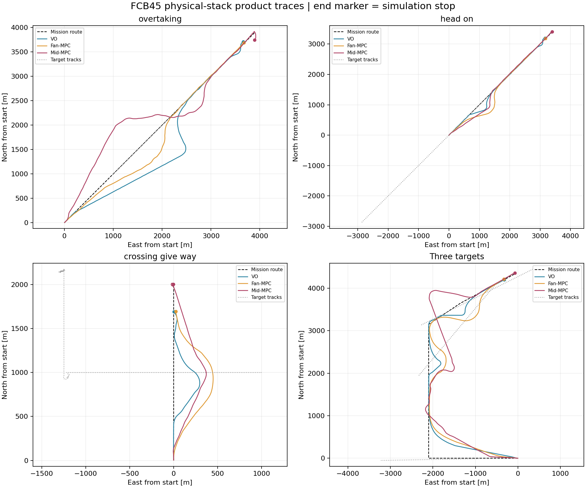
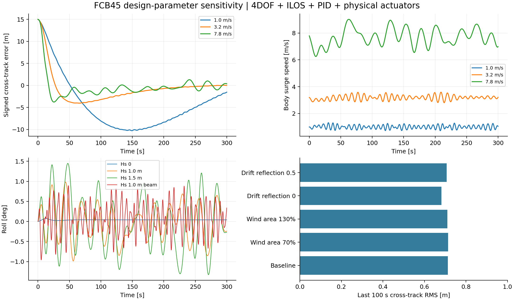

# FCB45 完整工程 GNC 栈：复核、修复与验证

日期：2026-09-09。基线：`main@7e493768`；本次修改未提交。船舶在建，按用户授权采用同事设计估计参数。

## 判定范围

已将 **4DOF plant → ILOS → PID → 3 主推 / 2 实际舵角 / 2 低速首侧推 → 风浪流载荷** 接入产品 `SessionCreateRequest → ExperimentRunner` 路径。工程模型和模块合同可检查、可回放；产品场景的到达结果见下方矩阵。**不得由模块通过推导全场景通过，也不得将 FK-only 波浪模型叫作完整耐波性模型。**

本报告区分四层：数学/单位正确、模块与集成回归、实际 Ship0 对全部目标的避碰与搁浅检查、完整任务到达。没有实船标定、全船两两安全、完整原生 evaluator/COLREGs 终审或 MASS-L3 系统验收声明。

## 1. S10 交接复核

本地复核原 S10 测试得到 **7 passed / 3 failed**，不是旧交接的 10/10。原始记录：`tmp/fullstack_review_20260908/baseline_s10.log`。Mid-MPC 的 OT、HO、CS 分别触发 passing-side、acceleration、回归 XTE 问题。它们是本次修改前实测结果，不回填为本次引入的问题。

135 项旧导引/环境/执行器模块基线通过，记录在 `baseline_modules.log`。这些通过仅覆盖旧模型自身合同，不能证明其物理表达和产品接线正确。

| 复核问题 | 证据 / 影响 | 本次处理 |
|---|---|---|
| 产品选择 ILOS，实际未传 accepted route | 工厂未自动安装 route bridge；direct reference 绕过 ILOS | 产品工厂自动接线，逐 tick 验证 guidance trace |
| 换线先投影、后重置 | 旧 segment cursor 污染新 route 首帧 | 先重置再投影；滚动几何变化重置游标；不跳过折返的未来段 |
| ILOS course/heading 混称 | PID 实际消费 heading；原 PI 积分量单位也未区分 | 增加 MSS/Børhaug 归一化积分律与 heading alias；追踪积分单位；无固定蟹行角 |
| 零海流仍额外添加静水阻力 | 7.8 m/s 零流，旧 external current 增加约 −74.8 kN | 新模型用同一 plant 的 MA/CA/D 推导相对水速等价增量，零流严格为零 |
| 风载荷方向、力矩与来源不足 | 无法将旧表证明为 FCB45 数据；from/to、左右镜像、FRD roll 力臂有问题 | 明确 NE-to 输入；采用 Blendermann speed-boat 类型先验；统一 `r × F` |
| inferred 波力量纲错误 | 旧横向项 N/m、roll 项 N·m²；含无依据 `0.03` 和运动 RAO 形状二次滤波 | 新 FK 压力面积积分直接得到 N / N·m；无运动 RAO 二次施加 |
| 波相位用瞬时遇频乘全局时间 | 变速/转向时 `ωe(t) * t` 不能正确累计相位 | 用世界坐标 `k·x − ωt + phase` 与有限水深色散 |
| 舵被表示为常数横向力执行器 | 低速仍可产生理想舵力，未执行真实舵角、舵速 | 新 V2 采用局部来流、桨后洗流、机械舵角、力率和角速限制 |
| 实际反馈与当前 PID 新命令错时比较 | 上一拍已实现力与下一拍新请求相减，产生虚假的 anti-windup | V2 显式启用 `align_previous_actuator_feedback`；旧栈保留原数值行为 |

旧 S10 / V1 配置保留作历史比较；新增 V2 独立配置，不应继续将旧 inferred 波核用于新模型的物理结论。

## 2. 最终模型与来源

### 船体及执行器

名义 45 m，Lpp 44.1 m、B 8 m、T 2 m、排水量 220 t。4DOF 为 surge、sway、roll、yaw；保留原有质量及水动力配置，V2 补入同事 roll added inertia `Kdotp = -1e7 kg·m²`、线性 roll damping `1e7` 与二次 damping `5e7`。

- 主推：3 台，实际力率 200 kN/s。
- 舵：左右独立角度；面积 3.5 m²、升力斜率 2.8/rad、角限 ±0.6109 rad、角速 0.1 rad/s。
- 桨后洗流：基于推力的盘面动量增速，混合系数 0.55、桨径 1.8 m 为显式工程假设；不叠加第二份洗流，也无任意最低有效船速。
- 首侧推：2 台，力率 50 kN/s；相对水速 1.5 m/s 开始降额，3.2 m/s 锁定，低于 2.7 m/s 解锁。高速实际输出必须为零。
- 分配：有界 nonlinear least-squares 同时求 3 主推、2 舵角、2 首侧推。分配预测与实际执行共用舵力/阻力公式；保留实际力率和舵速导致的残差。优化不收敛则显式失败，无 allocator fallback。
- 配置：新布局 `fcb45_main_rudder_bow_actuator_layout_v2`，trust 为 **inferred**，不是实船 calibrated / validated。

执行器结构参考 [MSS container.m](https://github.com/cybergalactic/MSS/blob/98970f71a21cfe81e7e29abdcc1bb6741789cddc/CRAFT/SHIP/models/container.m)；这里只借鉴力随来流和舵角变化的结构，没有把集装箱船水动力系数当作 FCB45 系数。

### ILOS 与 PID

采用 [MSS ILOSpsi](https://github.com/cybergalactic/MSS/blob/98970f71a21cfe81e7e29abdcc1bb6741789cddc/LIBRARY/guidance/ILOSpsi.m) 对应的归一化积分结构，Delta=50 m、kappa=0.5 m/s，输出 heading。每个物理 tick 执行；积分无需预设蟹行角。

Mid 的 accepted prediction 提供路径几何，当前 accepted executable speed 提供速度指令，避免把预测起点的实测速度不断作为下一拍速度目标。VO/Fan 使用 accepted course/speed intent 的固定锚点短路线；hold 不重新随船漂移。Mid continuation 只接受显式有限有效期，不改原 receipt/hash，不使用 UI 缓存作为控制授权。

PID 沿用同事参数，V2 横向请求及积分限值使用其 `max_force_y=60 kN`。反馈时序修正仅在 V2 显式启用；旧 A3 demo 与旧执行器时序回归通过。

**接口边界**：当前欠驱动 ILOS 输出前进速度和航向；它不是全驱动地速矢量跟踪器。曾试验将 SOG 向量旋入实际船体坐标，在大转角时要求倒车/横移并导致分配不收敛，已撤回。未添加位置 PID/DP 切换。低速停船及 planner SOG 与实际 surge 的严格匹配仍须通过端点任务验证，不能用固定蟹行角掩盖。

### 风、流、浪

| 分量 | 本次实现 | 可验证边界 |
|---|---|---|
| 流 | [Fossen 相对运动方程](https://fossen.biz/html/marineCraftModel.html)的同 plant MA/CA/D 等价力增量；含 body current derivative | 稳定、空间均匀 NE 海流；不允许白噪声流速度 |
| 风 | [MSS Blendermann 1994](https://github.com/cybergalactic/MSS/blob/98970f71a21cfe81e7e29abdcc1bb6741789cddc/LIBRARY/environment/blendermann94.m) speed-boat row 14；迎风面积45 m²、侧面积180 m² | 类型先验与设计面积估计；左右镜像、迎/顺风、roll 力臂符号有测试 |
| 一阶浪 | [Airy / Froude–Krylov 压力积分](https://capytaine.org/stable/theory_manual/theory.html)；匹配 L/B/T/排水量的 generalized Wigley 参数船体；有限水深色散 | 一阶激励；非真实船体线型，无 diffraction/radiation memory/slamming |
| 平均漂移 | 显式反射壁动量通量 proxy，逐分量幅值平方求和 | reflection energy fraction = 1 为默认参考，0/0.5/1 敏感性；不是 FCB45 QTF 或真实船舶的普遍上界 |
| 环境场 | 风 NE=(6,2) m/s、流 NE=(0.4,−0.2) m/s、Hs=1 m、Tp=7 s、24 波分量，离散能量归一 | 固定种子可重复；不叠加逐拍风/流白噪声 |

平均漂移来源、适用边界及为何此时选择 FK-only，详见[波浪专门调研](2026-09-09-fcb45-wave-model-sources.md)。完整来源与替代方案见[全栈来源复核](2026-09-08-fcb45-fullstack-review-sources.md)。

**仍存在的物理简化**：没有 CAD/面元 BEM 船型资产、频率相关辐射、二阶 QTF、heave/pitch、波流折射、波频观测滤波和实船舵效图。执行器使用平面 X/Y/N 作用点模型，未增加独立的舵力 roll 力臂；roll 通过已有水动力耦合与风浪激励产生。因而“4DOF 工程闭环”成立，“完整耐波性 / 舵致横摇复现”尚不成立。

## 3. 集成测试暴露的 planner 合同问题

以下均来自新物理栈运行及最小复现；未改安全阈值、场景几何或成功条件：

1. 实际船长/宽/吃水、plant/controller identity 和响应 envelope 未传入 planner：现由 adapter 提供，FCB45 的 L4 capability tuple 显式登记。它仍是 command-envelope 近似，不是完整 GNC 前向预测。
2. passing-side 用 HDG 构建地速候选：改用实际 NE velocity 的 COG；同地速不同蟹行角不再改变 passing-side。
3. 约束阶段要求即时进入航向走廊，当前航向与第一步 turn bound 无交集：走廊按现有最大转速可达距离进入；到达后恢复原走廊，没有放宽转速。
4. 单目标 NLP 数值容差比 L4 速度步长门宽：收紧 strict 求解容差至 `1e-7`，未放宽 L4；MASS_PARITY 保持原模式。
5. `QUALITY_CPA_RELEASE` 将 NLP 的膨胀中心距当作 hull clearance：L4 现在取明确的 200 m advisory hull 配置，NLP 仍保留船体与采样膨胀项，hard 180 m 不变。
6. first-feasible early stop 可以停在没有 recovery progress 的迭代：增加与原 L4 recovery 几何判据一致的候选过滤；独立完整 L4 仍运行，无强制 PASS。固定问题回放：78 次迭代过早结束，过滤后97次、约2.24 s获得带回归后缀的 feasible candidate。
7. RELEASED OT 目标会在本船停靠终点后追上：终点位于 horizon 可达范围时，将目标在剩余 horizon 内对终点的冲突纳入数值安全障碍；不重新分类 COLREG encounter，不删除未来 CPA。
8. Fan 最后一段以固定速度绕终点：根据现有 turn/command-rate envelope 和 `2/distance` 的追踪曲率限速；仅无 give-way/stand-on duty 的最后一段使用，不修改原到达半径。

## 4. 回归与场景结果

分段模块/核心回归：**761 passed, 1 skipped**。另外 Mid acceptance、integration、anticipatory planning、prediction evidence、C++ parity：**104 passed**。合计互不重复测试 **865 passed, 1 skipped**。不是整个仓库全套 pytest 声明。

日志：`verification_group_0.log` … `verification_group_6.log`、`verification_groups.json`、`integration_parity_verified.log`。Ruff 检查、新文件格式检查及 `git diff --check` 单独记录。旧文件仅格式化本次改动范围，范围检查全部通过；5个旧文件的整文件格式告警在 HEAD 基线同样存在，未顺手重排。

### 最终产品矩阵

<!-- MATRIX_START -->
| 算法 | 场景 | 最小中心距（各目标）m | 到达 | 终点距离 m | 最终速度 m/s | 原航线末端 XTE m |
|---|---|---:|---|---:|---:|---:|
| VO | overtaking | 514.7 | 通过 | 306.75 | 5.801 | 33.57 |
| VO | head_on | 220.2 | 通过 | 307.16 | 5.216 | 22.32 |
| VO | crossing_give_way | 254.8 | 通过 | 307.95 | 6.781 | 4.96 |
| VO | paper_ccta2023_multiship | 318.8 / 223.5 / 215.2 | 通过 | 308.68 | 5.871 | 3.43 |
| Fan-MPC | overtaking | 363.2 | 通过 | 308.60 | 3.018 | 10.79 |
| Fan-MPC | head_on | 365.9 | 通过 | 308.63 | 2.941 | 6.44 |
| Fan-MPC | crossing_give_way | 370.4 | 通过 | 307.22 | 3.232 | 23.14 |
| Fan-MPC | paper_ccta2023_multiship | 383.9 / 316.6 / 358.4 | 通过 | 308.43 | 3.080 | 15.54 |
| Mid-MPC | overtaking | 475.6 | 未通过 | 158.13 | 3.583 | 105.03 |
| Mid-MPC | head_on | 254.7 | 通过 | 4.87 | 0.049 | 4.87 |
| Mid-MPC | crossing_give_way | 266.2 | 通过 | 4.95 | 0.028 | 4.95 |
| Mid-MPC | paper_ccta2023_multiship | 402.5 / 457.5 / 337.5 | 未通过 | 21.44 | 0.564 | 17.23 |

**10/12 场通过原生到达与本次运行检查；2/12 未通过。** [冻结汇总](assets/fcb45-fullstack-20260909/campaign-summary.json)给出每场配置 hash、源码指纹、轨迹 SHA256 与原始路径。

- Mid-MPC / overtaking：mission goal not reached。最近到终点 1.45 m（t=1140.5 s，速度 0.498 m/s）；最终 t=1200.0 s。
- Mid-MPC / paper_ccta2023_multiship：mission goal not reached。最近到终点 0.21 m（t=1678.4 s，速度 0.376 m/s）；最终 t=1800.1 s。
<!-- MATRIX_END -->



[轨迹PDF](assets/fcb45-fullstack-20260909/product-trajectories.pdf)。图中终点圆点是仿真停止位置，不代表所有算法达到同一精停标准。

两项缺口都是位置与速度未同时通过：三船通过终点附近后仍运动；OT还需处理后方目标未来经过终点的安全停车策略。下一步应明确低速终点控制/位置保持的责任边界，再实施并重跑；本次未新增未经确认的位置PID/DP，也未放宽终点或未来安全门。

最终矩阵各场物理与控制参数一致；源码指纹间仅 controller/catalog 的注释与等价字符串排版发生变化，已按每场实际快照保留。

每场使用独立进程、原产品场景、正常 SessionCreateRequest。Mid 使用已存在验证配置：CPA advisory=200 m、hard=180 m 及 MID_MPC_VALIDATION_DOMAIN_PROFILE。安全统计是实际完成步的 Ship0-各目标中心距，含相邻步 swept 最小值；静态检查使用本船包围圆与 ENC hazard 的距离。到达沿用各算法原生规则：不能横向比较 VO/Fan 宽目标区与 Mid 的 5 m / 0.05 m/s 精停条件。

`mission_cross_track_m` 是距原任务有限折线的最短距离；`xte_m` 是距当时 accepted guidance route 的误差，二者不能混用。终点通过不等于完整 COLREG maneuver-quality evaluator 通过。

原生 pickle frames 在每步校验后释放以控制内存；完整时间序列另存 `trace.jsonl`。未声称完成原生 Evaluator 的最终离线汇总。首轮并行准备曾因 Seacharts 共享 shapefile 写冲突中断，属于准备失败；已对准备阶段加进程锁，失败保留并单独重跑。

## 5. 环境敏感性

固定300 s、dt=0.1 s、初始横向偏差15 m。仅改变一个参数；不是实船误差区间或稳态统计置信区间。

| 条件 | 最后100 s XTE RMS | 平均 surge | 最大 roll |
|---|---:|---:|---:|
| 7.8 m/s 基准 | 0.712 m | 7.758 m/s | 0.987° |
| 风面积70% / 130% | 0.714 / 0.711 m | 7.759 / 7.758 m/s | 1.001 / 0.994° |
| 反射比例0 / 0.5 | 0.681 / 0.707 m | 7.783 / 7.765 m/s | 1.048 / 1.061° |
| 低速1 m/s | 5.361 m | 1.001 m/s | 0.286° |
| 过渡速度3.2 m/s | 0.331 m | 3.195 m/s | 0.340° |
| Hs=0 / 1.5 m | 0.261 / 0.721 m | 7.800 / 7.742 m/s | 0.075 / 1.448° |
| Hs=1 m 横浪 | 0.232 m | 7.801 m/s | 0.959° |

10组均执行完成，无高速首侧推输出。低速300 s内仍有长暂态，不应称为精确定位通过。波频 surge 振荡在图中保留，不能以平均速度掩盖。



[PDF图](assets/fcb45-fullstack-20260909/environment-sensitivity.pdf) · [原始敏感性指标](assets/fcb45-fullstack-20260909/sensitivity.json)

## 6. 复现与交接

```bash
# 一场完整产品链路，输出全时间序列、失败诊断、模块配置与源码 hash。
.venv/bin/python -m tools.gnc_characterization.run_fcb45_fullstack_campaign \
  --algorithm mid_mpc_ipopt --scenario head_on \
  --output tmp/fcb45-head-on-recheck

# 本次分段验证的精确分组命令也保存在 verification_groups.json。
.venv/bin/python tmp/fullstack_review_20260908/run_segmented_verification.py
.venv/bin/python tmp/fullstack_review_20260908/run_verified_matrix.py
.venv/bin/python tmp/fullstack_review_20260908/run_sensitivity.py
```

主入口：`colav_simulator/modular_gnc/catalog.py::_physical_fcb45_candidate`，catalog 原200栈加 calm/environment 两个 V2 栈。与干净 HEAD 的逐配置比较：旧200栈配置完全相同，无丢失、无改写（`catalog_compatibility.json`）。各场 `stack_evidence.json` 给出完整可选 stack_id 与参数；使用环境卡时应选择包含 `fcb45_environmental_load` 和 V2 布局的栈。

生产文件：`fcb45_environment.py`、`fcb45_actuation.py`、`guidance_ilos.py`、`route_bridge.py`、`adapter.py`、`controller.py`、工厂/注册表/调度接线，以及上节逐条有原因的 Mid/Fan 集成修复。保留 baseline、试验失败、最终结果各自独立目录，不从旧通过结果挑选填充最终矩阵。

开发期“静态分配忽略舵阻力”和“地速矢量转换”导致的异常属于本次原型问题，已修复/撤回；不能归因于同事原始 S10。每个最终场景有源码指纹，历史探索目录仅供诊断。

未提交、未 broad-stage、未清理用户原有文件、未改8010活动会话、未部署 A4000。GUI 浏览器交互尚未单独验收。
