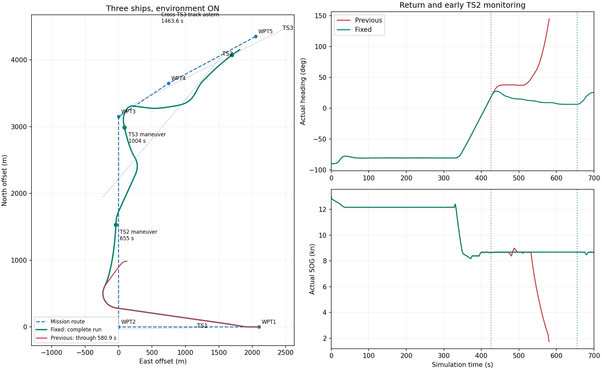

# VO：分离持续监控与机动启动

## 问题与修复范围

用户 Run `3476819a-26c1-47d5-8ba2-37a05a0203e1`，VO、三船、环境开启，暂停截图约580.9s。上轮集成将监控的 ACTIVE/GIVE_WAY/COMMITTED 直接转成VO机动约束，造成TS2在约2.7km、TS3在约4.1km外限制回航。随后方向累加约束和停车选择叠加，出现掉头。

本轮仅修改VO的监控职责接入与交叉机动约束。保留用户确认的超越完成、横向分离、重遇保护。GNC源码、控制器、执行器、水动力、1.2°/s参考变化率、0.25m/s²横向加速度、182m硬净距和190m偏好净距均未修改；Fan/Mid未修改。8020的用户会话没有用于自动测试，测试独立运行。

## 最终逻辑

1. **持续监控**：监控快照保留目标身份和让路职责，不因ACTIVE/COMMITTED本身启动机动，不直接禁用回航方向。
2. **机动启动**：保留VO原有当前运动风险入口；另检查名义回航参考是否会进入偏好安全域，或进入已确认让路职责对应的V1禁区。只有冲突进入有限执行提前窗口才接纳该目标规则。
3. **执行提前量**：窗口沿用基础预测时间和GNC课程响应时间，再计入参考转向、或转到最近移动让路候选所需的转向时间。后者使用既有速度/转向包络及本目标V1约束计算，不是新增固定距离或人为提高ROT。所有候选仍需通过后续完整动态、静态及执行约束。
4. **启动后保持**：只有已经由VO风险入口接纳的目标规则，才能由监控清障保护继续维持；不因暂时拉开CPA而过早回航。启动窗口不再截短已接纳规则的V1禁区。
5. **交叉机动可收回**：取消交叉让路“右转幅度只能逐次增加”的累加限制；候选仍须位于入遇允许侧并满足物理/COLREG约束。超越和对遇的进度保护保持原样。

诊断保留原始几何、监控职责、生效规则、激活依据，并新增 `reference_rule_conflict_tcpa_s` 和 `reference_admission_horizon_s`。由此可以区分“已监控”“已接纳机动”和“实际动作开始”。

## 用户环境开启工况

完整Run：见 [环境开启证据](evidence/vo-monitor-activation-20260915/three-ship-env-on.json)。保持用户原Run Specification，外层0.1s。

| 事件 | 修复后 |
|---|---:|
| TS1内部超越保护解除 | 328.0s，与原Run相同 |
| TS2首次接纳机动规则 | 655.0s，距离1024.5m |
| TS2运行时动作开始/结束 | 666.3s / 817.9s |
| TS3首次接纳机动规则 | 1004.0s，距离1058.9m |
| TS3运行时动作开始/结束 | 1013.9s / 1234.3s |
| 穿越TS3航迹线 | 1463.6s，在TS3后方1686.9m |
| 达到原场景目标 | 1503.4s |

580s：实际艏向9.18°，VO航迹向8.44°、请求4.67m/s，未激活TS2/TS3机动约束。全程没有选择零速停车，没有指令超时、碰撞或搁浅。

最小船体净距：TS1 **192.19m**，TS2 **185.29m**，TS3 **211.04m**。均通过182m硬门；TS2未达到190m偏好值，硬门余量约3.29m，不能称为所有偏好均满足。

TS1保护另做原Run前328s逐帧对照：3280帧，位置差为0，艏向/速度/角速度差约1e-15量级。见 [超越前缀对照](evidence/vo-monitor-activation-20260915/ts1-prefix-parity.json)。

## 回归与验收边界

- 158项相关pytest通过，涵盖监控不直接触发、有限窗口、参考让路冲突、可用转向率、持续清障保护、交叉方向收回、超越、原生输入和时间合同。不是全量仓库测试或远端CI。
- 环境关闭三船、0.2s外层步长：1293.8s到达；TS1/TS2/TS3净距244.89/206.06/194.52m；TS3于1263.6s在其后方1378.8m穿越航迹线；无碰撞、搁浅或指令超时。见 [环境关闭证据](evidence/vo-monitor-activation-20260915/three-ship-env-off.json)。
- 单船对遇和交叉让路、0.2s外层步长：均达到目标、无运行时碰撞/搁浅，最小净距分别210.97m、223.16m。见 [单船回归](evidence/vo-monitor-activation-20260915/single-encounter-regression.json)。与两种环境三船合计4个完整闭环通过。本轮未重跑单船超越完整闭环，以既有超越回归测试和用户三船Run的3280帧前缀对照验证保护不变。
- 独立评价的默认最低净距门为50m；本轮验收另按182m逐对检查，没有修改评价配置来取得PASS。环境开启时独立评价把TS2/TS3整体分类为clear，不能把其未计算的P_ahead15当作0或正式COLREG通过；船尾侧穿越由实际轨迹单独验证。
- 船尾侧判据检查实际穿越目标航迹线的位置，不以“CPA瞬间必须已在目标后方”替代它。本次环境开启TS3在CPA时纵向投影为+65.96m，但随后唯一航迹线穿越发生在其后方1686.9m，没有船首侧穿越。
- 将启动提前量提取为私有函数后，40组有状态序列、240次求解的指令与逐目标诊断与内联版本完全一致。环境开启完整运行使用内联版本，环境关闭及单船使用最终函数版本；源码SHA见证据，不改写历史Run提交身份。
- Ruff仅保留既有3项复杂度告警，无新增告警；GNC原生库与权威源码身份保持不变。

## 未采纳试验

只改启动门的版本约1201s求解失败；恢复完整V1禁区后仍约1402s失败；取消交叉累加限制后可以完成任务，但仍从TS3船首侧穿越；只补参考对齐转向时间也未解决该穿越。因此最终同时检查窗口内让路冲突和实际避让转向提前量。失败/未采纳试验保留在 [试验记录](evidence/vo-monitor-activation-20260915/rejected-trials.json)，不计入通过数量。

本轮没有改变实际零速控制的GNC实现；“全程不再选择停车”不等于此前环境下的停车止转问题已被修复或完成验收。
