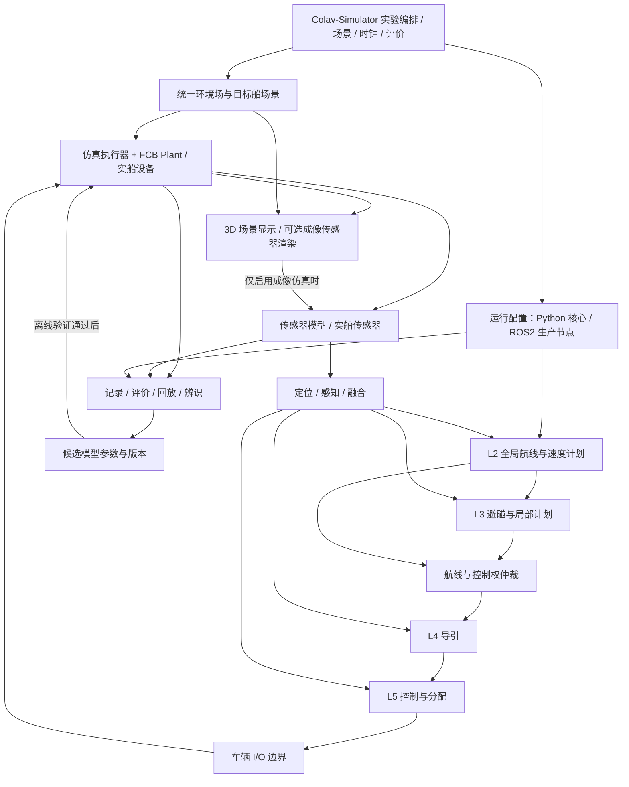

# 45 m FCB 数字孪生：Colav-Simulator → ROS2 全栈 → 实船数据闭环

日期：2026-09-17。性质：研究与候选架构；未实施集成、未运行海试或 ROS2 全栈验收。

研究输入：用户指定的六篇 PDF、对话《搜索数字孪生平台》、当前本地 Colav-Simulator、A4000 上 MASS-L3 的只读源码快照、研究团队论文和官方软件文档。旧对话只作线索；其中船舶规格、软件成熟度、运行通过状态均不直接继承。

本次完成条件：六篇论文的贡献与证据边界可追溯；现有代码可复用点有源码依据；三阶段各有输入、执行路径、产物、验收门槛；给出风浪流、时钟、模型、ROS2、实船记录与回放的责任边界；列明仍需确认的设计输入。

## 1. 判断与路线

三步可行。建议定义为同一个验证平台的三种运行配置：

1. **算法与场景验证**：Colav-Simulator 管理试验；动力学产生运动；三维后端显示过程，必要时生成传感器观测。
2. **真实软件集成验证**：换入生产用 ROS2 C++ L2/L3/L4/L5 节点；保留场景、数字船、传感器替身、记录与评价。
3. **实船驱动的模型与策略迭代**：记录真实航行；重现、辨识、验证、版本化模型；回到前两阶段回归。

阶段按成果推进，采集方案并行前置。年底上船前就应完成记录器、信号字典、时间同步、存储预算、离线恢复及采集演练；否则短暂海试可能只留下“能看轨迹、不能校模”的数据。

可离现场反复验证的目标，应限定为**已辨识、已验证的航速、装载、海况、作业区域和传感器配置范围**。超出该范围仍可仿真，但应显示外推标识与不确定性。仿真通过与实船部署、运营接受分别建立证据，不能互相替代。

特别修正原对话的一项隐含前提：标题中的“digital twin syncing”不等于已完成真实船在线同步。Berg 等 2025 研究的是仿真内 DRL 调 NMPC 权重或模型质量/阻尼参数，结尾仍要求真实世界验证；Menges 等 2024 的 Unity/AIS/LiDAR/PSF 工作也明确未连接真实 ASV。两者可支持架构和方法选择，不能提供本船实海闭环证据。[Berg 等](https://doi.org/10.1038/s41598-025-93635-9)；[Menges 等](https://arxiv.org/abs/2401.04032)。

SINDy 论文有真实 Otter 操纵数据与留出机动验证，但部分 DT 结果包含周期性实测状态修正；应区分同步状态估计精度和独立自由推演精度。它支持第三步的辨识路线，不能据此直接保证 FCB 长时间开环预测准确。[Kandemir 等](https://doi.org/10.1016/j.apor.2025.104825)，本地 PDF pp. 7–11；详见专项证据文件。

NTNU 的集成验证架构确有 **OSP/FMI + Gemini/Unity + ROS** 的分工证据，但应把不同试验分开：Hanssen 游戏论文的 ROC 场景采用脚本自动航行与简化避碰；milliAmpere2 系统论文另有真实试航证据，试航仍配安全员。六篇材料不是同一套已公开、可直接部署的完整数字孪生软件包。[NTNU 验证架构，文内 pp. 17–19](https://assor.folk.ntnu.no/PhD%20Thesis/PhD_Thesis_Torben.pdf)；[milliAmpere2 系统论文](https://doi.org/10.1115/1.4067370)；[本地逐篇实验边界](2026-09-17-ntnu-gemini-evidence.md)。

## 2. 当前工程基础：需要扩展，已有部分不必重做

源码快照：Colav-Simulator HEAD `ddfdce5e875dc30eb9b88054dfaf0fd5e8c52c60`；工作区存在原有未提交变更。本节仅证明当前源码具备接口或实现，不代表相应运行已验收。

| 现有部分 | 当前证据 | 对三阶段的意义 |
|---|---|---|
| 统一实验与证据 | [`RunSpec` / `RunManifest`](../../colav_simulator/experiment/contracts.py)，[`ExperimentRunner`](../../colav_simulator/experiment/runner.py)，[`EvidenceWriter`](../../colav_simulator/experiment/persistence.py) | 沿用实验身份、场景/ENC/构建哈希、执行算法、失败与 fallback 记录 |
| 模块化 GNC 和数字船 | [`ModularShipStack`](../../colav_simulator/modular_gnc/stack.py)，源码 114–190 行装配环境/船模/控制/导引/分配/执行器；192–222 行 reset/snapshot/restore | 复用模块边界与固定步进；快照只覆盖其明确拥有的状态 |
| 风浪流和载荷 | [`environment.py`](../../colav_simulator/modular_gnc/environment.py)，[`fcb45_environment.py`](../../colav_simulator/modular_gnc/fcb45_environment.py) | 已有环境场与作用力分离；避免再由游戏引擎独立叠加同一套风浪流 |
| 原版 C++ GNC 嵌入 | [`original_gnc/native.py`](../../colav_simulator/original_gnc/native.py) 1–6、25–46 行；[`NativeStack`](../../colav_simulator/original_gnc/stack.py) 1–34 行 | 可在 Python 试验里执行冻结 C++ 核心、核对构建身份；其调度器不运行 ROS/DDS |
| ROS2 外围接口 | [`ros_adapter.py`](../../colav_simulator/modular_gnc/ros_adapter.py) 1–28、65–76 行 | 已有时序、QoS、乱序、重置语义；G10 明确为内存脚本传输的 A3 证据，不能当作真 ROS2 集成通过 |
| 历史 AIS 与反事实 | [`historical_replay.py`](../../colav_simulator/historical_replay.py)，[`historical_counterfactual.py`](../../colav_simulator/historical_counterfactual.py) 1–7 行 | 已有历史重建、T0 分支与未来信息隔离；可扩展接入实船数据，尚不是多传感器 FCB 航行记录器 |
| 决策记录 | [`decision_replay/recorder.py`](../../colav_simulator/decision_replay/recorder.py) | 复用完整决策轨迹记录入口；扩展时间轴与实船证据关联 |

参数可信度必须单独保留：[`catalog.py`](../../colav_simulator/modular_gnc/catalog.py) 97–161 行明确 `validated_for_vessel=False`；FCB 环境含工程假设，波浪尚无实船 RAO/QTF，现有说明列出无绕射、辐射记忆、砰击等边界。代码中的厂商配置取值也不等于已确认的真实装载状态。此处不能把“4DOF”“FCB45”标签当作可信度等级。

MASS-L3 旧本地路径已不存在。专项审计转到 A4000 `/home/marine.huang/Code/mass-l3`，HEAD `fa7635af53fce5e3cca18dcc5f8c484032a65aca`，只读核对源码，未部署/运行全栈。当前 `fcb_simulator_node` 仍直接消费 M5 并内部控制；另有 `third_party/gnc_ws` 的导引/控制/分配/Plant 链和 `gnc_bridge` 跨域接入。须明确选择并核对生产链，不能把两条仿真路径叠加。[ROS2 与平台证据](2026-09-17-ros2-twin-platform-evidence.md)。同事最终交付的 L2/L4/L5 包、版本与部署图，仍须由对应团队确认。

## 3. 稳定架构：把可替换点放在边界

以下为建议结构，方框名称是职责，不要求立即拆成独立微服务。

核心约束：

- **一艘船一个运动积分权威**。外部 Plant 计算位姿时，3D 引擎按位姿驱动；关闭重复浮力/操纵积分。若选用游戏引擎或 Gazebo 自带 Plant，则明确由其接管，避免双重动力学。
- **一份环境事实，多种用途**。风速矢量、海流、波谱与相位供载荷模型和渲染使用。水面动画参数不能自动当成真实受力；视觉升沉/纵摇若仅用于显示，必须标注，不能进入 IMU/控制验证。要验证六自由度传感器运动，需单独合格的运动模型。
- **一个时间权威**。阶段一沿用确定性实验时钟；阶段二由试验时钟驱动 `/clock`，各 ROS 节点使用仿真时间；阶段三回放使用记录时间映射。在线真船则用真实时间。显示帧率不决定物理步长。
- **一个执行器命令仲裁点**。自主、船长、应急、遥控模式各有明确优先级与当前拥有者；L3 计划不能绕过 L4/L5 直接成为 Plant 输入。L5 若拆成控制与分配两包，按同事接口映射。
- **真值与观测分开**。真值用于仿真、评价、调试；完整感知 SIL 的算法只接传感器/估计状态。阶段一允许理想状态入口，但运行报告应明确其注入层级。
- **控制器预测模型与验证 Plant 分开管理**。允许同源实现支持移植对齐；行为可信度还要面对独立数据、参数扰动与未参与调参的场景，避免同一模型自证正确。

车辆 I/O 最小合同建议包含：命令及实际反馈、设备 ID、物理量与单位、量程/饱和/变化率、时间戳、序号、来源/质量、坐标系、模式与控制权。世界合同包含：船体位姿速度、目标船、地形/水深、环境场、场景/模型版本。先定义字段与语义，再绑定 gRPC/ROS2/文件格式。

坐标先冻结当前海事惯例的规范表示，再由边界转换：经纬度与本地切平面原点、NE/NED 与 ROS ENU/FLU、Unity 左手系、航向与航迹角、SOG 与对水速度、风/浪的来向与去向。转换应有直行、左右转、侧流的已知向量检查。不得只改变量名。

## 4. Step 1：Colav-Simulator 中的环境避碰试验

**目的**：用现有算法在有物理影响的风浪流下，展示并评价“监视 → 避让 → 通过 → 恢复航线”。

建议路径：现有实验会话 → 当前选定 COLAV → GNC/执行器 → FCB Plant → 合成观测 → COLAV；旁路向三维后端发布状态、计划、轨迹、目标、环境与时间。

最小增量：

1. 选一个已明确身份和适用范围的 GNC/Plant 组合；不在接三维时顺便改变避碰求解器。
2. 加只读 World/Scene 输出适配器，显示本船、他船、计划/预测轨迹、CPA、控制权与实际环境载荷。
3. 统一暂停、倍速、重置、录制与 `run_id`；无头批量试验独立于渲染进程。
4. 先用 AIS/目标级传感器模型验证决策与执行；只有感知任务需要时再加雷达、相机、LiDAR 原始流。
5. 场景先覆盖实际试航走廊：同一地理原点下对齐 ENC 岸线/水深、码头/航标三维资产和碰撞边界；记录水深/潮位基准。实船视频或测绘可补外观与遮挡，但美观的港口模型不能代替可通航水域及碰撞几何。

**G1 验收产物**：固定场景集 + 配置/模型哈希 + trace + 评价报告 + 一段同步 3D 回放。

- 对遇、交叉让路/直航、追越、代表性多船及恢复航线均有完整试验；不可只展示轨迹截图。
- 相同 seed、步长和输入，开/关显示的数值轨迹与事件一致或满足预先声明的数值容差。
- 风、流、浪逐项开关与组合试验能追溯“环境 → 载荷 → 船舶响应”；画面海浪不能代替这项检查。
- 分别报告本船安全、全体船安全、COLREG 行为、任务完成、航线偏差与求解失败；不将某一分数视作全项通过。
- 实际执行算法、后端及 fallback 明确；未校准船模标记为工程仿真。

该阶段形成可用的算法验证环境。它不以完成所有高保真传感器或六自由度流体仿真为前提。

## 5. Step 2：ROS2 C++ 全链路软件集成

**目的**：验证将来部署的软件包和真实接口如何协作，覆盖时间、模式切换、通信与执行响应。

执行链：定位/融合 → L2 航线 → L3 避碰 → 仲裁 → L4 导引 → L5 控制/分配 → 仿真设备 I/O → 同一数字船 → 传感器；L3 可向 L2 返回重规划请求，但需显式合同，避免两个规划器互相覆盖。

采用同一场景与参数版本，依次替换模块。先引入真实 L4/L5 与闭环状态，再接 L3/L2；模块未就绪时允许有标记的替身用于联调，但全链路验收必须全部换成目标版本。

两种执行配置分开验收：

| 配置 | 运行方式 | 验证对象 |
|---|---|---|
| 可重复软件试验 | 固定物理步长、明确多速率调度、时间戳屏障；仅支持的节点可倍速 | 数值/行为回归、接口语义、故障注入 |
| 部署时间行为试验 | 目标计算机、真实进程/DDS、按墙钟实时节奏 | 执行耗时、队列、丢包、deadline、重启与恢复；含硬件后才称相应 HIL |

`use_sim_time` 解决时间来源，不自动建立确定性屏障或控制顺序。QoS、队列深度、消息有效期与过期策略逐话题冻结；控制权切换和重置必须清除旧命令。倍速能力用实测决定，不能从“Python/C++”语言判断。

本次源码审计发现具体缺口：远端 GNC 的若干节点使用 wall timer，Plant 按 wall dt 推进；仅设置 `use_sim_time` 不足以支持暂停/倍速/seek。现有 `fmi_bridge` 的 wrapper 主要解析模型描述并维护内存值，尚未证明执行真实 FMU。两项都需按所选路线实施和验收，不能因包名存在而视为已完成。[源码定位与当前边界](2026-09-17-ros2-twin-platform-evidence.md)。

**G2 验收产物**：冻结部署图与接口字典、生产包 commit/镜像摘要、rosbag/trace、对照报告、故障试验报告。

- 同一组接受的计划输入下，嵌入核心与 ROS2 节点先做输出/时序对齐，再运行自主算法闭环；合成输入通过不代替闭环验收。
- 核查真实进程、订阅/发布链和命令执行反馈，确认 L2/L3/L4/L5 实际参与，没有隐含内部自动驾驶或替身绕过。
- 覆盖直航/转弯/避碰/恢复、航线更新、人工接管、消息迟到/中断、进程重启、仿真暂停与重置。
- 真值不得经调试话题进入完整感知试验的算法；理想观测试验单独标记。
- 在目标硬件记录耗时分布和错过期限次数；门槛依据团队接口预算制定。

本阶段完成仍不等于批准在真船自动控船。年底若只有数据采集机会，优先以独立记录与影子决策运行，不让第三步依赖获得主动控制权限。

## 6. Step 3：实船数据回放、模型辨识与船长行为分析

### 6.1 四种运行模式

| 模式 | 被固定的输入 | 新计算内容 | 可支持的结论 |
|---|---|---|---|
| 航行重现 | 记录的本船/目标状态、画面、设备反馈 | 3D/海图/时间轴重现与事件标注 | 当时发生了什么；不验证动力学 |
| 设备与船模验证 | 已记录操纵命令或实际执行器反馈、初态、可获得环境 | 执行器模型/Plant 自由推演，对照测得状态 | 延迟、推力、阻尼、转向响应是否准确 |
| 感知与决策回放 | 记录的传感器输入与船长实际运动 | 新感知/融合/L3 的影子输出 | 同一历史观测下会提出什么决策；不证明新决策实际安全效果 |
| 反事实闭环 | 分支时刻以前的状态历史、任务意图、场景/环境条件 | 新算法 → GNC → 数字船 → 新视角传感器 → 新决策 | 经校准仿真条件下不同策略的条件性结果 |

校船体模型时优先输入**实际执行器反馈**；校执行器模型时再用“命令 → 反馈”。只有指令而没有反馈时，舵机延迟/饱和与水动力误差可能无法区分。

反事实自船转向后，原相机/雷达画面对应旧船位，不能继续冒充新视角反馈。需要重建目标与环境并重新生成观测，或明确只做目标级近似。历史目标轨迹可作“其他船不响应”的条件，但不能据此声称交互行为真实；关键交会另用响应模型与多种可能行为分支。

### 6.2 海试记录最小集合

| 信号域 | 应准备的记录 | 缺失的代价 |
|---|---|---|
| 时间与身份 | 传感器原始时间、接收时间、时钟偏差/质量、序号、设备/软件/参数版本 | 不能可靠区分决策迟延、网络迟延与船舶响应 |
| 导航状态 | GNSS/RTK 位置和质量、姿态/航向、IMU、角速度、SOG/COG、对水速度及可用不确定度 | 仅 AIS 轨迹通常不足以分离流、侧滑、执行器和船体参数 |
| 人与控制权 | 手柄/舵令/车钟、自动/手动/DP 模式、接管事件、目标航向/航速、告警 | 无法解释动作发生前的任务和控制约束 |
| 执行器 | 每个桨/轴/舵/侧推的命令和反馈、RPM/桨距/舵角、可用推力/功率、饱和与故障 | 校模只能拟合混合误差，难以归因 |
| 环境与船况 | 风速风向及安装信息、水流/水深可用测量、海况；吃水、装载、质量/重心估计、推进器可用性 | 不同工况混在一起，参数看似变化却无从解释 |
| 周围交通 | AIS、雷达 tracks/原始数据、相机/LiDAR（按实际设备）、目标检测/融合输出及协方差 | 不能重建船长看到的交通环境与传感器遗漏 |
| 任务语境 | 计划航线/速度、操纵事件标记、试验目的、船长事后解释 | 只能描述动作，不能断言意图 |

用真实设备原生频率记录，并保留丢帧/掉线统计；不把所有话题统一到某个任意频率。波浪/海流无测量时记录“未测”，使用带范围的先验，不能反推成唯一真值。稠密视频/雷达采用原始文件及索引也可，须与 MCAP 共用时间与完整性清单。

数据包除消息本体，还应包含 ROS 消息定义、QoS、`/tf_static` 与动态 TF、传感器外参/内参、参数文件、地图版本和软件构建身份。回放 seek 只改变消息播放位置；要重建有内部状态的跟踪器、MPC、控制器，需完整快照支持，或重置后从足够早的时间预热。不能把播放器能拖动进度条等同于系统可正确恢复任意时刻。

采集前用已获许可的记录接口演练：断电/磁盘满恢复、分卷、时间对齐、导出、校验和、离线播放。存储预算按每路实测码率 × 时长 × 备份数计算。具体 GNSS、IMU、控制反馈、雷达接口与允许试验动作仍需船厂/团队提供。

### 6.3 校模顺序与准入

建议先灰箱、后复杂学习：时间偏差/坐标校准 → 执行器时滞与推力映射 → 纵向加减速 → 横向/艏摇操纵 → 环境残差 → 必要的横摇/六自由度 → SINDy 或残差学习 → 有边界的在线同步研究。

所需操纵数据以船长批准且可执行的实际试验为限；恒速、加减速、左右转等片段提高辨识能力。普通运营数据可能激励不足，不能承诺识别全部水动力系数。不同速度、装载、推进组合应区分适用域。

训练/调参/验收按独立航次或连续操纵段切分，不能随机打散相邻采样点。同时检查一步预测、多步自由推演、转向/停车等行为指标；避免用每步实测位置重置模型，掩盖累计漂移。

模型候选应携带：数据切分、代码与参数版本、物理约束、残差与区间、适用域、回归结果、批准记录。先以估计参数在离线候选中验证；未通过不更新已接受基线，更不自动更新船上控制器。

**G3 验收产物**：可复查的海试数据包、四模式分明的回放案例、船长标注案例集、至少一个独立留出航次验证的模型候选及回归报告。具体数值容差依据传感器精度、预测时长和工程用途制定，本研究不编造统一米级门槛。

船长行为分析宜围绕“何时开始避让、先转向还是减速、采取多大幅度、何时恢复、当时看到什么”。轨迹只能支持动作推断，意图要依靠任务记录、事件标注和复盘。船长选择也应经安全/COLREG/任务评价，不能直接当成所有情境的最优标签。

## 7. 平台选型原则

建议保留 Colav-Simulator 为实验、评价与数据入口，保持 ROS2 为生产软件集成接口；三维与成像仿真后端可替换。先做一个小范围可复现构建与外部位姿驱动验证，再确定后端，不先迁移整个工程。

| 候选 | 当前可信依据 | 本项目建议位置 |
|---|---|---|
| Gemini / Unity | [官方仓库](https://github.com/Gemini-team/Gemini) 已于 2025-11-12 归档；论文与代码可研究，旧 ROS 适配需查版本 | 优先用于验证能否复用船舶场景和成像传感器；冻结可构建版本与资产清单，评估自维护成本 |
| Unity + 自有薄适配 | 自定义位姿/场景接口；ROS-TCP 或 gRPC 需按所选实现确认 | 若团队已有 Unity 资产与经验，可提供三维演示及感知场景；外部 Plant 保持独立 |
| PyGemini | [2025 作者预印本](https://arxiv.org/html/2506.06262v1) 描述 Python、rosbag、rclpy 与渲染结合；表 I 将 radar 和 motion physics 标为开发/规划项 | 值得补充评估；本次未找到可核验的海事官方发布仓库/安装版本，不把论文能力当作即装即用产品，也不与电离层 `gemini3d/pygemini` 混同 |
| Gazebo / VRX | 官方版本矩阵与 ROS2 集成证据见专项报告 | 团队偏 ROS2/Gazebo 时可选；已有小型 USV 模型不能直接代表 45 m FCB，仍需定制 Plant 和传感器验证 |
| FMI / OSP | 为组件模型联合仿真提供接口；NTNU 验证研究有采用证据 | 船厂提供 FMU、需要接动力/能源/推进黑箱时引入；不要求把 L2–L5 全部 FMU 化 |

PyGemini 论文还明确指出其不适合硬实时船载运行。上述软件能力须以选定版本实测；本文不使用其平台对照表对其他项目作全面优劣判断。

后端验证样例保持相同：一艘 FCB + 两艘目标 + 既有风浪流 + 外部位姿/时钟 + 一路所需传感器 + 无头与带显示对照 + 断连/重置。比较可构建性、同步、数据吞吐、场景资产、传感器可信度与维护投入。若只需展示，先不让原始雷达仿真成为阶段一关键路径。

## 8. 推进次序与待确认输入

这是建议顺序，不是未经团队确认的工期承诺：

1. **现在并行启动采集准备**：列设备/协议/控制反馈可获得性、时间源、存储和试验范围。
2. **冻结四个合同**：车辆 I/O；坐标与时间；场景/环境；数据/回放与版本。
3. **完成 Step 1 最小切片并验收 G1**：现有场景 + 一个已知后端 + 三维展示 + 同一证据链。
4. **逐模块换入 ROS2，验收 G2**：先数值/接口对照，再完整自主闭环与目标硬件时间行为。
5. **上船前完成记录演练**：即使全栈尚未完成，也能独立获得有价值的真实数据。
6. **上船采集后验收 G3**：校准模型、独立留出验证、场景提炼、回归；多轮迭代后再扩展适用域。

进入实现前，最影响方案的四项输入：同事 L2/L4/L5 的实际包和接口版本；FCB 真实推进/操舵/装载配置；可取得的传感器与设备反馈；年底能否安排辨识操纵，还是仅被动记录航行。上述未知不阻止本次架构研究，但决定具体字段、模型阶次和验收门槛。

## 9. 专项证据索引

- [NTNU / Gemini / milliAmpere2 论文与源码证据](2026-09-17-ntnu-gemini-evidence.md)
- [同步、RL/NMPC、SINDy 与实船辨识证据](2026-09-17-twin-sync-identification-evidence.md)
- [ROS2、MASS-L3 当前实现与平台选型证据](2026-09-17-ros2-twin-platform-evidence.md)

六篇指定论文的逐篇定位、实验范围和不可外推结论见前两份证据文件。以上架构、步骤及门槛均为基于证据的工程建议，不冒充论文直接给出的完整 FCB 方案。
