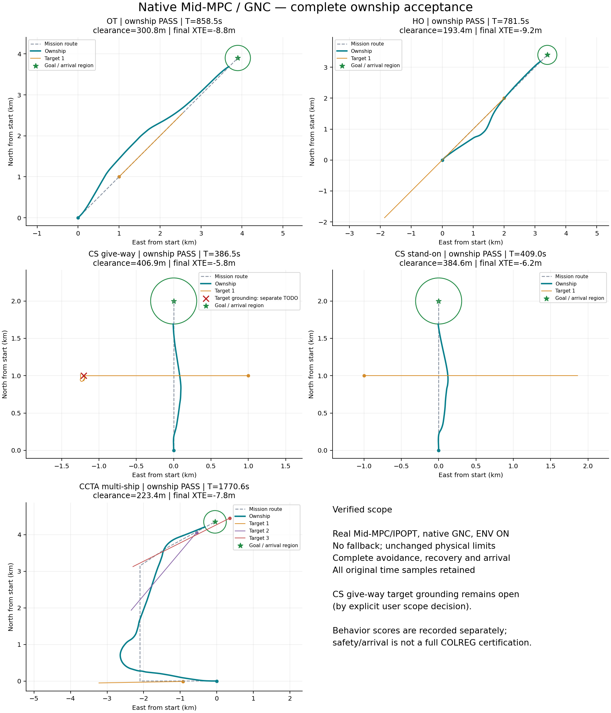

# Mid-MPC + native GNC + ENV ON: maneuver, recovery and arrival

## Accepted scope and result

Five requested ownship scenarios pass complete avoidance, mission recovery and shared arrival. Every case uses real CasADi/IPOPT, native original GNC, ENV ON, the original scenario, a 3000 s diagnostic ceiling and a 10 s solve period. The source fixtures select the `god` tracker. This is simulator acceptance for these tuples, not a claim about every tracker, environment or a MASS-L3 system release.

Completion requires the actual goal distance within 308.7 m, final-leg cross-track within the existing 20 m recovery tolerance, complete evaluation, Ship0 physical safety PASS and no fallback. A duration-only FINISHED is insufficient. All five runs share byte-identical algorithm, trajectory and evidence code. Catalog display wording was subsequently corrected to describe the timed contract; its before/after hashes are recorded separately. Immutable run manifests and source identities are preserved in the summary.

| Scenario | Arrival T (s) | Goal distance (m) | Final cross-track (m) | Min Ship0 hull clearance (m) | Real solver events | Global groundings |
|---|---:|---:|---:|---:|---:|---:|
| OT | 858.5 | 308.13 | -8.82 | 300.77 | 88 | 0 |
| HO | 781.5 | 307.98 | -9.25 | 193.41 | 77 | 0 |
| CS give-way | 386.5 | 306.58 | -5.81 | 406.92 | 36 | 1 |
| CS stand-on | 409.0 | 307.74 | -6.21 | 384.57 | 40 | 0 |
| CCTA multi-ship | 1770.6 | 308.56 | -7.80 | 223.39 | 188 | 0 |

All solver events returned SUCCESS, all executed the intended solver, and all cases have zero rejected candidates and zero fallback. SUCCESS includes independently accepted feasible/nonoptimal IPOPT iterates; it does not mean every solve reached global optimality. Global collision count is zero in all five runs. The paper scenario is the repository's `paper_ccta2023_multiship`, containing Ship0 and three targets, not a hand-made substitute.

Machine-readable results, source hashes, evaluator scores and immutable run IDs: [acceptance-summary.json](evidence/mid-gnc-trajectory-20260917/acceptance-summary.json).

## Maneuver evidence

Original user OT run: `80dfc2bb-eba4-42f9-a842-22dc297238eb`. It failed at T885.5 after an Infeasible IPOPT result; it was not merely a two-second timeout. The repaired OT completes at T858.5. Maximum cross-track drops from about 998 m to 329.52 m; maximum recovery COG from about 126 degrees to 61.93 degrees; maximum body yaw rate from 2.51 deg/s to 1.17 deg/s.

Initial alteration is about 15.54 degrees against the 45-degree mission course. It is not a claim that the initial angle became larger: first 5/10/15-degree alterations occur at T23.5/39.5/95.5 versus T68.5/76.5/87.0 in the original run. The confirmed maneuver criterion uses safe/capable angles, an early distinct action, stable passage and a smooth recovery, rather than a fixed universal turn angle. Apparent-maneuver and stand-on evaluator scores remain separately disclosed in the JSON; safety/arrival must not be relabeled full COLREG certification.

## Changes and verified causes

1. **Unify planning and execution (user-selected option A).** Mid-MPC publishes every optimized position/course/SOG sample, original issue time, sample interval, finite validity and current native route identity. No synthetic bulge, thinning, old mirrored-prefix pin or premature mission handback changes this timed trajectory. Historical spatial compilation remains available to its other callers.
2. **Independent native admission.** ARM checks measured initial state, finite geometry, integration, source yaw/speed/lateral-acceleration/radius limits, parent/reference identity, expiry and immutable renewals. Ordinary operator-route first-change protection remains active. Coordinate conversion and admission use the same source projection.
3. **Execute the intended time and speed basis.** Guidance consumes timed speed samples without previewing distant braking early, including zero, and converts SOG to body surge. Equivalent reanchored local segments preserve guidance recovery state. The source dynamics/control/allocation files are unchanged.
4. **Make epoch-zero state real.** The adapter invokes the source's unchanged odometry publisher before the first plan, without advancing time or integrating state. Clone/reset replay follows the same sequence. Otherwise the new initial-state admission correctly rejected T0 because no GeoPosition existed yet.
5. **Stop outward drift after a safe pass.** A mission-parallel reference is allowed only after the maneuver is achieved, the locked side has clearance and CV CPA clears every selected contact. Commitment and all safety constraints stay active. Give-way direction is previewed before confirmation without inventing a committed minimum alteration.
6. **Respect the finite route.** An unbounded cruise tail crossed the goal into ENC forbidden space. Recorded OT T654.5 violated static rows by about 862.58 m, after which seed repair found a route that missed the goal disk. Native trajectories now include physical-rate-limited terminal braking; the cruise floor yields only to this declared terminal schedule. Future final-leg entry is handled within a multi-leg prediction, not only after the measured vessel reaches that leg.
7. **Use one capture geometry and objective.** Separate direct-to-goal stopping and constant-lead LOS objectives disagreed with the 20 m capture predicate. The final native reference first captures the mission leg and then brakes; the NLP consumes that same reference. Recorded multi-ship T1657.2 changes from Converged/invalid capture after 110 iterations to a real admissible IPOPT iterate after 2 iterations, zero constraint violation and objective 0.2995 -> 0.2212. The initial seed was not substituted for an optimizer result.
8. **Require declared arrival to exist.** Both the iterate filter and independent L4 gate require actual goal-disk entry when the terminal reference declares it. Staying outside the disk can no longer pass capture vacuously. No arrival radius or recovery tolerance was widened.
9. **Do not postpone recovery every replan.** Timed trajectories already contain the measured sample zero. Their first future recovery reference now turns within the existing rate envelope instead of duplicating today's course. Historical non-timed numerical anchoring remains unchanged.
10. **Apply source turning limits in the NLP.** The 80 m native minimum radius and 0.25 m/s2 lateral acceleration are supplied through the immutable execution constraint. Existing ROT rows enforce their speed-dependent bounds without changing decision or row dimensions. Strict staged parameters expand; the unstaged frozen MASS_PARITY graph retains its numerical contract. A matching iterate check prevents angular numerical tolerance from admitting an invalid native radius.
11. **Preserve full-sample evidence without bulk unpacking.** Long 0.1 s multi-ship runs previously exited with code 137 during finalization. Packed evidence now has a lazy reiterable view; evaluator projection retains its exact consumed fields, solver summaries retain scalar metrics, and success/failure exporters use the view. No samples are dropped. Tests compare evaluator values, semantic hashes and exact Parquet bytes. The actual final multi-ship case successfully persisted its 625 MB trajectory and complete evaluation.

The original T885.5 capture-aware seed regression, route-end segment-index exception, eligible timeout publication and frozen iterate/publication geometry consistency are also covered. There are no scenario-ID branches, forced PASS results, fallback planners, looser physical bounds or reduced solver precision.

## Source identity and native verification

- GNC source manifest: `8590d52f4b3ee551ae390bb019ffca2a6ad434bd5659a6c92d8f54c870ff9e62`.
- Native v7 library: `78997104a85bfc5042698d5d9b702058700e342e6e6a0625669719d7ba652277`.
- Build: `build/gnc-planner-trajectory-v7-20260917`.
- Source checksum comparison confines changes to seven `ship_guidance` files and two message contracts. Dynamics, control and thrust allocation are byte-unchanged.
- Fresh route and velocity response characterizations pass the existing trajectory R2 >= 0.90 gate. The route approximation remains tau_course=87.0333 s, tau_speed=24.0675 s. These are measured approximations, not a claim that the nonlinear source is exactly first order.
- A4000 independently compiled the actual ROS Humble source in `/home/marine.huang/colav-gnc-oracle/mid-trajectory-20260917-v7`: 13 packages built. Source-only export omits CMake-listed test sources, so reference compilation used BUILD_TESTING=OFF; no ROS unit-suite pass is claimed.
- Current-source public ordinary route-contract output parity: coordinate transform 1941 calls/1800 outputs; ARM 1874 calls/20 outputs, no differences. New independent ROS vectors are committed beside the preserved historical vectors. This is callback parity for that sequence, not complete ROS timed-path closed-loop acceptance.
- Native tests separately cover timed admission/rejection, projection, stale identity, expiry, immutable renewals, timed braking, speed basis, initial state and clone/reset equivalence.
- ROS Humble generated invalid Python for an explicit empty-array default. The new optional course array uses the implicit ROS empty default, with only that added field receiving a native backward-compatibility default.

## Validation and reproduction

Final relevant regression: **413 passed, 1 pre-existing failure** in 453.76 s. The unchanged main at `65d5164e` independently reproduces that failure: `test_mid_mpc_multiship_closed_loop_is_safe_observable_and_recovers` expects exactly 3 global collisions but observes 0. Its ownship safety assertions pass. The assertion and scenario were preserved. Source baseline comparison is in `legacy_multiship_baseline.log` (553.20 s). Ten final import/evidence checks also pass; real frozen-seed tests were rerun after test-only formatting.

Ruff reports no new lint findings: 28 baseline findings versus 27 current across touched files (13 existing runtime findings remain). Thirteen touched Python files already fail formatting on main; those unrelated formatting changes were preserved. Newly added test files pass formatting. Both worktrees pass diff whitespace checks; GNC uses CR-at-EOL-aware checking to preserve its source line endings. The standalone C++ contract executable passes, including the low-speed radius counterexample. These are explicit baseline limitations, not a full-CI-green claim. Evidence logs live in `tmp/mid_gnc_20260917_followup/`; full runs and their exact RunSpec/seed/ENC hashes live in `tmp/mid_complete_20260916/<tag>/runs/<run_id>/`. The report summary gives each tag and ID. Diagnostic runs v5-v12 are not accepted runs; specifically, v11 lacked complete evaluation and acceptable route recovery, and v12 was intentionally interrupted after an unresolved frozen diagnostic was noticed.

The selected 3000 s diagnostic ceiling is unchanged. Actual arrival occurs within the repository scenario durations (OT/HO 1200 s, CS 600 s, paper 1800 s). Numerical and native physical limits are unchanged. Baseline lint/format findings are reported separately; a focused result is not a claim that the entire repository CI is green.

## Deferred target-vessel issue

By explicit user decision, the CS give-way target's terminal behavior remains a separate task. Its unchanged Viknes/FLSC/LOS route reaches the last waypoint near T285, continues at 7 m/s, then grounds at T314.7584. Ship0 remains clear. This case therefore passes ownship acceptance but not all-vessel grounding acceptance. No target route or scenario was changed to make the test pass.

## Deployment

Both local mains are updated: simulator code commits `07310676` (native trajectory/recovery/arrival) and `c35321ee` (bounded evidence export), plus `c5af7281` (catalog wording only); GNC `0bbce06` (timed source admission/guidance). The simulator default build symlink now resolves to `build/gnc-planner-trajectory-v7-20260917`. No environment override is needed for the default main checkout.

The existing `com.marine.colav-simulator.frontend` service was restarted on 8010; root and GNC catalog return HTTP 200. The actual default-loaded native module reports contract version 1 and the exact source/library hashes above. Default-main native admission/qualification/evidence smoke: **27 passed in 6.20 s**. The pre-restart unstarted CREATED session was saved to `tmp/mid_gnc_20260917_followup/8010-predeploy-session.json`; no running session was interrupted.

[Deployment verification](evidence/mid-gnc-trajectory-20260917/deployment-verification.json) and [test/lint baseline checks](evidence/mid-gnc-trajectory-20260917/validation-checks.json) record the exact scope. No remote push was performed. User research documents, papers and unrelated worktrees were preserved.
