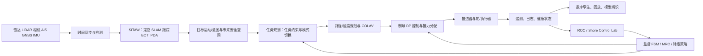

# SFI AutoShip WP1 AutoRemote：架构、发展链路与证据

**研究日期：** 2026-09-18  
**范围：** WP1 AutoRemote；重点是 MASS 的感知、SITAW、定位/跟踪、COLAV、任务规划、数字孪生、解释性和 milliAmpere 实船证据。  
**证据规则：** 优先使用 NTNU/SFI 官方页面、官方年度报告、论文原文/出版社页面和官方代码仓库；把项目目标、仿真结果、全尺寸海试、公开试运营分开记录。用户本地 PDF 只作为原文复核材料，关键结论均给出可追溯的公开来源。

## 1. 结论先行

WP1 AutoRemote 不是一个单独的 COLAV 算法项目，而是 MASS 自主闭环中从“环境/自身状态感知”到“决策、执行和异常回退”的研究包。NTNU 官方定义 WP1 的目标是：开发感知和决策系统，使 MASS 能完成任务，并在异常事件中具备 fallback；WP1 被明确分成两条主线：

1. **Task 1.1：SITAW 与传感器融合。** 为决策系统提供现有系统通常缺少的环境信息，长期重点包括海事 SLAM 和 extended object tracking（EOT），官方明确称二者仍处于低 TRL。
2. **Task 1.2：将 SITAW 接入自动控制。** 在最优控制和 AI 框架中实现自主决策，并由具备 MASS 所需可靠性和韧性的低层控制算法执行。

来源：[S1 WP1 AutoRemote 官方页面](https://www.ntnu.edu/sfi-autoship/autoremote)，第 13–16 行；[S2 WP1 Innovation Leads](https://www.ntnu.edu/sfi-autoship/wp-1-innovation-leads)。

从现有一手材料可以复原出一条比较稳定的技术主线：

上图是跨来源综合，不是 SFI 官方发布的一张单一系统图。它由 mA1 论文中的系统架构、mA2 论文中的实际 SITAW/COLAV/DP 结构、WP1 官方任务划分和 2025 年度报告共同归纳而来。证据显示，WP1 的工程重点一直是“模块化感知—规划—控制—监督闭环”，而不是端到端从传感器直接输出推进器命令。Autosea 官方方法页明确把 PDA 风格跟踪和基于 MPC 的避碰组合起来，并说明其目的之一是保留透明度、处理估计/数据关联/运动和意图不确定性。[S4](https://www.ntnu.edu/autosea)；[S5](https://www.ntnu.edu/autosea/approach)

## 2. WP1 的正式边界和研究人员/项目组织

官方 WP1 页面列出的负责人是 Edmund Førland Brekke。研究人员覆盖 Brekke、Morten Breivik、Anastasios Lekkas、Tor Arne Johansen、Martin Baerveldt、Miguel Hinostroza、Simon Lexau、Daniel Menges、Johannes Skarø、Trym Tengesdal、Emil Martens、Joel Jose、Mikkel Bergstrand、Henrik Flemmen 等。官方列出的博士/博士后项目包括：

- Situational awareness for autonomous ships；
- Mission planning systems for autonomous ships；
- Non-GNSS localization / SLAM；
- Multi-sensor object detection and classification；
- Autonomous docking；
- Explainability-centred AI collision avoidance；
- Digital Twin for Situational Awareness and Optimal Control（已完成）；
- Localization and tracking；
- Risk-based COLAV/anti-grounding（已完成）。

这些项目覆盖从感知到底层执行的完整链条，但“列在 WP1 页面”只证明其属于研究组合，不等于每项都已集成到同一艘船或达到运营级。来源：[S1](https://www.ntnu.edu/sfi-autoship/autoremote)，第 18–75 行。

## 3. 发展链路：从 Autosea 到 SFI AutoShip

### 3.1 Autosea：先形成可解释的模块化 COLAV 闭环

NTNU 官方页面把 Autosea 定义为“Sensor fusion and collision avoidance for autonomous surface vehicles”。其目标是开发自主船舶制导和导航方法，核心是 sense-and-avoid；官方称项目已在 Trondheimsfjorden 和荷兰 Den Helder 外海的自主/半自主水面艇上完成全尺寸避碰实验。项目与 DNV GL、Kongsberg、Maritime Robotics 紧密合作，合作方提供艇、传感器、导航和控制技术。[S4](https://www.ntnu.edu/autosea)

Autosea 的方法页给出更明确的技术路线：

- 传感器融合使用 PDA 风格目标跟踪，为量测—目标关联计算概率；
- COLAV 使用不同形式的 MPC，把风险评价编码进代价函数；
- 跟踪器输出不确定性，供 MPC 处理自身未来运动和他船未来运动的不确定性；
- 软件框架在 2015–2016 年开发，2017–2018 年完成多次全尺寸避碰实验。

这条路线的关键不是“某个 MPC 最优”，而是让感知不确定性能够沿接口传给决策和控制，并让系统保留可检查的中间量。[S5](https://www.ntnu.edu/autosea/approach)

### 3.2 milliAmpere1：把研究算法放到可重复的真实船试验平台

2022 年 NTNU/Autoferry 原文把 mA1 描述为 2017 年建造的半尺寸原型，mA2 于 2020 年建造；mA1 逐步增加自主能力，并被 MSc/PhD 广泛用作海事自主研究平台。论文明确说明 mA1 **不是商业客运认证船**，而是开发和测试运动控制、自主系统和传感器配置的平台。[S6](https://doi.org/10.1088/1742-6596/2311/1/012029)，PDF 第 1–3 页；本地复核副本：[milliAmpere—An Autonomous Ferry Prototype](</Users/marine/Documents/Paper/milliAmpere- An Autonomous Ferry Prototype.pdf>)。

mA1 的硬件/软件基线如下：

- 船长 5.0 m、船宽 2.8 m，最多 6 人，但未获商业客运认证；
- 两台电动 azimuth 推进器；
- RTK GNSS compass、IMU；
- X-band radar、LiDAR、5 个可见光相机、5 个红外相机；
- ROS 将运动控制拆成原子节点，以 publish/subscribe 连接；
- DP 节点跟踪姿态/轨迹，推力分配节点把期望广义力映射到推进器速度和角度；
- 本地控制面板和远程 joystick 用于人工控制/监督。

论文中的 mA1 系统架构图把 Localization and sensors、Autonomy/SITAW/Supervisory control、Vessel control and monitoring、Thrusters/Electric system 分成模块，说明研究代码从一开始就围绕接口和可替换组件组织。[S6](https://doi.org/10.1088/1742-6596/2311/1/012029)，PDF 第 2–4 页。

### 3.3 mA1 上的 COLAV 不是单一路线

mA1 原文明确区分多种研究算法：

1. **SP-VP（Single Path Velocity Planner）**：固定名义路径，在 path-time 空间进行搜索，通过避开障碍边和速度/障碍距离代价生成时间参数化航迹；配合 reference filter、ROS 运动控制和 FSM，实现自动过河、靠离泊、MRC 回退。它适合狭窄、固定航线的渡船场景，但固定路径会限制一般航行中的 COLREG 航向变化。
2. **CBF + encounter-specific domains**：根据 Rule 13–15、17 分类，为目标船建立规则相关 domain，把控制 barrier function 放进二次规划，以期望 DP 广义力为基准进行避碰；论文称该方法在 Kanalen 使用 mA1 和休闲船目标完成实验验证，目标由 LiDAR/radar 跟踪，静态障碍由 ENC 与 LiDAR 共同处理。
3. **自动 docking**：从仅 GNSS 反馈的轨迹优化，发展到融合 LiDAR/超声波、在线更新凸可行域，处理未映射障碍和地图/GNSS 误差。

因此，mA1 的“已经做过海试”不能被翻译成“所有 WP1 COLAV 都在船上运行”；应当逐篇核对算法、场景和闭环接口。[S6](https://doi.org/10.1088/1742-6596/2311/1/012029)，PDF 第 5–8 页。

### 3.4 mA1 感知/定位证据

原文给出了比较有用的可复现实验边界：

- 基本 SITAW 用 RTK-GNSS 导航，雷达和 LiDAR 检测/跟踪；IPDA 把各传感器的 cluster centroid 关联到既有目标或创建新目标，并计算目标存在概率。
- 相机管线先去 Bayer、去畸变，再通过 YOLOv4 输出边界框和类别；相机无直接距离信息时使用相机高度进行地理配准，并用地图过滤岸边/系泊目标。
- 雷达/LiDAR/相机/红外的不同融合配置被比较；在无系泊船干扰的数据上，LiDAR 与相机 bearing 融合提高了跟踪精度并缩短了目标丢失时间。
- LiDAR SLAM 验证航迹约 1060 m、636 s；断开 RTK-GNSS 后仍运行 LiDAR odometry、IMU 和 loop closure，后半段平均二维位置误差 2.3 m，端到端误差 0.9 m。

这些数字是 mA1 的特定数据集/实验，不应外推成港口全工况精度保证。[S6](https://doi.org/10.1088/1742-6596/2311/1/012029)，PDF 第 8–11 页。

### 3.5 Shore Control Lab：把“远程接管”变成可测量的系统问题

mA1 论文将 NTNU Shore Control Lab 作为自主船基础设施的一部分，提出三条设计原则：操作员理解自主系统在“想什么”；操作员有足够 SITAW 能在需要时接管；操作员可以随时打开/关闭自主模式。mA1 论文描述约 10 Gbps 私有 5G 网络、屋顶基站、视频、雷达、LiDAR、GNSS、推进/电源状态、网络 DP joystick 和双向音频；这里的 10 Gbps 是论文对网络架构/带宽的描述，不是无线链路吞吐实测结果。[S6](https://doi.org/10.1088/1742-6596/2311/1/012029)，PDF 第 11–12 页。

这不是纯 UI 项目：论文把最大响应时间（从发现危险、接管到取得足够 SITAW 的时间）作为可测量指标，并用 Unity/Gemini 仿真构造可重复的交通场景，研究眼动、瞳孔、心率和皮肤电等人因数据。当前 SFI 基础设施页也说明 Shore Control Lab 与虚拟模拟器和真实自主水面船相连，目标是研究人与 AI 协同的韧性自主系统。[S17](https://www.ntnu.edu/sfi-autoship/infrastructure/)。

## 4. milliAmpere2：从研究原型到受监管的运营尝试

### 4.1 工程化系统架构

2025 年 JOMAE 论文是目前最完整的 mA2 一手系统与试验描述。论文指出 mA1 的目标是研究平台，而 mA2 的目标是面向公众过河演示的系统原型；mA2 于 2021 年下水，运营区域是 Trondheim 城市港区一条约 100 m 的运河。mA2 研究围绕人因设计、电池/推进、自主导航与控制、远程监视/控制、风险评估五个问题组织。[S7](https://doi.org/10.1115/1.4067370)；本地原文：[The Autonomous Urban Passenger Ferry milliAmpere2](</Users/marine/Documents/Paper/The Autonomous Urban Passenger Ferry milliAmpere2- Design and Testing.pdf>)。

mA2 的实际架构可概括为：

- **传感器：** 2 LiDAR、8 RGB 相机、4 IR 相机、X-band radar、RTK GNSS、IMU、靠泊超声波；输入通过 SenTiBoard 做时间戳/同步。
- **SITAW：** 雷达/LiDAR 点云过滤岸线和码头后聚类，视觉采用 YOLOv4 检测，多个异构传感器输入 IPDA，输出目标位置和速度。
- **控制：** 双天线 RTK-GNSS + IMU；DP 有人工和自主模式；自主模式接收 autonomy computer 生成的 waypoint/trajectory。
- **COLAV：** 论文明确写明 mA2 运营区域选择 **SP-VP**；SP-VP 把 ferry 约束在名义路径上，在 path-time 图中避开障碍，并通过代价维持名义路径和期望速度。
- **降级：** SITAW 数据缺失或性能退化时进入 minimum-risk condition，DP 转为 station-keeping/停止过河；另有两个 emergency stop 切断推进器电源。
- **岸基：** ROC 与 mA2 使用 4G/5G，另有 DP 厂商提供的 5.8 GHz C-band；数据中心提供数据存储、加密访问，通信架构用 AADL 做网络安全设计。2025 论文另称数据中心到 ROC 的服务器传输速度为 10 Gbps；这是数据中心/ROC 侧链路描述，不是 4G/5G 或 C-band 无线吞吐实测值。[S7](https://doi.org/10.1115/1.4067370)，PDF 第 6 页。

最重要的边界是：**mA2 论文不支持“mA2 运行了 WP1 全部 MPC/RL/COLAV 研究成果”的说法。** 它明确说多个 COLAV 算法曾在 mA1 上测试，mA2 为受限运河 ODD 选择了 SP-VP。[S7](https://doi.org/10.1115/1.4067370)，PDF 第 4–6 页。

### 4.2 2022 公开试运营的真实证据

mA2 的公开试验不是完全无人运营：

- 2022 年进行了三周公众试运营；
- 为满足挪威海事局指南，船上始终有安全操作员；
- 论文把目标系统描述为 Degree 4，并讨论在需要人工干预时转入 Degree 3（远程控制/无人船员）的设计关系；2022 试验仍由船上安全操作员执行，不能据此说这些人工干预已经由 ROC 完成；
- 试验期间约需要 25 次人工干预；
- 一个边界案例是 SITAW 把本船尾流当成目标，COLAV 试图“避让”尾流而加速；另一个是暴风雨后的漂浮树叶被跟踪，导致停车；诊断和软件修复均在观察到问题后 24 h 内完成；
- 论文称常规运行总体能正确跟踪目标并避免潜在碰撞，但其保守策略是对所有横越交通停止，而不是完整按 COLREG 机动；作者认为该策略适合有休闲船和皮划艇、且水流较强的城市运河。

这些是非常有价值的“运营反馈—故障归因—软件更新”证据，但不能写成“无安全员的自主载客运营已完成”。论文还指出，移除船上安全员、转为 ROC 运营仍是未来工作；计划先使用能看见渡船的岸边 local operation center，再逐步过渡到 ROC。[S7](https://doi.org/10.1115/1.4067370)，PDF 第 7–9 页。

### 4.3 2025 mA1 硬件与现场辨识证据

2025 年 OMAE 论文摘要报告 mA1 经过推进器和电气系统升级后进行了初步全尺寸实验，验证船上硬件/软件和各子系统在中等天气下正常运行。文中列出的工程系统包括四台 azimuth 电推进器、CAN 总线、RTK GNSS/IMU、Linux 工控机和 ROS 软件、LiDAR、海事雷达、5 个 EO 与 5 个 IR 相机，以及 radio joystick 和 emergency stop。[S8](https://omae.secure-platform.com/a/solicitations/246/sessiongallery/20241/application/155401)；论文 DOI：`10.1115/OMAE2025-155401`。

同年 IEEE Access 论文报告 mA1 的 model identification、dynamic positioning 和 thrust allocation 的现场试验结果，说明 WP1/控制研究不仅停留在仿真，但这类结果主要证明建模/控制子系统现场可运行，不能自动等同于完整 COLAV 或运营级安全验收。[S9](https://doi.org/10.1109/ACCESS.2025.3593251)。

## 5. 2025 年 WP1 研究组合和 TRL 边界

SFI AutoShip 2025 年度报告把 WP1 概括为 situational awareness、sensing 和 control，并在商业化/创新组合页给出下列 TRL。TRL 是项目自己的成熟度标记，表示研发结果组合的阶段，不等于船级社认证或完整 ODD 接受。

| WP1 结果 | 年报明确证据 | 年报 TRL | 应如何理解 |
|---|---|---:|---|
| Radar-based SLAM / GNSS fallback | 研究陆地附近 GNSS 失效时的雷达定位/建图 | 3 | 研究原型/概念验证，不能写成运营级 GNSS 替代 |
| Portable maritime sensor rig | 便携式 sensor rig 已在真实环境测试 | 5 | 有代表性环境验证，仍不是全船系统认证 |
| Digital twin / adaptive control | Daniel Menges PhD、预测监测、在线辨识和自适应控制 | 3 | 主要是仿真/算法验证；论文自己要求真实世界验证 |
| COLAV simulation framework | Scenario Generator、Simulator、Evaluator，已开源 | 5 | 验证工具链达到功能原型/相关环境验证；不是 COLAV 算法本身达到 TRL 5 |
| Autonomous docking | mA1 上 LiDAR 感知、adaptive pose selection 的闭环海试 | 5 | 具体 docking 能力有全尺寸实验；不能外推到所有海况/码头 |

来源：[S3 SFI AutoShip Annual Report 2025](https://www.ntnu.edu/documents/1294735132/0/Report_Autoship_2025%2B%281%29.pdf/f4c482e5-324d-62b6-7308-6800e2cd0d13?t=1774619753064)，印刷页 18、23–30、52；本地副本：[Report_Autoship_2025 (1).pdf](</Users/marine/Documents/Paper/Report_Autoship_2025 (1).pdf>)。报告还明确写到 WP1 的 2025 重点是实时适用性、最优性/可解释性解释、LiDAR docking 闭环实验、CUDA symbolic programming accelerator、radiometric radar odometry、camera/LiDAR free-space estimation、EOT 和多运动模型；2026 年重点是缩小最优性与实时性的差距。[S3]

### 5.1 2025 年创新 leads 的实际分层

官方 WP1 innovation-leads 页面列出以下研究成果。网页本身把内容分为 “Active” 和 “Completed” 标题，但没有对每个条目标注可审计的时间戳或验收记录；因此下面把它们作为研究组合和技术方向，不把页面条目自动当成已部署功能。

| 方向 | 官方拟解决的问题/方法 | 可确认的验证边界 |
|---|---|---|
| Autonomous docking | 规划算法、低层控制、风流动态障碍下的安全/能耗 docking | 年报称 mA1 有 LiDAR 闭环 docking 实验；RL-NMPC 仍需海试验证 |
| Transparency and explainability | 给已有 COLAV/grounding avoidance 提供人能理解的实时解释和交互界面 | 年报称论文投稿/与 Shore Control Lab 合作；不是 mA2 无人运营能力 |
| EOT + localization | 将 tracking、mapping、localization 联合，显式处理不确定性 | 研究成果和真实数据论文；不是所有传感器已统一上船闭环 |
| Radar localization and mapping | GNSS 失效时用雷达作为近岸 fallback | 年报 TRL 3 |
| Caspar multi-sensor detection | 从符号表达式生成 CUDA kernel，加速非线性优化 | 年报把它列作潜在实时优化能力，不等于已在 mA2 控制回路运行 |
| Safe-space estimation | 综合动态交通、静态障碍、船体尺寸和不确定性，直接预测未来可航空间 | FUSION 论文使用真实 mA2 数据做 free-space 估计，但仍属于感知/预测组件 |
| Mission planning | ROS + temporal planner，处理任务顺序、时长、同步和 contingency | 官方页面称系统已部署 mA1；2026 论文进一步报告 mA1 现场验证 |
| Digital twin | 预测监测、环境力估计、碰撞规避控制、异常检测、在线辨识 | 2025 年报 TRL 3；Nature 论文的核心验证为模拟，明确要求真实世界验证 |
| COLAV simulator/evaluator | ENC grounding、标准/随机/AIS 场景、传感器噪声/故障、COLREG 评分、外部 COLAV 接口 | 年报称已开源、TRL 5；Kongsberg 2025 使用以静态场景为主，动态场景扩展仍是计划 |
| Portable sensor rig | 快速取得高质量海事数据 | 年报 TRL 5；不能据此推断大规模长期运营数据管线已完成 |

来源：[S2](https://www.ntnu.edu/sfi-autoship/wp-1-innovation-leads)、[S3](https://www.ntnu.edu/documents/1294735132/0/Report_Autoship_2025%2B%281%29.pdf/f4c482e5-324d-62b6-7308-6800e2cd0d13?t=1774619753064)。

## 6. WP1 感知融合、EOT 和安全空间：从“目标点”走向“可规划空间”

### 6.1 EOT 和运动约束跟踪

2025 年 IEEE Access 论文将海上 LiDAR extended-object tracking 具体化为 motion-constrained ICP + ESKF 的 3D tracker，作者用真实海事数据评估，并报告其相对二维 GP-EOT 对 wake-induced noise 更有韧性、状态和目标 extent 估计更好。[S13](https://doi.org/10.1109/ACCESS.2025.3582327)。这解释了 WP1 为什么不满足于把他船表示成一个点：船体尺寸、点云形状、尾流噪声会直接改变碰撞几何和预测安全裕度。

另一篇 2025 IEEE Aerospace 论文使用 Gaussian-process extent model，并把 LiDAR/stereo scene flow 与 EOT 融合；其 DOI 为 `10.1109/AERO63441.2025.11068504`，论文元数据和摘要可从 [NTNU WP1 publications](https://www.ntnu.edu/sfi-autoship/autoremote) 与 [IEEE DOI](https://doi.org/10.1109/AERO63441.2025.11068504) 追溯。当前证据支持“真实海事数据上的跟踪研究”，不支持“已成为 mA2 运营主闭环”的更强说法。

### 6.2 Free-space estimation

WP1 Safe-Space lead 的目标是让规划器直接查询未来仍可航的空间，而不是只消费目标船的位置和速度。官方 innovation lead 明确要求同时考虑动态交通、静态障碍、船体 extent、检测不确定性以及 AIS 缺失。[S2](https://www.ntnu.edu/sfi-autoship/wp-1-innovation-leads)

2025 FUSION 论文把 stereo camera 的水面分割与 LiDAR 深度结合，用垂直平面矩形（stixels）表示视线内障碍，并用 mA2 真实采集数据做实验；SINTEF 的公开条目称定性评估显示在复杂环境中能可靠估计可航水域，但没有把它宣称为完整闭环 COLAV 验收。[S14](https://www.sintef.no/en/publications/publication/10266491/)。

## 7. 数字孪生：控制自适应的研究证据与部署边界

2025 Scientific Reports 论文提出 DRL + NMPC，用 DRL 调整 NMPC 参数并在线识别未知模型参数，目标是让数字孪生随实体船动态同步。论文报告的是仿真：在其测试设置中，DRL 调参相对手工 NMPC 显著改善航迹误差和 waypoint 成功率，并得到平均约 2.6%、最大低于 10% 的模型参数相对误差。[S10](https://www.nature.com/articles/s41598-025-93635-9)；本地 PDF：[Digital twin syncing](</Users/marine/Documents/Paper/Digital twin syncing for autonomous surface vessels using reinforcement learning and nonlinear model predictive control.pdf>)。

需要保留两个限制：

- 论文明确指出 RL 在安全关键海事部署中存在验证和可解释性困难；
- 结论明确写出还需要真实世界 validation tests，不能把这篇论文写成 mA1/mA2 上已运行的 DRL-NMPC 控制器。

年度报告把“Digital twin methods for adaptive control”列为 TRL 3，和论文的仿真性质一致。[S3]、[S10]。因此，WP1 数字孪生的现实价值更接近“把数据、模型辨识、预测控制和回放纳入闭环研发资产”，而不是用 3D 可视化替代真实 V&V。

## 8. 任务规划：从局部避碰到任务/模式/回退管理

WP1 官方 innovation lead 把 mission planning 定义为 MASS autonomy stack 中缺少的高层模块：解释高层命令、处理时空约束、生成可执行任务并应对 contingency。官方条目把 temporal planning、uncertainty modeling、RL 和 LLM-assisted planning 写成概念/后续研究方向；这些内容不能视为已部署功能。当前能由 2026 出版物确认的现场实现是 STP/temporal planner，不包括 RL 或 LLM 已接入 mA1 控制闭环。[S2](https://www.ntnu.edu/sfi-autoship/wp-1-innovation-leads)

2025 年报描述的 mA1 ROS mission-planning framework 采用 Simple Temporal Problem，处理任务顺序、持续时间和同步，并已在 mA1 上作为研究平台使用；报告同时列出 OMAE 硬件/软件论文、mA1 现场辨识和为三篇路径规划/COLAV 硕士论文提供的实验执行。[S3]，印刷页 25。

截至 2026 年，出版社页面进一步报告了 mA1 上 temporal mission planner 的现场实验验证：系统使用 STP 管理导航、装卸和 docking mode 等高层动作，通过 ROS 接入 GNC；评估包括 ROS 仿真和 sheltered-basin field experiments，路径规划使用 A* 加迭代平滑/B-spline。该证据可以称为“mA1 上任务规划的现场验证”，但它仍是受控水域研究试验，不等于开放海域或商业运营接受。[S16](https://www.sciencedirect.com/science/article/pii/S0029801826016926)，DOI `10.1016/j.oceaneng.2026.125858`。

## 9. COLAV 仿真/评估工具：WP1 对工程验证最可复用的产物

Tengesdal 和 Johansen 的 CCTA 2023 论文提出并公开了 COLAV simulation/evaluation framework。论文摘要明确列出：

- standard scenarios + random variations；
- 基于历史 AIS 的场景数据库；
- 目标船可用预定义航迹，也可运行自身 COLAV 做主动/反应式避碰；
- 可配置目标跟踪/SITAW 不确定性；
- ENC grounding hazards；
- Evaluator 按 COLREG、安全和其他性能指标评分；
- 作为验证/保证工具，也可在线或离线调节 COLAV planner。

来源：[IEEE Xplore CCTA 2023](https://ieeexplore.ieee.org/document/10252863/)、[NTNU 作者原文 PDF](https://torarnj.folk.ntnu.no/colav_simulator.pdf)、[官方 GitHub 仓库](https://github.com/ntnu-itk-autonomous-ship-lab/colav-simulator)。

官方仓库说明该框架于 2025 年秋季开源，核心包括 `Simulator`、`ScenarioGenerator`、`Visualizer` 和 Gymnasium/RL 接口，可选 `seacharts`、`rrt-rs`、`vimmjipda`；代码仓库还明确说外部 COLAV 应通过 `ICOLAV` 接口接入。[S12](https://github.com/ntnu-itk-autonomous-ship-lab/colav-simulator)

2025 年度报告的 Kongsberg 使用案例补充了工程边界：框架由 Scenario Generator、Simulator、Evaluator 三部分组成，外部第三方 COLAV 可直接控制 ownship；但 Kongsberg 当时主要用预先分类的静态场景，计划扩展到动态交通。报告还说明，让 target vessel 运行自己的 COLAV 可避免固定航迹目标造成不真实的 head-on/stand-on 行为，降低 ownship 的过度机动。[S3]，印刷页 53。

因此，`colav-simulator` 对用户当前项目最有启发的地方不是“有一个仿真器”，而是把 **场景生成、被测算法接口、他船行为、传感器退化/故障、ENC 约束、COLREG/安全评分和回放** 组合成可审计验证资产。与此同时，TRL 5 只对应验证框架/工具链，不代表接入其中的每个 COLAV 求解器都已达到同一成熟度。

## 10. 解释性与人机协同：WP1 与 ROC 的接口

WP1 官方 innovation lead 将 explainability 目标表述为：为已有碰撞/搁浅规避系统提供界面，以便人类监督者理解系统为什么采取某个动作；年报称 2025 年提交了关于 automation transparency 的会议论文，并与 Shore Control Lab 合作开发交互式可解释界面。[S2](https://www.ntnu.edu/sfi-autoship/wp-1-innovation-leads)；[S3]，印刷页 24。

2026 年论文 “Why This Avoidance Maneuver?” 提出 contrastive explanation：把系统实际选择的轨迹与名义轨迹/替代机动比较，显示碰撞风险、效率、COLREG 或其他可解释目标的差异。四名有经验海员的探索性用户研究表明，这种对比有助于理解复杂多船场景，但也可能增加认知负荷；作者因此建议按需/按场景提供解释，而不是所有场景一直显示详细解释。[S15](https://arxiv.org/abs/2604.08032)

这与 mA2 运营经验相互印证：自动化并没有消除人工责任，真实系统需要在目标误跟踪、异常加速、停车、通信退化或交通复杂时解释当前状态、给出可接管窗口和 MRC。解释模块的验收应包括导航员是否能及时判断“继续/接管/拒绝机动”，而不能只验收界面上是否出现文字。

## 11. 产学研结合的实际机制

SFI AutoShip 官方主页将中心定义为 8 年期 research-based innovation centre，2020 年 12 月启动，拥有 20 多个挪威海事产业伙伴，覆盖终端用户、产品/服务供应商、研究机构、大学和政府；中心目标同时包含 SITAW、AI、autonomous control、digital infrastructure、shore control、风险和无人船责任问题。[SFI 官方主页](https://www.ntnu.edu/sfi-autoship)

WP1 的产学研链路可以按证据分为四层：

1. **基础方法：** NTNU 的估计、控制、AI、风险和人因研究，形成跟踪、SLAM、MPC、DP、任务规划等模块。
2. **开放研究平台：** mA1 作为可重复的真实船研究平台，允许不同研究生/博士项目共享传感器、ROS、控制和数据。
3. **工程/运营原型：** mA2 把前代研究组合到电推进、冗余、DP、SITAW、SP-VP、通信和 ROC，并经过公众试运营；同时以安全操作员、MRC 和 NMA 指南约束 ODD。
4. **开放软件、数据和论文：** COLAV simulator 开源；WP1 持续发表传感器、控制、任务规划、数字孪生和人因论文；研究结果通过 SFI innovation leads、TRL 和 industry workshops 进入伙伴对话。

这条链路的实质不是“论文—直接上船”，而是“论文/算法 → 共享实验平台 → 受限实船闭环 → 运营日志与故障归因 → 软件/模型更新 → 再验证”。mA2 尾流误跟踪和树叶误报在 24 h 内修复的案例，正是这一闭环的具体证据；同时也揭示当前系统仍依赖 ODD、保守策略和现场人工监督。

## 12. 对 MASS/COLAV 项目可直接借鉴的验收边界

基于上述证据，研究或工程报告中应把以下说法分开：

| 说法 | 可接受证据 | 不应直接推出 |
|---|---|---|
| 感知算法有效 | 真实传感器数据、目标跟踪误差、EOT/free-space 评估 | 全船 COLAV 在复杂交通安全 |
| COLAV 算法有效 | 闭环仿真 + 明确目标行为 + COLREG/安全指标 + 现场试验 | 商业 ODD 或法规接受 |
| mA1 实船验证 | 某一算法/子系统在 mA1 特定水域完成的闭环实验 | 所有 WP1 方案均在船上运行 |
| mA2 公开试运营 | 2022 三周公众试验、船上安全操作员、约 25 次人工干预及修复 | 无人、无安全员、开放水域商业运营 |
| 数字孪生有效 | 模型同步/辨识、仿真预测、回放与现场数据对齐 | 已完成实船实时闭环部署 |
| 仿真框架 TRL 5 | 工具链可配置场景、外部算法、故障、评分、开源 | 接入该框架的算法自动获得 TRL 5 |
| 解释性有效 | 导航员在复杂场景中的理解、接管判断、响应时间、负荷 | 画出轨迹或生成解释文字就代表可安全接管 |

这组边界与用户正在开发的 COLAV Simulator 直接相关：应分别报告原始 G3/碰撞安全、COLREG 机动质量、仿真复现、单船/多船闭环、传感器退化、MRC/接管和真实船试验结果。

## 13. 主要来源

1. [SFI AutoShip WP1 AutoRemote 官方页面](https://www.ntnu.edu/sfi-autoship/autoremote)
2. [SFI AutoShip WP1 Innovation Leads 官方页面](https://www.ntnu.edu/sfi-autoship/wp-1-innovation-leads)
3. [SFI AutoShip Annual Report 2025 官方 PDF](https://www.ntnu.edu/documents/1294735132/0/Report_Autoship_2025%2B%281%29.pdf/f4c482e5-324d-62b6-7308-6800e2cd0d13?t=1774619753064)；本地副本：[Report_Autoship_2025 (1).pdf](</Users/marine/Documents/Paper/Report_Autoship_2025 (1).pdf>)
4. [Autosea 官方项目页](https://www.ntnu.edu/autosea)
5. [Autosea Approach 官方页](https://www.ntnu.edu/autosea/approach)
6. Brekke et al., [“milliAmpere: An Autonomous Ferry Prototype”](https://doi.org/10.1088/1742-6596/2311/1/012029)，JPCS 2311 (2022) 012029；本地副本：[PDF](</Users/marine/Documents/Paper/milliAmpere- An Autonomous Ferry Prototype.pdf>)
7. Eide et al., [“The Autonomous Urban Passenger Ferry milliAmpere2: Design and Testing”](https://doi.org/10.1115/1.4067370)，JOMAE 147 (2025) 031409；本地副本：[PDF](</Users/marine/Documents/Paper/The Autonomous Urban Passenger Ferry milliAmpere2- Design and Testing.pdf>)
8. Hinostroza et al., [“milliAmpere1 Autonomous Ferry Prototype: Hardware and Software”](https://omae.secure-platform.com/a/solicitations/246/sessiongallery/20241/application/155401)，OMAE2025-155401，DOI `10.1115/OMAE2025-155401`
9. Hinostroza et al., [“Model Identification, Dynamic Positioning, and Thrust Allocation System for the milliAmpere1 Autonomous Ferry Prototype: Field Trial Results”](https://doi.org/10.1109/ACCESS.2025.3593251)，IEEE Access 13 (2025)
10. Berg et al., [“Digital twin syncing for autonomous surface vessels using reinforcement learning and nonlinear model predictive control”](https://www.nature.com/articles/s41598-025-93635-9)，Scientific Reports 15, 9344 (2025)；本地副本：[PDF](</Users/marine/Documents/Paper/Digital twin syncing for autonomous surface vessels using reinforcement learning and nonlinear model predictive control.pdf>)
11. Tengesdal & Johansen, [CCTA 2023 paper](https://ieeexplore.ieee.org/document/10252863/)、[作者公开 PDF](https://torarnj.folk.ntnu.no/colav_simulator.pdf)
12. [NTNU Autonomous Ship Lab 官方 COLAV Simulator 仓库](https://github.com/ntnu-itk-autonomous-ship-lab/colav-simulator)
13. Dalhaug et al., [“Motion Constrained Point Cloud Matching for Maritime Tracking”](https://doi.org/10.1109/ACCESS.2025.3582327)，IEEE Access 13 (2025)
14. Skarø et al., [“Stixel-Based Free Space Estimation for USVs Using Stereo Camera and LiDAR”](https://www.sintef.no/en/publications/publication/10266491/)，FUSION 2025
15. Jose et al., [“Why This Avoidance Maneuver? Contrastive Explanations in Human-Supervised Maritime Autonomous Navigation”](https://arxiv.org/abs/2604.08032)，arXiv 2604.08032 (2026)
16. Hinostroza, Lexau & Lekkas, [“Field experimental validation of temporal AI-based mission planning for a maritime autonomous surface ship”](https://www.sciencedirect.com/science/article/pii/S0029801826016926)，Ocean Engineering 359 (2026), 125858
17. [SFI AutoShip Infrastructure 官方页](https://www.ntnu.edu/sfi-autoship/infrastructure/)

**研究状态说明：** 本文件只新增 WP1 证据笔记；未修改代码、配置或其他已有文档。
