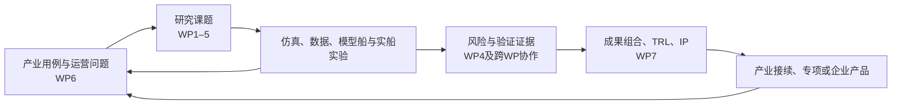
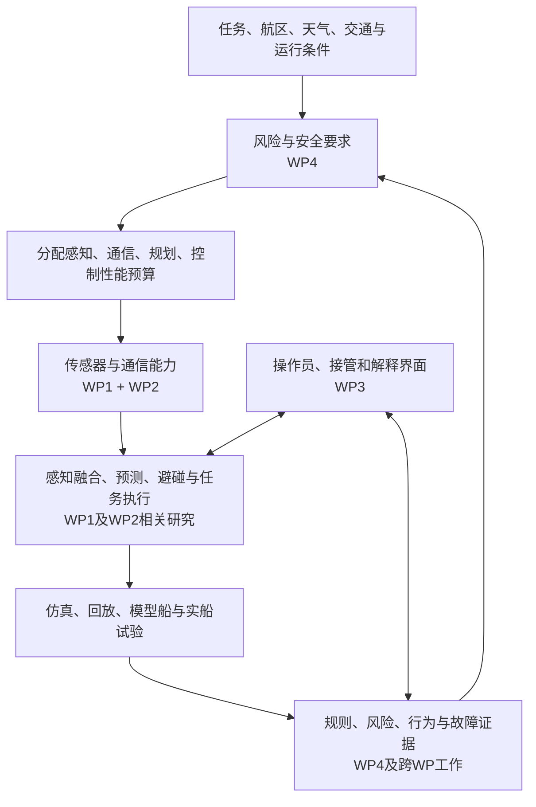

# SFI AutoShip：项目架构、发展链路与 WP1 / WP2 / WP4 研究

调研日期：2026-09-18。对象：NTNU 主持的 SFI AutoShip，重点 MASS 自主航行与避碰。以 2025 年报为组织与成果基线，补充截至调研日可核实的官方网页、论文原文及 2026 年更新。

## 1. 结论与上下文校正

**SFI AutoShip 值得学习的是一套把产业问题、研究模块、试验设施、安全论证和产业接续组织起来的机制。它没有一份覆盖所有论文、所有船舶的统一量产软件架构。** 本文因此分开呈现：组织架构、研发及产业转化链、具体船舶技术架构、验证基础设施，以及三大 WP 的成果及成熟度。

已经读取原 ChatGPT 对话《调研避碰系统工程化方案》。保留其中“算法、数据、仿真、实船、安全证据应形成闭环”的问题意识；其中有关你当前仓库能力、船舶技术规格和资源投入比例的判断，本次没有重新做源码或船厂文件审计，不作为已核实事实。旧回答本身不作为文献证据。

需要先纠正五个容易混淆的边界：

1. **Autoferry / milliAmpere 早于 SFI AutoShip。** milliAmpere1 自 2017 年用于研究；SFI 中心于 2020 年 12 月启动，周期 2020–2028。不能把前期船舶、全部关联项目和后续企业成果都写成 SFI 单独完成。[SFI 官方](https://www.ntnu.edu/sfi-autoship)；[milliAmpere 原型论文](https://doi.org/10.1088/1742-6596/2311/1/012029)
2. **SFI AutoShip 与欧盟 AUTOSHIP 是不同项目。** 后者为 H2020 815012，2019-06 至 2023-11，协调方 PNO Innovation；合作机构可能重叠，但成果统计与 WP 划分不能混用。[欧盟项目记录](https://cordis.europa.eu/project/id/815012)
3. **8 个 WP 不等于 8 个技术研发包。** WP1–5 是主要专题研究，WP6 用例集成，WP7 创新及商业化，WP8 管理、沟通与传播。官网研究页只列前七个，年报 p.17 解释了差异。[2025 年报](https://www.ntnu.edu/documents/1294735132/0/Report_Autoship_2025.pdf/9dc32b39-98e6-93ff-fd55-695a9da0dbd0)；[研究总览](https://www.ntnu.edu/sfi-autoship/research)
4. **milliAmpere2 的公众试运营不等于已经持续无人商业运营。** 2025 设计论文报告的是 2022 年三周试运营，所有航次都有船上安全员，约 25 次人工干预；论文明确讨论尚不能移除安全员的技术及监管约束。这是该论文时点的状态，不外推为 2026 年全部运营状态。[设计与测试论文，§3](https://doi.org/10.1115/1.4067370)
5. **WP 名称不是软件分层。** WP2 也做态势感知、航迹规划与 COLREG 可测试化；数字孪生跨 WP1、WP3、WP4；mHUD、Oceanscape 官方主要归在 WP3。按论文标题把所有感知放 WP1、所有仿真放 WP2、所有验证放 WP4，会误读实际分工。[WP2](https://www.ntnu.edu/sfi-autoship/digital-infrastructure)；[WP3](https://www.ntnu.edu/sfi-autoship/roc)

## 2. 中心如何组织产学研

### 2.1 治理与学科基础

2025 年报 p.12–15：中心由 NTNU 信息技术与电气工程学院的工程控制论系（ITK）主持，涉及 NTNU 三个学院、六个系。研究伙伴还有 SINTEF Ocean、SINTEF Digital、IFE、University of Oslo。2025 年报统计 23 个伙伴；这是一份年度快照，不与不同时间官网或社交主页数字混合。[年报](https://www.ntnu.edu/documents/1294735132/0/Report_Autoship_2025.pdf/9dc32b39-98e6-93ff-fd55-695a9da0dbd0)

| 层次 | 2025 年组织与作用 |
|---|---|
| Centre Board | 主席 Øystein Engelhardtsen，DNV；产业、研究与公共部门参与治理 |
| Centre Management | 主任 Anastasios M. Lekkas；副主任 Roger Skjetne、Svein Peder Berge |
| Scientific Advisory Committee | Thor I. Fossen 主持，提供科学咨询 |
| Innovation and Commercialisation Advisory Committee | Equinor 的 Kjetil Skaugset 主持，连接价值与转化判断 |
| NTNU 工程控制论、电子系统 | 感知、估计、控制、通信等技术基础 |
| 海洋技术、海洋运营与土木工程 | 船舶、海洋作业、模型试验、安全与运行问题 |
| ICT and Natural Sciences、设计系 | 数据/算法及人机交互等互补能力 |
| SINTEF / IFE / UiO | 工业研究集成、人因试验、法律等跨机构能力 |

表中学科作用为根据人员与课题进行的归纳，不表示每个 WP 只由一个系负责。原始组织图已核对年报 p.13。

### 2.2 八个 WP 的职责地图

| WP | 正式方向 | 2025 年负责人 | 对整体闭环的作用 |
|---|---|---|---|
| 1 | AutoRemote | Edmund Førland Brekke，NTNU | 形成感知、决策、控制与异常应对能力 |
| 2 | Digital Infrastructure | Pierluigi Salvo Rossi，NTNU | 研究支撑自主/遥控运行的信息、通信、协同及数据能力 |
| 3 | ROC & Human Factors | Ole Andreas Alsos，NTNU | 研究人如何理解、监督、接管系统 |
| 4 | Safety & Assurance | Ingrid B. Utne，NTNU | 风险、设计安全、验证、法律及保证证据 |
| 5 | Sustainable Operations | Pauline Bellingmo，SINTEF | 物流、能耗、港口及作业经济环境效益 |
| 6 | Use Cases | Svein Peder Berge，SINTEF | 将 WP1–5 组合到产业场景，提供数据与试验机会 |
| 7 | Innovation & Commercialisation | Kjell Olav Skjølsvik，NTNU | 创新机会、知识产权、成熟度、技术转移 |
| 8 | Management, Communication and Dissemination | 年报未像前七个给出独立负责人卡片 | 中心管理、传播与协作维持 |

来源：[年报 p.13、17](https://www.ntnu.edu/documents/1294735132/0/Report_Autoship_2025.pdf/9dc32b39-98e6-93ff-fd55-695a9da0dbd0)。WP8 名称按年报文字描述展开，未臆造负责人。

### 2.3 为什么产业参与能进入研究过程

官方 WP6 描述了明确机制：每个用例由终端用户、产品/服务商、研究机构、大学及主管部门共同参与；典型用例项目持续 2–3 年，产业方深度参与；达到适当成熟度后交由产业内部或后续专项继续开发。WP6 同时承担用例规格、运营数据管理、成果集成、仿真/模型船/实尺度演示四类任务。[WP6](https://www.ntnu.edu/sfi-autoship/use-cases)

WP7 则负责创新能力、IP 管理、知识转移。年报 p.51–52 说明他们维护成果组合，使用 TRL 1–9 加简化 KTH Innovation Readiness Level 维度评估，不仅数论文。[WP7](https://www.ntnu.edu/sfi-autoship/innovation)；[年报](https://www.ntnu.edu/documents/1294735132/0/Report_Autoship_2025.pdf/9dc32b39-98e6-93ff-fd55-695a9da0dbd0)

2025 年四类产业用例揭示了研究范围远大于小渡船：

| 用例 | 产业问题及年报记录 | 对自主航行的启示（本文分析） |
|---|---|---|
| UC1 Deep Sea Bulk Shipping | Grieg Star；周期性无人驾驶台 B0、运营传感器数据质量 | 先研究特定功能/时段无人化及数据可信性 |
| UC2 Short-Sea Container Shipping | NCL；岸基人员操作多船起重机，缓解人员不足 | 自主船运营收益可能来自作业组织，而非只来自航行算法 |
| UC3 Ferries | Torghatten Flakk–Rørvik 渡船；自动靠泊与能耗，先分析两艘船运营数据 | 用现有船人工操作建立量化基线，再提出自动化收益 |
| UC4 Offshore Support Operations | Equinor、Fugro、Reach Subsea、Kongsberg 等相关伙伴；无人水面平台支持 ROV | 船岸协作、监管及一人多船仍是核心挑战 |

来源：年报 p.49–50。Reach Remote 的成熟产品体现更广泛长期产业合作；不能把产品整套技术或全部开发工作归于 SFI。milliAmpere 是关键试验设施，也不是上述四类产业用例的总称。

**本文归纳的产学研闭环：**



图为基于官方职责的综合归纳，不是 NTNU 发布的软件调用图。

## 3. 发展链路：从可试验原型到限定场景运营

更早的 Autosea 已形成“概率跟踪 + MPC”的模块化路线：2015–2016 软件开发，2017–2018 在挪威和荷兰开展全尺寸避碰实验，产业伙伴提供平台、传感器和控制技术。这是与 Autoferry 相邻且相互关联的基础，不是把所有历史项目合并为 SFI。[Autosea 官方方法说明](https://www.ntnu.edu/autosea/approach)

| 时期 | 可核实事件 | 该阶段解决的问题 |
|---|---|---|
| 2016–2017 | NTNU 启动城市自主渡船探索；milliAmpere1 2017 年下水并用于研究 | 获得可修改、可装传感器、可做控制实验的实体平台 |
| 2018 | milliAmpere 命名；大量跨学科学生项目持续参与 | 把一次性样机转为长期研究设施 |
| 2019 | Zeabuz 成立，承接 NTNU 自主渡船技术商业化 | 形成大学之外的产品化主体 |
| 2020 | Gemini 传感器仿真论文；Shore Control Lab 建设启动；12 月 SFI 启动 | 扩充数字与人因实验能力，并形成长期联合研究中心 |
| 2021 | 2022 原型论文记载 milliAmpere2 于 2021 年 6 月下水 | 加强冗余、可靠性、载客和持续运行所需设计 |
| 2022 | milliAmpere2 三周公众试运营；ROC 中开展虚拟船监督/接管研究 | 同时获取真实乘客、交通、操作员与故障经验 |
| 2023 | Zeabuz 技术进入 Torghatten / Zeam 的 Stockholm MF Estelle 商业航线 | 显示研究生态有产业接续，但与 milliAmpere2 试运营是不同案例 |
| 2024–2025 | 中心增加实船、模型辨识、感知、验证及产业共同研究；2025 完成中期评估 | 从研究概念向可集成、可试验成果推进 |
| 2026–2028 | 年报提出后期聚焦成熟成果；2026 testbed v5 继续公开模型、软件与试验边界 | 把研究积累变成可复用能力，产业继续承担后续成熟化 |

来源：[NTNU 原型论文](https://torarnj.folk.ntnu.no/icmass%20milliampere%202022.pdf)、[Autoferry 新闻](https://www.ntnu.edu/autoferry/news)、[NTNU/Zeabuz 学生项目说明](https://www.idi.ntnu.no/education/fordypningsprosjekt.php?p1_1=1&p1_2=1&p1_3=1&p1_4=1&p1_5=1&p3_11=1&s=2)、[Zeam 2023 揭幕公告](https://www.mynewsdesk.com/se/zeam/pressreleases/vaerldens-foersta-kommersiella-autonoma-passagerafaerja-invigd-3258263)、年报 p.7、[testbed v5](https://arxiv.org/abs/2505.06787v5)。

时间冲突：个别机构影响力总结将 milliAmpere2 下水写作 2020；原型技术论文明确写 June 2021。本表采用直接技术论文，并保留此差异，避免拼成一个虚假精确时间线。2026–2028 一栏也不意味着这些未来目标已全部完成。

### 3.1 milliAmpere1 与 milliAmpere2 的真正分工

**milliAmpere1：研究自由度高的工程验证平台。** 2022 原型论文总结了运动规划、控制、避碰、靠泊、多目标跟踪、定位的实船实验；周边还包括 sensor rigs 和岸控实验室。2025 年仍在更新硬件软件、开展模型辨识、DP、推力分配、任务规划与避碰试验。它没有因 milliAmpere2 出现而失去作用。[原型论文](https://doi.org/10.1088/1742-6596/2311/1/012029)；年报 p.23–25。

**milliAmpere2：将算法放入载客运行约束的 living lab。** 设计不仅考虑导航，还包括乘客上下船、甲板、供电、冗余推进、船岸通信、操作员、风险评估与主管部门批准。论文五个研究问题分别覆盖人本设计、能源推进、自主导航控制、远程监控、风险安全。[设计论文](https://doi.org/10.1115/1.4067370)

2022 公众试运营的实际策略非常有启发性：采用适合狭窄运河的 **SP-VP（Single Path Velocity Planner）**，沿标称路径在路径—时间空间规划速度；保守让行横穿交通。不能由“NTNU 发表很多 MPC”推出“milliAmpere2 试运营使用全部这些 MPC”，也不能把局部运河策略直接迁移为开放海域通用 COLREG 决策。[同论文 §2.3.4、§3.1]

### 3.2 真实系统架构：论文明确展示了什么

以下依据 milliAmpere2 论文 Figure 6、Table 2、§2.3–2.4，表示文中系统；不声称是 2026 最新配置。

```text
外感知：雷达 / LiDAR / 可见光 / 红外
    ↓ 时间戳、同步、标定；各传感器检测处理
SITAW：异构多传感器融合与目标跟踪
    ↓ 障碍物状态估计
自主决策 / SP-VP / 靠泊：生成航点与轨迹参考
    ↓
工业 DP 系统 ← GNSS / IMU / 风传感器；备用定位
    ↓
推力控制 → 四个方位推进器

船岸：5G 主数据网 + 4G 备份 + 5.8 GHz 专用 DP 遥控链路
    ↕
Shore Control Lab / ROC / 数据中心

并行安全路径：手动终端及备用终端；性能降级时 DP 定点；急停切推进器电源
```

重要细节：

- Table 2 列出的传感器不代表每次试验全部进入融合。2022 公众试运营的外感知使用雷达与 LiDAR；同年另有仅光学相机的避碰实验。
- SenTiBoard 用于准确时间戳及同步；传感器融合与原始数据可用性存在具体硬件基础。
- 原始 radar spokes 经本船导航信息映射、地图滤波和聚类，形成检测；融合采用 IPDA 系列方法。不能只关注规划器而跳过检测/关联质量。
- 当态势感知等性能降级，自主系统转入 minimum risk condition，DP 定点保持。**这依赖该渡船可全向控制、局部水域及尚可用的定位/推进，不是所有 MASS 的通用失效处置。**
- 图中 autonomy computer 与 DP 系统分离；4G/5G 和专用 DP 无线链路也有不同职责。数据中心到 ROC 的 10 Gbps 不等于船岸无线链路达到 10 Gbps。

### 3.3 运营经验如何反推研究

2025 论文 p.8 对 2022 试运营给出具体证据：

| 真实观察 | 诊断 | 对研发的意义（本文分析） |
|---|---|---|
| 约 25 次人工干预 | 试运营也在探查自主系统边界 | 必须记录接管原因，不能只统计碰撞数 |
| 无明显理由加速 | SITAW 把本船尾流当作目标，COLAV 加速避让 | 规划行为异常可能源于上游虚假目标 |
| 风暴后停车 | 漂浮落叶被跟踪成目标 | 环境扰动应进入检测、融合及行为回归场景 |
| 两类边界问题在发现后 24 h 内修复 | 操作员日志→工程师诊断→软件更新 | 数据、事件记录、复现与更新组织，是实船进步的关键 |
| 乘客认为“无人安全员”也可接受 | 实际航次始终有安全员；“没有安全员”是想象题 | 用户信任问卷不能代替安全证明或无人运行证据 |

这些结果不能计算成可靠的长期接管率：文中约 25 次是三周试验累计，且带测试目的；没有足够一致的暴露量与事件严重度定义支持跨系统对比。

## 4. 验证基础设施：多条互补路线

### 4.1 milliAmpere2 / TRUSST：OSP + Gemini + ROS + 工业控制软件

Torben 2023 博士论文收录的 *Towards Contract-based Verification for Autonomous Vessels*，论文内 pp.17–19、整本 PDF pp.117–119，描述：NTNU、Zeabuz、DNV 在 TRUSST 中合作的仿真环境，以 OSP/FMI 承载传统海事模型，Gemini/Unity 承载虚拟世界和外感知传感器，ROS 运行自治软件，供应商平台运行商用运动控制系统；支持自治软件精确副本的 SIL。[论文原文](https://assor.folk.ntnu.no/PhD%20Thesis/PhD_Thesis_Torben.pdf)；[期刊 DOI](https://doi.org/10.1016/j.oceaneng.2023.113685)

这是关联项目的技术证据，不能称为 SFI 已发布一套可直接安装的统一产品。该论文还主张：组件验证可简化无关模块，提高搜索覆盖；顶层集成才加入更完整环境。高保真不是每个测试都必须付出的成本。

一个非常具体的契约例子：若顶层要求安全距离 10 m，跟踪误差上界 1 m，则规划参考需至少 11 m；再考虑目标估计误差上界 3 m，规划相对估计目标的保证增至 14 m。这些是论文演示值，不是海事通用标准。价值在于把安全裕量分配到模块，并明确各模块假设。[同论文内 p.17]

### 4.2 MC-Lab：数字—物理分级验证

本地 *Digital-physical testbed…* 为 arXiv:2505.06787v5，2026-07-17 版本。它给出的路线是：

```text
低保真模型：快速模块与控制逻辑试验
       ↓
mcsimpy：3/6 DOF、船体水动力、波浪载荷等控制相关模型
       ↔ Stonefish：需要图像/传感器反馈的算法试验
       ↔ Unity：MC-Lab 与船舶状态可视化、远程交互
       ↓
ROS 2 / Python / C++ 共用模块 → 水池模型船实物试验
       ↓ 论文提出的进一步验证路径
milliAmpere1 / Gunnerus 等更大尺度平台
```

这里的 C/S 舰队共用 ROS 2 软件栈，不能倒推旧 Gemini 或 milliAmpere2 历史软件已经全部迁移 ROS 2。它与前一节是不同设施/项目脉络，而不是一个总仓库的两个配置。[testbed v5](https://arxiv.org/abs/2505.06787v5)

这篇论文特别值得读其**验证误差**：44 组水池试验中，模型波浪载荷整体偏高；Figure 4 拟合斜率 surge 1.63、sway 1.30、yaw 2.08，即使 R² 较高，也不能说绝对值预测准确。作者解释船体几何、吃水与质量差异，并明确缩比、黏性/非线性、推进器试验覆盖与不确定性传播的限制。它展示了“说明模型能用于什么”的研究习惯，而非证明数字孪生全面等价实船。[本地 v5，pp.7–8、13–14]

论文给出 [mcsimpy](https://doi.org/10.5281/zenodo.17274093) 和 [C/S 软件](https://doi.org/10.5281/zenodo.17233653) 发布 DOI；本次网页工具未能打开两个归档，故仅确认论文有发布指针，未验证下载、构建或许可证。

### 4.3 Shore Control Lab：把人也放进验证闭环

本地文件名为 *Shore Control Lab: A research infrastructure…*，但 PDF 内正式题名为 *NTNU Shore Control Lab: Designing shore control centres in the age of autonomous ships*，2022，DOI 10.1088/1742-6596/2311/1/012030。其设施包括两艘渡船、岸控室、研究人员观察/记录区域、利益相关方观察室、Gemini、混合现实设施和码头基础设施。[论文](https://doi.org/10.1088/1742-6596/2311/1/012030)

作用是系统研究监督、接管、界面、负荷与态势恢复。能够连接真实船和虚拟船，不代表多船无人运营已经获证。mHUD 也需放在这条人因链路理解：本地 2025 论文以 12 名航海学生进行桥楼仿真实验，证据支持该实验条件下的可用性/态势感知发现，不能直接推出实船事故率下降。[mHUD 论文](https://doi.org/10.1017/S0373463325101124)

## 5. WP1 AutoRemote：感知—决策—控制的研究主线

负责人 Edmund Førland Brekke，工程控制论系。官方分两大任务：**Task 1.1：SITAW 与传感器融合；Task 1.2：把 SITAW 接入自主决策与自动控制**。长期关注 maritime SLAM、extended object tracking，以及最优控制/AI 与可靠底层执行的组合。[WP1](https://www.ntnu.edu/sfi-autoship/autoremote)

### 5.1 具体课题、人员、产物与边界

| 研究线 / 代表研究者 | 要解决的问题 | 已有工作与证据边界 |
|---|---|---|
| Non-GNSS localization — Henrik Flemmen | GNSS 不可靠时如何持续定位 | 雷达里程计/SLAM；2025 年报 radar-SLAM TRL 3，不能作为全航区 GNSS 替代保证 |
| EOT + localization — Martin Baerveldt | 密集狭窄水域中，目标形状、运动与本船定位相互影响 | 联合跟踪、定位、地图与概率关联；GP 船体轮廓、多运动模型；2025 仍推进实时闭环 |
| Detection / sensor rig — Emil Martens | 数据采集困难，复杂优化实时算力不足 | 便携海事采集装置；Caspar CUDA 符号优化加速；采集 rig 年报 TRL 5，不等于 Caspar 已部署到运营控制 |
| Free / safe space — Johannes Skarø | 目标列表不能直接表达未来哪里可走 | stereo camera + LiDAR stixels；真实 mA2 数据上的自由空间研究；未来概率安全空间是进一步研究目标 |
| Docking — Simon Lexau | 港池、风流、障碍和定位误差下安全靠泊 | LiDAR-based tracking + adaptive pose selection 的闭环海试；年报 TRL 5；RL-NMPC 仿真与后续海试计划要分开 |
| Mission planning — Miguel Hinostroza；Mikkel Bergstrand 新课题 | 从局部规划提升到任务顺序、时长、同步和异常处理 | ROS temporal planning；2025 mA1 平台，2026 有受控水域现场验证论文 |
| Digital twin — Daniel Menges / Adil Rasheed | 模型参数漂移、环境力变化及控制预测误差 | 模型同步、预测控制、RL 调参；年报 adaptive DT TRL 3，主要论文仍属仿真研究 |
| Explainability — Joel Jose | 监督者理解避让原因和备选动作 | 反事实/对比轨迹解释，关联 Shore Control Lab；小样本探索性评价，非安全接管保证 |
| COLAV / anti-grounding — Trym Tengesdal | 系统测试覆盖、COLREG/安全评价与算法比较 | COLAV simulator、场景生成、ENC 与独立评价；年报框架 TRL 5 |

来源：年报 pp.18–27、52，以及 [WP1 innovation leads](https://www.ntnu.edu/sfi-autoship/wp-1-innovation-leads)。表中的人名用于追踪研究线，不表示一人包办整项工作。

### 5.2 感知研究为何与避碰行为直接相关

WP1 正从“目标位置/速度”扩展到“存在性、几何形状、关联不确定性、可航空间”。2025 *Motion Constrained Point Cloud Matching for Maritime Tracking* 采用运动约束点云匹配和误差状态滤波，以真实海事数据评估；stixel 论文则把水面图像分割与 LiDAR 深度结合，重建视线中的障碍/自由空间。前者有助于减少尾流等点云干扰，后者让未知或非 AIS 目标也进入可航区域判断。[点云跟踪](https://doi.org/10.1109/ACCESS.2025.3582327)；[stixel 论文机构记录](https://www.sintef.no/en/publications/publication/10266491/)

本地商船跟踪论文也很值得纳入：SINTEF Digital 与 Kongsberg Discovery 使用 **2 部雷达、12 部相机和导航仪器**，采用 JIPDA、loopy belief propagation 近似关联以及 PHD 轨迹初始化；为每种传感器设置 visibility 状态，使“该传感器暂时看不见”不自动等于“目标不存在”。但是论文明确**没有 ground truth**，只能据其实验材料谨慎判断跟踪效果，不能声称获得严格绝对精度验证或自主避碰闭环证明。致谢说明主体工作来自 PROXIMA（282324），SFI（309230）支持论文完成；年报收录此成果，不代表整个商船系统由 SFI 单独开发。[论文](https://doi.org/10.1016/j.oceaneng.2025.121610)；[SINTEF 记录](https://www.sintef.no/en/publications/publication/0198cc96f850-fe6c0695-dbf0-4ee4-b2f1-d92014431e47/)

需要区分三个阶段：真实数据离线效果 → 船上实时感知 → 感知接规划的闭环结果。年报对 EOT 的描述仍明确把“最优性与实时性差距”列为 2026 重点；不能将一篇跟踪论文当成整船避碰的验收。

与你的“避碰不自然”直接相关的推论是：同一次频繁改航向，可能由目标漂移、轨迹存在性切换、威胁判断或优化器重规划引起。milliAmpere2 尾流案例已经给出上游误检引发下游异常行为的真实例子。因此需要跨模块同一时间轴，而不只保存规划器最终轨迹。

### 5.3 控制、建模与任务规划的工程递进

2025 *Model Identification, Dynamic Positioning, and Thrust Allocation System for the milliAmpere1 Autonomous Ferry Prototype: Field Trial Results* 给出了实体船辨识、DP 与推力分配验证；它是“基础执行与模型得到现场检验”的证据，并非每个避碰算法都完成运营安全验证。[论文](https://doi.org/10.1109/ACCESS.2025.3593251)

2026 *Field experimental validation of temporal AI-based mission planning for a maritime autonomous surface ship* 继续把任务规划通过 ROS 接入 GNC，包含高层航行、装卸触发和靠泊模式等动作，在仿真及 sheltered basin 做验证。这是任务层向实船推进的清晰证据；它不同于给 COLAV 增加一种 cost，也不同于完全开放水域自治。[出版社摘要](https://doi.org/10.1016/j.oceaneng.2026.125858)

2025 年 mA1 硬件论文还报告推进/电气升级；因此引用“mA1 两推进器”或“四推进器”都应附版本。本文不把不同年份配置拼接成一艘固定不变的船。[OMAE2025 摘要](https://omae.secure-platform.com/a/solicitations/246/sessiongallery/20241/application/155401)

### 5.4 数字孪生与学习：能支持什么

*Digital twin syncing for autonomous surface vessels using reinforcement learning and nonlinear model predictive control*（2025）研究 RL 调节 NMPC 和模型参数，以仿真展示模型同步/控制性能。论文明确需要真实世界验证。其价值是说明模型和控制可以随数据更新，而非证明生产系统已经可以不经验证在线改变控制器。[论文](https://www.nature.com/articles/s41598-025-93635-9)

本地 Menges 2024 DT 论文也属于这一研究脉络；与 Gemini 的传感器渲染、WP2 Radio Twin、WP4 safety twin 不是同一个“孪生产品”。对你当前系统可借鉴的流程是：真实数据 → 候选参数 → 独立数据检验 → 回放/闭环回归 → 版本化采用。这是本文建议，不是宣称 NTNU 所有设施采用此统一发布流程。

### 5.5 可解释性与行为质量

*“Why This Avoidance Maneuver?”*（2026）比较被选轨迹与替代轨迹，使监督者看到风险与其他目标之间的差异。论文的探索性研究仅四名有经验海员；复杂场景可能更易理解，但信息负荷也增加。不能把解释越多等同接管越安全。[论文](https://arxiv.org/abs/2604.08032)

对“人类般自然”航行，当前证据支持先分解安全、COLREG 行为、轨迹连续性、执行器活动与操作员理解，再研究学习方法；本次未找到足以证明 SFI 已完成通用“熟练船员式端到端 COLAV”的证据。

### 5.6 开源仿真框架的产业用途

Tengesdal / Johansen 的框架将场景生成、Simulator、Evaluator 结合，覆盖标准/随机/历史 AIS 场景、可配置 SITAW 误差、目标船主动反应和 ENC 搁浅风险。[作者论文](https://torarnj.folk.ntnu.no/colav_simulator.pdf)；[NTNU 上游仓库](https://github.com/ntnu-itk-autonomous-ship-lab/colav-simulator)

年报 p.53 进一步记录 Kongsberg 使用案例：当时主要使用预分类静态场景，动态交通扩展仍在规划。产业采用是真实信号；其边界也应保留。框架 TRL 5 不会自动给接入的 COLAV 算法赋予 TRL 5。

### 5.7 WP1 成熟度快照

年报 p.52：radar-based SLAM 3；sensor rig 5；adaptive-control DT 3；COLAV validation simulator 5；autonomous docking 5。这些数值属于不同成果，不可平均成“自主系统 TRL 4.2”，也不可代替批准文件。

## 6. WP2 Digital Infrastructure：可信信息、通信与协作闭环

负责人 Pierluigi Salvo Rossi，电子系统系。WP2 把船、岸控中心和其他交通参与者视为分布式 maritime IoT：节点观察不同、设备不同、链路不对称、环境随时间改变。其重点是**信息是否及时、足够、可信地到达需要它的决策节点**。[WP2](https://www.ntnu.edu/sfi-autoship/digital-infrastructure)

### 6.1 正式四任务

| Task | 官方研究内容 | 对 MASS 的含义（本文分析） |
|---|---|---|
| 2.1 | 自主船、RCC 与其他交通之间通信技术方案 | 任务对带宽/时延/可用性的需求应先于链路选型 |
| 2.2 | radio/radar、cooperative、massive MIMO、sensor fusion | 用分布式观测补船载盲区，研究海事传播与感知性能 |
| 2.3 | cooperative/system-provided information 的协议和原型 | 将局部信息变成可协同决策的数据与交互 |
| 2.4 | 防 bitstream manipulation、spoofing、meaconing、jamming | 处理错误/恶意信息及链路不可用造成的物理风险 |

这些是任务定义。未找到已部署海事 massive-MIMO 产品或覆盖所有列举攻击的实船闭环验收，故不把任务名视为完成项。

### 6.2 Radio Twin 与海上通信模型

**Giacomo Melloni / Torbjörn Ekman** 研究视距、镜面反射、海面散射与衰落；2025 论文关注海面大尺度散射场相位分布。海上通信不能只依据距离估计“有没有网”，平静海面也可能因反射引起不利链路条件。[EuCAP 2025](https://doi.org/10.23919/EuCAP63536.2025.10999707)

**Manju James / Kimmo Kansanen** 的 Radio Twin 以实验与合成信道数据训练模型，目标是预测通信性能、帮助选择通信方式/物理层配置和提前降级。年报记录 Gaussian-mixture 密度估计等研究，通信建模与 ML 性能预测均为 TRL 2。它是**无线信道孪生**，不是船舶动力学孪生，也不是已经部署完成的自动链路调度器。[WP2 innovation leads](https://www.ntnu.edu/sfi-autoship/wp-2-innovation-leads)；年报 pp.30–32、52。

### 6.3 岸基雷达与低可观测目标

**Lukas Herrmann / Egil Eide** 研究 ship–shore radar network、低 SNR 目标检测和 track-before-detect。岸基站点可向覆盖区船舶提供额外轨迹信息，降低对单船传感器视角的依赖。年报将网络概念列 TRL 3；2025 newsletter 报告两站点、四套雷达，但硬件网络存在不能直接证明其已接入载客避碰控制。

代表成果：

- *Target Detection in Maritime Radar Tracking Based on Spatial Image Gradients*：低信噪比雷达检测，含真实海事雷达数据验证。[论文](https://doi.org/10.1109/JSEN.2025.3569085)
- *Histogram-Probabilistic Multi-Hypothesis Tracking with Integrated Target Existence*：把目标存在性与轨迹管理加入直方图概率多假设跟踪。[作者预印本](https://arxiv.org/abs/2504.20526)

对你的系统，关键研究接口不是只接收一个岸基目标点，还包括观测年龄、参考坐标、误差、身份/来源以及与本船 track 的关联；后半句是工程推论，公开资料没有统一生产级消息契约可直接照抄。

### 6.4 协同避碰与决策支持

**Melih Akdağ / Tor Arne Johansen** 的研究跨通信与航迹决策：多目标轨迹规划可生成/排序候选路线，2025 年报列 TRL 5。另有去中心化协商协议研究，利用异步通信及分布式约束优化进行协同避碰，并报告仿真和现场实验。[协同避碰论文](https://doi.org/10.1109/TCST.2025.3619554)

这说明 WP2 不只“搬运比特”，也研究交换信息后如何合作。但实验协商协议不等于跨厂商船舶已经采用的航海通信标准；参与船不合作、丢包或消息过期时的行为仍需单独验收。

### 6.5 对你最重要的一条：从避碰后果反推感知需求

**Peter Keenan Morris / Pierluigi Salvo Rossi，与 DNV 合作**：Data Fusion in Maritime IoT simulator 将传感器噪声、目标估计、故障和避碰放进闭环，观察信息质量如何改变 CPA、碰撞及规则表现。官方把下面两篇列入 WP2：

1. *From COLREG compliance to performance requirements for situational awareness systems in autonomous navigation systems*（2025）。[论文](https://doi.org/10.1088/1742-6596/3123/1/012010)
2. *Leveraging Collision Avoidance Robustness to Establish Situational Awareness Requirements: A Closed Loop Simulator Approach*（2025）。[论文](https://doi.org/10.3850/978-981-94-3281-3_ESREL-SRA-E2025-P3941-cd)

它们研究的方向可以概括为：

```text
给定遭遇、船舶能力、COLAV 与安全/规则要求
  → 改变噪声、精度、更新/检测等感知条件
  → 跑闭环与规则/稳健性评价
  → 找出失败边界
  → 形成该条件下的感知性能要求
```

此处“需求”是场景/模型/算法相关结果，不能直接作为任意 MASS 的采购阈值。其价值在于把传感器指标与最终航行行为关联，也将 WP2 与 WP4 的验证问题接通。更详细方法与限制见下节 WP4 的跨 WP 证据。

### 6.6 网络安全与当前公开缺口

官方 Task 2.4 明确覆盖网络—物理攻击。关联 NTNU 研究有 AADL 通信架构、GNS3 仿真、通信/网络安全 testbed，以及导航数据异常与纵深防御研究。[通信架构](https://doi.org/10.1177/1748006X211002546)；[网络安全 testbed](https://doi.org/10.1007/978-3-030-95484-0_1)

这些材料有助于建立威胁模型和试验平台，但当前公开证据未提供统一生产级认证、跨厂商协议、海试攻击数据集或完整切换 KPI。milliAmpere2 的多链路与加密数据访问属于具体系统实现，也不足以证明 WP2 全部安全任务已完成。

## 7. WP4 Safety & Assurance：风险进入设计、控制与证据

负责人 Ingrid B. Utne，海洋技术系。WP4 的对象包括技术、软件、网络安全、人和组织；不只评价两船有没有相撞。[WP4](https://www.ntnu.edu/sfi-autoship/safety)

### 7.1 四任务与实际课题

| Task | 正式范围 | 核心问题 |
|---|---|---|
| 4.1 | 运行中的风险管理 | 系统能否监测状态、识别危险并减轻后果？ |
| 4.2 | 设计安全与 fail-safe | 故障、冗余、失效传播及降级行为是否在设计时解决？ |
| 4.3 | 系统验证与仿真 | 如何经济、可重复地覆盖大量正常和边界情形？ |
| 4.4 | 法律、责任、风险接受、标准与保证 | 谁接受何种风险？现有规则如何应用于自主操作？ |

年报 pp.38–46 的课题地图：

| 人员 / 课题 | 具体工作 | 证据状态 |
|---|---|---|
| Susanna Dybwad Kristensen — Online risk modeling | STPA 扩展、软件失效分类、Bayesian network 风险模型接入路径规划 | 仿真与 Grethe ASV field trials；相关 online risk lead 年报 TRL 5 |
| Raffael Wallner — Safety demonstration using DT | 代表性场景、真实控制单元对应的虚拟模型、模型选择与安全证明 | 方法研究；年报 safety DT validation TRL 2 |
| Spencer Dugan — Drift grounding / loss of command | 推进、电力生成/分配失效的频率、维修时间、冗余、风险缓解 | 事故与 AIS 数据研究；年报 TRL 3；2026-02 博士答辩 |
| Ayoub Tailoussane / UiO — COLREG 法律 | 法律定义与机器执行困难，自主船适用规则问题 | 法律研究及论证，不是现行规则豁免 |
| Emir Cem Gezer — Risk-aware safeguarding control | 正常/回退模式切换，symbolic control、STL、NMPC、CBF；模块化试验床 | 数字与模型船试验；testbed 年报 TRL 3 |
| Sreekant Sreedharan — Assurance languages/tools | Legata 可计算法规语言、场景仿真、合规证据 | 研究平台/工具方向；需要审查规则解释与覆盖范围 |
| Jon Estil Krågebakk — AI / sea-state safety | 极化 stereo + GNSS/IMU；用 REEF3D/Blender 生成波面训练数据 Ægir-Frames | 数据生成与环境估计研究；不是海试传感器全面验证 |
| Paul Lee — Risk-aware AI | 训练中嵌入碰撞概率估计和可解释风险；与 DNV 合作 | 年报展示仿真案例，不能作为已部署安全控制器 |

来源：[2025 年报](https://www.ntnu.edu/documents/1294735132/0/Report_Autoship_2025.pdf/9dc32b39-98e6-93ff-fd55-695a9da0dbd0)，pp.38–46、52；[WP4 公开研究清单](https://www.ntnu.edu/sfi-autoship/safety)。**本地德国作者的 *Towards Safety Aware AI Agents* 与 Paul Lee 的 SFI 课题不是同一篇工作。**

### 7.2 在线风险：让风险信息真正影响动作

该研究脉络将危险识别与控制连接：

```text
运行概念 / 控制结构
 → 危险、失效、风险影响因素
 → 动态风险模型与不确定性
 → 风险感知路径 / 监督控制
 → 模式选择、通知、降级或终止
```

这是一组方法的综合路线，不是一个统一实现已经完成全部功能。代表源头是 *Towards supervisory risk control of autonomous ships*（2020）。[论文](https://doi.org/10.1016/j.ress.2019.106757)

2025 *Evaluating the effect of risk metrics for supporting operational decision-making by autonomous surface vehicles* 比较不同风险度量对路径选择的影响，并有仿真和实体 ASV 试验。实质问题是：事故发生概率、人员风险、经济损失不是同一个目标；换一个风险数值定义，最优航迹也可能改变。[论文](https://doi.org/10.1016/j.oceaneng.2025.121937)；年报 p.39。

对 MASS 避碰的推论：必须说明风险对应的事件、预测时间、后果与接受准则，不能仅设一个无语义的 `risk_score`。CPA 是几何指标，不能涵盖动力丢失、搁浅、人员暴露或人工接管失败。

### 7.3 为什么 WP4 研究动力、电力和维修

Dugan 的研究关注 loss of command：如果推进或电力系统失效，原本可执行的避碰轨迹可能失去意义。无人/少人运行又改变故障维修与恢复时间，最终影响漂流搁浅风险。2025 论文用 AIS 活动量改善事故暴露量估计与风险影响因素识别。[论文](https://doi.org/10.1016/j.ress.2025.111156)

Gomola 等人的多层软件失效分类则把分布式软件的原因、传播过程、系统后果与抽象层级关联，用自治导航/避碰作为案例。它提供 hazard/failure 分析结构，不提供适用于所有软件的故障概率。[论文](https://doi.org/10.1177/1748006X241309170)

因此，“规划器无碰撞”和“船舶系统安全”是不同论证对象。安全轨迹必须在执行器、能源、通信、定位和模式控制的可用性假设内成立。

### 7.4 正常控制与安全回退之间的切换

Gezer 的问题不是再实现一个单独避碰控制器，而是多个正常模式和安全回退模式之间如何安全切换。年报列出 symbolic control、STL、NMPC、CBF 与 Bayesian belief networks 的研究，并以数字—物理 testbed 支持验证。[年报 p.43]

milliAmpere2 的 DP 定点是一个具体 minimum-risk condition。对其他船型，减速、保持航向、驶向安全区域、锚泊或人工接管是否可行，都要依据操纵能力、环境与故障剩余能力判断。不能把“异常就停车”当作可跨船型移植的安全层。

*Human-autonomy collaboration in supervisory risk control of autonomous ships* 还把 ROC 操作员纳入 STPA/风险控制关系，研究通知与介入窗口。[论文](https://doi.org/10.1080/20464177.2024.2319369)。对岸控系统，告警发出不等于人已经理解态势并能有效控制。

### 7.5 COLREG：工程可计算性与法律适用性同时研究

Sreedharan 的 Legata 路线尝试将海事规则转为可计算逻辑，再用大规模场景仿真产生轨迹、评分与可审计材料。法规会随港口、海峡、分道通航和地方规则变化，工具必须保留“使用了哪种解释”的证据。[年报 p.44]

Tailoussane 的法律研究提出自主船规则适用及部分规则机器执行困难的问题；年报 p.42 还记录其对特定规则适用范围的学术主张。**这是研究建议，不能解释为自主船目前可以自行选择不遵守某些 COLREG。**

相关技术基础 *Safety and COLREG evaluation for marine collision avoidance algorithms* 将 maneuver detection、Rules 8 与 13–17 等转成可评价指标，并用模拟遭遇和真实运营轨迹研究表现。[论文](https://doi.org/10.1016/j.oceaneng.2023.115991)。评价器参数、规则版本和时间语义必须可审计；评分不等于法定合规裁决。

### 7.6 跨 WP 的感知要求反推：方法与局限

上一节两篇 Morris / DNV 论文**官方归 WP2，并获 SFI AutoShip 与 SAFEMATE 支持**；这里讨论它们如何服务 WP4 的 assurance 问题。

ESREL 2025 工作使用可控噪声/偏差、简化 SB-MPC、ALOS/PID 等组件，逐步扰动 SA 输入，观察 DCPA 与显著航向变化；ICMASS 2025 加入简化雷达、GPS/AIS 噪声与融合，并用 STL 定义的规则稳健性评估。结果显示：感知误差对避碰的影响依赖具体遭遇；安全间距变化和动作反复程度也不完全同步。[ESREL](https://doi.org/10.3850/978-981-94-3281-3_ESREL-SRA-E2025-P3941-cd)；[ICMASS](https://doi.org/10.1088/1742-6596/3123/1/012010)

两篇原文都保留了关键限制：低保真运动模型；无完整环境动力学；船型/场景有限；噪声与失败统计简化；真实 tracker、误检/漏检、ENC/搁浅和恶意交通等仍待扩展。不能把论文里的某个米级噪声转折点变成你自己船的感知门槛。

合理迁移方式是复用实验方法：**你的船模、真实执行链、实际 COLAV、实测传感器误差 → 扰动扫描 → 规则/安全/行为评价 → 失败边界 → 输入性能契约。** 这也是把“频繁改舵/调速”从观感问题变成可归因实验的途径。

### 7.7 安全证明与获准运营之间仍有一条独立链路

2025 年报 p.52 的 WP4 成熟度：在线碰撞/搁浅风险模型 TRL 5；漂流搁浅缓解 TRL 3；safety DT validation TRL 2；modular autonomy safety testbed TRL 3。它们是中心报告的成果阶段，不是认可组织对完整 MASS 的批准。

本次同步核对 IMO 最新信息：**非强制 MASS Code 于 2026 年 5 月通过，7 月 1 日生效**；采用目标导向、运行模式及风险评估框架。其适用范围和成员国实施不能由小渡船论文替代；2025 论文里关于未来 MASS Code 的时间预期也不应继续当作现状。[IMO 官方 FAQ](https://www.imo.org/en/mediacentre/hottopics/pages/autonomous-shipping.aspx)

对本次研究最重要的区分是：SFI 提供方法、模型、工具与试验；具体船舶是否获准按指定人员配置、航区和运行模式运营，需要另一套主管机关/船级社证据。


## 8. 三个 WP 如何共同服务自主避碰

以下是本文对官方研究成果的工程综合，不是中心发布的统一接口规范：



对你的研究方向，最值得抽取的是以下“可验证问题”，而不是复制完整组织：

| 你的关注点 | 研究问题 | 可形成的工程产物（本文建议） |
|---|---|---|
| 数字孪生 | 哪类测试需要哪种保真度？模型在哪些海况/操纵条件失效？ | 模型用途声明、校准数据、残差与有效范围 |
| 实船数据/模型优化 | 是否能重建感知→决策→指令→执行反馈全过程？ | 同步航次包、标定/版本清单、可重放事件 |
| 融合与威胁 | 目标存在性、尺寸、运动不确定性和数据时效如何影响安全？ | 带质量与不确定性的输入契约、感知故障测试 |
| 行为自然性 | 抖舵/调速来自检测、关联、规划重算还是执行器？ | 分层日志、计划变化与舵/RPM活动指标、原因分类 |
| 安全验证 | 感知误差、时延和跟踪误差的联合预算是多少？ | 假设—保证契约、场景覆盖、反例及回归 |
| mHUD/辅助决策 | 人能否知道为什么避让、何时必须接管、接管后能否及时恢复态势？ | 可解释决策原型、接管实验、人员与时间裕量证据 |

这些建议延续原对话的闭环方向，但没有在本次调研中验证你当前仓库是否已经具备每项能力；也不把具体通信协议、存储格式或云平台误说成 SFI 全中心统一选择。

## 9. 产学研路线中最值得复制的机制

1. **一条用例对应一组明确问题。** 先确定运河、沿海航行、靠泊或周期性无人驾驶台等运行场景，再界定感知、控制、安全及人因研究边界。
2. **研究船和运营试验船承担不同风险。** milliAmpere1 支持快速实验，milliAmpere2 将乘客、人工监督和运营流程引入。算法论文成绩与载客运行准备度分别评价。
3. **试验发现要回到课题。** 尾流虚警、落叶、接管时间、数据质量都能产生针对性研究；不只在既定 benchmark 上追求更低 cost。
4. **安全问题提前成为研究输入。** 感知范围、延迟、操纵能力与人工接管需要共同满足运行条件；安全验证不是实现完成后的单独盖章。
5. **成果转化有专门责任与度量。** 论文、可运行软件、数据、TRL、IP、产业接续各有位置，不要求所有博士论文直接成为产品。
6. **人才也是转移载体。** 年报 p.7 统计研究人员进入伙伴机构、100 多名关联硕士学生等成果；共同试验、共同论文和人员流动延续知识。[年报](https://www.ntnu.edu/documents/1294735132/0/Report_Autoship_2025.pdf/9dc32b39-98e6-93ff-fd55-695a9da0dbd0)

补充一篇本次联网发现、与你“欣赏产学研结合”尤其相关的新文献：Skjølsvik、Ellingsen、Haugen，*A Systems Approach to Innovation Ecosystem Management: System Model Validation via an Ecosystem Case Study*，2026-09-01；作者来自 NTNU、Kongsberg、DNV，案例涉及 SFI AutoShip。[出版社页面](https://www.mdpi.com/2079-8954/14/9/1058)。本次核实了出版社检索摘要与书目信息，全文打开遭遇 429，故没有用未读全文支持更具体的因果结论。

## 10. 证据边界与查阅顺序

“完整架构”在这里指可从公开资料建立的项目/功能/设施地图。未获得内部总体设计、全部 ICD、完整部署清单、商业源码、运营批准文件或连续运行日志。以下几种结论不可互相替代：

| 证据 | 能支持 | 不能单独支持 |
|---|---|---|
| 年报 / innovation lead | 课题方向、中心报告的阶段与成熟度 | 第三方独立认证、完整产品能力 |
| 论文仿真 | 给定模型/场景/假设下结果 | 实船闭环或任意海况安全 |
| 海试 / 模型船 | 特定平台与条件下行为 | 全尺度、全航区、全年无人可靠运行 |
| 公众试运营 | 系统与乘客/交通/操作流程的联合经验 | 移除安全员或广域商业获证 |
| 商业运营公告 | 航线或服务已经推出 | 所有自主功能、所有时段均无人干预 |
| 用户体验问卷 | 用户信任及使用感受 | 客观事故风险或法定安全等效 |

建议阅读顺序：milliAmpere2 设计与测试 → milliAmpere 原型 → WP1/2/4 年报分章 → 感知需求与 COLREG 两篇论文 → Torben 契约验证 → MC-Lab testbed → 商船融合与模型同步 → mHUD/解释性。先建立系统边界，再进入单算法细节。

## 附录 A. 本地近期 PDF 清单与使用边界

按文件修改时间筛选 2026-09-15 至 2026-09-18，共 23 份。修改时间只是“近期下载”的代理，不能证明实际下载时间。23 份均从原 PDF 重新提取，并与已有文本比对一致；阅读深度按相关性区分，未声称逐页精读整本博士论文或整本会议集。

| PDF | 本次用途 / 归属边界 |
|---|---|
| [Report_Autoship_2025 (1).pdf](</Users/marine/Documents/Paper/Report_Autoship_2025 (1).pdf>) | 中心组织、全部 WP、成果和 TRL 基线；相关章节细读 |
| [milliAmpere- An Autonomous Ferry Prototype.pdf](</Users/marine/Documents/Paper/milliAmpere- An Autonomous Ferry Prototype.pdf>) | Autoferry 既有工程基础；原型平台与研究链路 |
| [The Autonomous Urban Passenger Ferry milliAmpere2- Design and Testing.pdf](</Users/marine/Documents/Paper/The Autonomous Urban Passenger Ferry milliAmpere2- Design and Testing.pdf>) | 架构、公众试运营、安全员、干预与运营边界；关键章节及架构图细读 |
| [PhD_Thesis_Torben.pdf](</Users/marine/Documents/Paper/PhD_Thesis_Torben.pdf>) | 2023 博士论文；契约验证及 OSP/Gemini/ROS 集成，重点 pp.117–119 |
| [Digital-physical testbed for ship autonomy studies in the Marine Cybernetics Laboratory basin.pdf](</Users/marine/Documents/Paper/Digital-physical testbed for ship autonomy studies in the Marine Cybernetics Laboratory basin.pdf>) | SFI 等多项目共同支持；本地 v5 2026-07-17；模型、水池验证及局限 |
| [Autoferry Gemini- a real-time simulation platform for electromagnetic radiation sensors on autonomous ships.pdf](</Users/marine/Documents/Paper/Autoferry Gemini- a real-time simulation platform for electromagnetic radiation sensors on autonomous ships.pdf>) | 2020 关联基础设施论文；传感器仿真，不直接证明 SFI 完整数字孪生产品 |
| [Shore Control Lab- A research infrastructure for investigating future challenges in monitoring and operating MASS.pdf](</Users/marine/Documents/Paper/Shore Control Lab- A research infrastructure for investigating future challenges in monitoring and operating MASS.pdf>) | 正式题名为 NTNU Shore Control Lab: Designing shore control centres in the age of autonomous ships；2022 |
| [Digital twin syncing for autonomous surface vessels using reinforcement learning and nonlinear model predictive control.pdf](</Users/marine/Documents/Paper/Digital twin syncing for autonomous surface vessels using reinforcement learning and nonlinear model predictive control.pdf>) | WP1 明列成果；自适应模型与控制研究 |
| [DIGITAL TWIN OF AUTONOMOUS SURFACE VESSELS FOR SAFE MARITIME NAVIGATION ENABLED THROUGH PREDICTIVE MODELING AND REINFORCEMENT LEARNING.pdf](</Users/marine/Documents/Paper/DIGITAL TWIN OF AUTONOMOUS SURFACE VESSELS FOR SAFE MARITIME NAVIGATION ENABLED THROUGH PREDICTIVE MODELING AND REINFORCEMENT LEARNING.pdf>) | Menges / Rasheed 路线；本地为 arXiv:2401.04032v2，2024，下载日期不等于发表年份 |
| [Stixel-based Free Space stimation for USVs using Stereo Camera and LiDAR.pdf](</Users/marine/Documents/Paper/Stixel-based Free Space stimation for USVs using Stereo Camera and LiDAR.pdf>) | WP1；自由空间/可航区域表征；保留本地文件名拼写 |
| [“Why This Avoidance Maneuver?” Contrastive Explanations in Human-Supervised Maritime Autonomous Navigation.pdf](</Users/marine/Documents/Paper/“Why This Avoidance Maneuver?” Contrastive Explanations in Human-Supervised Maritime Autonomous Navigation.pdf>) | WP1 解释性研究，与 WP3 人机监督相关 |
| [Maritime object tracking from a commercial vessel using radars, electro-optical cameras and navigational instruments.pdf](</Users/marine/Documents/Paper/Maritime object tracking from a commercial vessel using radars, electro-optical cameras and navigational instruments.pdf>) | PROXIMA 主体工作、SFI 支持完成出版；真实商船数据但无 ground truth，不等于自主航行闭环 |
| [From COLREG compliance to performance requirements for situational awareness systems in autonomous navigation systems.pdf](</Users/marine/Documents/Paper/From COLREG compliance to performance requirements for situational awareness systems in autonomous navigation systems.pdf>) | 官方列 WP2；跨越感知性能、COLREG 与安全验证 |
| [Leveraging Collision Avoidance Robustness to Establish Situational Awareness Requirements- A Closed Loop Simulator Approach.pdf](</Users/marine/Documents/Paper/Leveraging Collision Avoidance Robustness to Establish Situational Awareness Requirements- A Closed Loop Simulator Approach.pdf>) | 官方列 WP2；闭环仿真反推感知需求 |
| [Maritime Head-up Display (mHUD) a safety-enhancing navigational tool for ship bridges and remote operation centres.pdf](</Users/marine/Documents/Paper/Maritime Head-up Display (mHUD) a safety-enhancing navigational tool for ship bridges and remote operation centres.pdf>) | WP3；12 名学生桥楼模拟器研究，不能等同事故率证据 |
| [Oceanscape A graph-based framework for autonomous coastal navigation.pdf](</Users/marine/Documents/Paper/Oceanscape A graph-based framework for autonomous coastal navigation.pdf>) | WP3；环境图与航路规划，不能把全部图模型当作 WP1 威胁引擎 |
| [Designing User Interface Elements for Remotely Operated Ship-to-shore Cranes.pdf](</Users/marine/Documents/Paper/Designing User Interface Elements for Remotely Operated Ship-to-shore Cranes.pdf>) | WP3/WP5 邻接主题；船岸起重机 UI，非本次自主航行核心 |
| [Developing a video game for research and prototyping of unmanned maritime vessels.pdf](</Users/marine/Documents/Paper/Developing a video game for research and prototyping of unmanned maritime vessels.pdf>) | 2022 硕士论文；SCL/Gemini 人因模拟实验相关 |
| [SINDy-based modeling of an uncrewed surface vessel with experimental validation.pdf](</Users/marine/Documents/Paper/SINDy-based modeling of an uncrewed surface vessel with experimental validation.pdf>) | NTNU Ålesund、Otter USV；相邻建模研究，未据此确认为某 SFI WP 项目 |
| [Online modeling and prediction of maritime autonomous surface ship maneuvering motion under ocean waves.pdf](</Users/marine/Documents/Paper/Online modeling and prediction of maritime autonomous surface ship maneuvering motion under ocean waves.pdf>) | 2023，武汉理工等；外部参考，不计作 NTNU/SFI 成果 |
| [Towards Safety Aware AI Agents.pdf](</Users/marine/Documents/Paper/Towards Safety Aware AI Agents.pdf>) | 德国联邦国防军大学项目 MORE；外部风险学习参考，不计作 SFI 成果 |
| [A Digital Twin Assisted Framework for Quality Assurance in Mould Manufacturing.pdf](</Users/marine/Documents/Paper/A Digital Twin Assisted Framework for Quality Assurance in Mould Manufacturing.pdf>) | Aarhus University；模具加工孪生，非海事/SFI，排除核心证据 |
| [COMPIT2025_Pontignano.pdf](</Users/marine/Documents/Paper/COMPIT2025_Pontignano.pdf>) | 会议论文集；按相关单篇处理，不把整本作者与成果归给 SFI |


## 附录 B. 分 WP 证据底稿

主报告独立包含三 WP 的结论、研究地图、代表论文和边界。以下底稿保留更细的逐论文核对与来源，便于继续研究：

- [WP1 AutoRemote 证据底稿](/Users/marine/Code/Colav-Simulator/docs/research/2026-09-18-autoship-wp1-evidence.md)
- [WP2 Digital Infrastructure 证据底稿](/Users/marine/Code/Colav-Simulator/docs/research/2026-09-18-autoship-wp2-evidence.md)
- [WP4 Safety & Assurance 证据底稿](/Users/marine/Code/Colav-Simulator/docs/research/2026-09-18-autoship-wp4-evidence.md)
