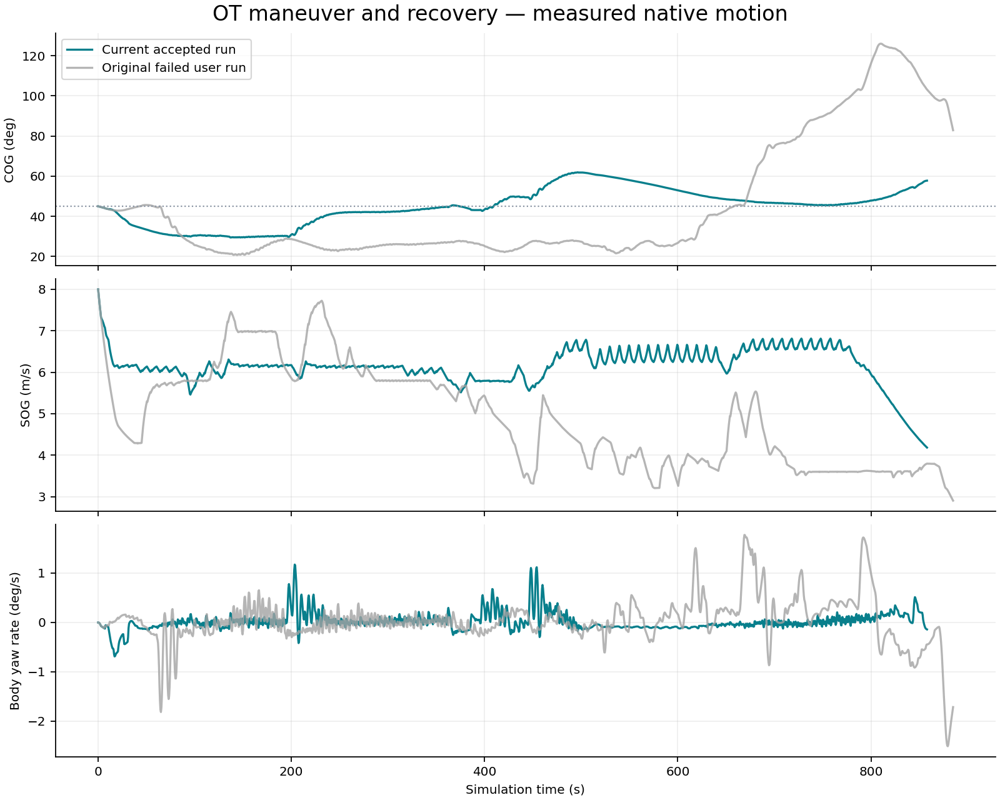

# Authoritative GNC 卡片与原始源码：双仓差异说明

日期：2026-09-20。对象：GNC 开发同事。范围：界面 **Authoritative GNC · 2026-09-14** 卡片及其原生 C++ 执行链；以 Mid-MPC + Three-Ship + Environment ON 为主要使用场景。

**结论：该卡片运行原始 GNC 的受控修改版。底层控制、推力分配、船舶动力学和环境模型源码保留；主要改变路线接纳、导引参考生成及消息合同，让外部规划轨迹可以按其几何、时间和速度约定进入原生执行链。** 卡片日期、`baseline` 标签不能证明代码仍等于 8 月原始快照。

本次只读取双仓、接口和已有证据，新增支持文档与 diff 包；没有修改 GNC 或 Simulator 业务代码，没有重启或操作仿真会话。Full Stack、回放优化、Mid-MPC 优化器自身改动不属于本报告 diff 范围。

## 1. 对比对象与身份链

| 层次 | 版本 / 路径 | 本次核验 |
|---|---|---|
| 同事原始交付 | `/Users/marine/Code/external_sources/L4-5_source_only_20260824_v2` | 原清单 183 个文件；与 GNC 导入提交逐文件 SHA-256 一致 |
| GNC 原始 Git 基线 | `/Users/marine/Code/GNC`，`e1d435df4be9a30130c5b37d9bcb7552aff728f7` | 原始快照导入，不是修改后的中间版本 |
| 当前权威 GNC | 同仓 `0bbce06d7ad9ba8330d1d9934070f75c16ac2cf7` | 工作区干净；原始 183 文件中 174 不变、9 修改；新增源码 5 文件 |
| Simulator 集成 | `/Users/marine/Code/Colav-Simulator`，HEAD `00c8f441c30f7cfeae53f4515b4fe715c014a903` | 卡片映射到 `original_gnc`；工作区另有无关未提交变动，本次不纳入 diff |
| 截图 ENV ON 变体 | `original-gnc-20260914-v1-env-on` | 从运行中 8010 `/api/gnc/stacks` 实时读取，`available=true` |
| 默认原生构建 | `build/original_gnc-current → build/gnc-planner-trajectory-v7-20260917` | 磁盘库哈希、构建清单、卡片 API 三者一致 |

源清单 SHA-256：`8590d52f4b3ee551ae390bb019ffca2a6ad434bd5659a6c92d8f54c870ff9e62`。

动态库 SHA-256：`78997104a85bfc5042698d5d9b702058700e342e6e6a0625669719d7ba652277`。

双仓关系：

```text
8 月原始交付 ──183 文件校验──> GNC Git e1d435d
                                │ 六次源码提交
                                ▼
                         GNC Git 0bbce06
                                │ 源清单锁定 + 提取/构建
                                ▼
Simulator original_gnc adapter → 原生 C++ 动态库 → 卡片 ENV ON/OFF
```

证据：[实时卡片](evidence/gnc-colleague-diff-20260920/live-card-identity.json)、[审计摘要](evidence/gnc-colleague-diff-20260920/audit-summary.json)、[183 文件逐项校验](evidence/gnc-colleague-diff-20260920/source-comparison.json)、[构建身份](evidence/gnc-colleague-diff-20260920/build-identity.json)。这里只核验所选卡片目录和默认构建身份，不把“正在运行某个指定场景”当成已核实事实。

## 2. 哪些改了，哪些没改

`GNC e1d435d → 0bbce06` 的 `src/` 差异：**14 文件，+966 / −211 行**。包括 9 个已有文件修改和 5 个新增文件；行数含少量 CRLF 差异，以及把 Vincenty 投影函数提取到公共头文件的代码移动，不等于 966 行新算法。

| 模块 | 与原始快照比较 | 含义 |
|---|---|---|
| `ship_guidance` | 6 个已有文件修改，新增 3 个头文件 | 接纳、模式、投影、导引与速度参考发生行为变化 |
| `ship_interfaces` | 2 个已有消息和 CMake 修改；新增 2 消息 | 新增速度意图与定时轨迹合同；ROS 消息包及消费者需配套重编译 |
| `ship_control` | 5 个原始清单文件逐字节不变 | 未改 PID/SMC 控制源码；输入参考变化仍会改变闭环响应 |
| `thrust_allocation` | 10 文件逐字节不变 | PGD、执行器限制等原源码保留 |
| `ship_dynamics` | 16 文件逐字节不变 | 4DOF 动力学、船体参数等原源码保留 |
| `env_engines` | 40 文件逐字节不变 | 原风、流、浪模型与资产保留；ENV ON 是选定环境工况 |
| 其余原清单文件 | 全部不变 | “仓库未改”不代表每个 ROS 节点均被卡片启动 |

“源码不变”特指权威 GNC 仓库。Simulator 为本地执行替换 ROS 外壳、通信与时钟，生成的绑定文件自然不会与 ROS `.cpp` 字节一致，详见第 5 节。

## 3. 修改原因、修改前后行为

### G1. 普通避碰与紧急避碰分离

**原行为**：`avoidance`、`collision_avoidance`、`emergency_avoidance`、`emergency_avoid` 均编码为 6。导引解码为紧急避碰，普通绕行也进入默认 **3.2 m/s** 紧急限速。

**当前行为**：普通避碰编码 **10**，紧急避碰保留 **6**；3.2 m/s 仅由紧急模式触发。普通避碰仍受船舶上限、接纳速度、保留的跟踪与末端约束限制。

**为什么改**：原任务可能请求 6–8 m/s，但普通避碰标签直接把执行上限压到 3.2 m/s。规划端的速度/CPA 时序与执行端不一致；持续遭遇下尤其明显。这是模式策略调整，不是控制器调参，也不是认定紧急限速应删除。

位置：`avoidance_mode_policy.hpp:29`、`coordinate_transform_node.cpp:85`、`ship_guidance_node.cpp:6101`。提交 `b3b7b2b`。

### G2. 单个弯道限速不再永久压低整条路线

**原行为**：ARM（Active Route Manager）求最严格角点 `suggested_max_speed_mps`，随后对整条路线所有速度取同一最小值。

**当前行为**：记录逐点 `admitted_speed_limits_mps`；危险角点局部限速，再按 `sqrt(v_next² + 2*a_decel*distance)` 向上游传播必要减速包络；后续直航段可恢复其原请求速度。

**为什么改**：一个短折角不应成为整条长路线的永久巡航上限。历史 VO 诊断中，39 m/36 m 相邻段、100.7° 转角产生约 29.845 m 半径，再由 1.2°/s 上限推出 **0.62508 m/s**，污染后续整条路线。该历史案例揭示机制；不能将后来的所有改善都归因于此 C++ 修改。

位置：`active_route_manager_node.cpp:1048`、`:1153`、`:1208`、`:1299`。提交 `4dcfedd`。影响普通空间路线接纳；当前 Mid 定时轨迹走 G5 独立接纳分支。

### G3. 航段索引与更新后的导引状态

**原行为**：`current_wp_idx_` 表示目标点，但路径更新时段索引与目标点索引混用；越过 `i+1` 后仍可能指向旧目标。每次新 Path 还会清除归线、速度恢复、流补偿等状态。

**当前行为**：当前段 `i → i+1` 的目标为 `i+1`，越过后切到受边界限制的 `i+2`。若更新前后局部段端点相同，或两条定时轨迹局部段同向、共线，则保留对应导引状态；局部框架真变了才重置。

**为什么改**：频繁重规划不应反复从旧目标点追踪，也不应把同一局部航段的恢复状态每轮清零。保留条件包含位置/方向比较，不是无条件继承积分或恢复状态。

位置：`ship_guidance_node.cpp:2263`、`:2324`。提交 `4dcfedd`、`0bbce06`。

### G4. MPC 已接纳路径避免被人工航线策略再次改写

**原行为**：稠密路径也被外部转弯预览、航向误差归线限速、turn-segment 限速及圆弧/Chaikin 重写再次处理。ARM 30 m 最小段也可能拒绝稠密拼接段，旧路线到期后转回内部三点归航路径。

**当前行为**：

| 开关 / 条件 | 当前处理 | 保留项 / 适用边界 |
|---|---|---|
| `external_route_turn_skip_planner_routes=true`，源为 `mid_mpc_ipopt` | 跳过外部转弯预览的速度应用 | 该处航向预览和中心线逻辑仍在 |
| `planner_route_speed_gate_skip=true`，源为 `mid_mpc_ipopt` | 跳过 turn-segment 速度门和 rejoin 的航向误差分支 | 横向归线分支保留，默认阈值 60 m |
| `planner_route_arc_smoothing_skip=true`，源为 `mid_mpc_ipopt` | 导引不改写已接纳点列 | 普通人工航线仍走原几何处理；定时路径独立强制保留点列 |
| `planner_route_min_segment_skip=true`，非紧急 Mid 空间计划 | 容忍不足 30 m 的段 | 该空间分支其余接纳检查保留；紧急空间计划仍保留 15 m 门 |

**为什么改**：避免接纳后的可执行参考被第二套面向人工航线的启发式重新限速或变形，从而破坏规划端与执行端的一致性。

**必须如实说明**：这里确实豁免了部分旧门，不能写“全部保护完全未改”。中间版本空间路径通过 `command_source` 识别；当前 Mid 主路径还必须通过 G5 定时合同。来源字符串本身不是安全证明，也不构成通信认证。

位置：`ship_guidance_node.cpp:1487`、`:5230`、`:5663`、`:5749`；`active_route_manager_node.cpp:1098`。提交 `11a21c3`、`8a574a0`、`9c43d7b`。

### G5. Mid 定时轨迹：从“空间路线”改为“有时间合同的路径输入”

**原接口**：航点 + 速度上限。无法完整表示 Mid 的采样周期、初态、已接纳参考身份及有限有效时间；轨迹重锚在本船附近时，还与人工航线首变化距离门冲突。

**当前接口**：`behavior_mode=planner_trajectory_v1`，经 `AvoidancePlan → ARM → RoutePlan → Path → Guidance`，增加 `trajectory_dt_s`、`trajectory_reference_id`；ARM 转交航向数组、相对有效期，Path 携带逐样本时间。

接纳依据从人工航线距离启发式转为明确的轨迹合同：

- `command_source=mid_mpc_ipopt`；船位已存在、原点锁定；父路线 ID/版本、时间合法。
- 新轨迹首样本匹配实测位置、COG、SOG；位置容差 0.25 m，航向/速度数值容差 `1e-3`。
- 新计划绑定当前已接纳路线；同 ID 续租的几何、速度、模式、航向、采样周期、原发布时间不可偷偷改变。
- 每样本有限，速度非负；检查速度上限、角速度、速度变化率、横向加速度、最小半径，以及位置与速度积分一致性。
- 当前默认物理边界：8 m/s、1.2°/s、0.08 m/s²、0.25 m/s²、80 m。参数的实际部署值仍须以运行清单为准。
- 名义航线接口不能直接宣称 `planner_trajectory_v1`，必须经过避碰接纳入口。

相应地，已接纳定时轨迹跳过坐标节点的人工航线更新距离门、圆弧重写和 FAP 插点；不将不足 30 m 的定时采样距离当作人工航线无效段。位置投影与 ARM 校验共享 WGS84/Vincenty 实现。

**效果**：规划器输出的逐点几何与速度序列可原样送到导引；失效、旧身份、初态不符、不可执行轨迹仍拒绝。原人工航线仍走其原接纳分支。

**精确定义**：“定时轨迹”不等于直接以每个计划 COG 驱动控制器。当前导引仍用路径 LOS/ILOS/ALOS 计算航向；航向数组用于轨迹接纳一致性，速度按时间样本形成上限。不能声称实现了严格的逐时刻位置跟踪或零跟踪误差。

位置：`planner_trajectory_contract.hpp:41`、`active_route_manager_node.cpp:949`、`coordinate_transform_node.cpp:572`、`ship_guidance_node.cpp:2165`。提交 `0bbce06`。

### G6. 速度参考按时间执行，保留零速并区分 SOG / surge

**原行为**：空间航点预览可能提前看到远处低速/停车点；`<=0.1` 的速度还可能当成“未给定”。SOG 与船体纵向速度直接混用会引入另一种参考偏差。

**当前行为**：定时路径跳过旧空间速度预览；使用 `floor(elapsed/dt)+1` 选择当前区间的下一样本，保留 0；根据侧滑把计划 SOG 转为 surge 上限，`u_limit = SOG * max(0, cos(atan2(v,u)))`。LOS 尾部和最终发布前都做限幅，覆盖提前返回分支。

**为什么改**：避免提前制动、停车指令丢失、速度坐标系混淆。该值是上限，其他保留的导引限制仍可令实际指令更低；实际船速还受原控制器和动力学响应影响。

位置：`ship_guidance_node.cpp:5711`、`:6198`、`:6475`。提交 `0bbce06`。

### G7. 同卡片新增 VO/Fan 速度意图接口

这是卡片相对原始代码的真实新增能力，但**当前 Mid + Three-Ship 不走这条分支**。

原来只有路线式输入；现在新增 `VelocityIntent` 和 `VelocityExecutionStatus`，ARM 校验父任务、模式、时间、速度后转发。导引把目标 COG/SOG 转为航向/surge，执行原控制链；到期/零速进入停车保持，明确返回命令恢复路线权。

新增导引 `velocity_course_gain=4.0`，按速度调度并受航向变化率、横向加速度限制；原 PID 增益源码不变。速度意图续租不重复发布会重置速度积分的 target pose。状态区分请求 COG/SOG、应用 heading/surge、实测量与限幅原因。

位置：`active_route_manager_node.cpp:398`、`ship_guidance_node.cpp:6229`、`:6271`；新增两份 `Velocity*.msg`。提交 `b3b7b2b`。这是闭环导引策略扩展，不能仅称为格式转换。

## 4. GNC Git 提交与可审阅 diff

| 提交 | 修改主题 | 本包完整提交 diff |
|---|---|---|
| `b3b7b2b` | 普通/紧急模式；速度意图与反馈 | [01](evidence/gnc-colleague-diff-20260920/commits/01-b3b7b2b.diff) |
| `4dcfedd` | 局部限速、减速传播、目标点索引与局部状态 | [02](evidence/gnc-colleague-diff-20260920/commits/02-4dcfedd.diff) |
| `11a21c3` | planner 路线豁免外部转弯速度应用 | [03](evidence/gnc-colleague-diff-20260920/commits/03-11a21c3.diff) |
| `8a574a0` | planner 路线豁免部分 rejoin/turn-segment 速度门 | [04](evidence/gnc-colleague-diff-20260920/commits/04-8a574a0.diff) |
| `9c43d7b` | 保留稠密点列、最短段豁免 | [05](evidence/gnc-colleague-diff-20260920/commits/05-9c43d7b.diff) |
| `0bbce06` | 定时轨迹接纳、投影与导引消费 | [06](evidence/gnc-colleague-diff-20260920/commits/06-0bbce06.diff) |

优先阅读：[逐文件完整代码对照](evidence/gnc-colleague-diff-20260920/code-diff.md)。其中每个文件提供修改前源码、修改后源码、原始 diff；行号来自固定版本，不依赖本地后续编辑。

下载/复现用：[完整源码 diff](evidence/gnc-colleague-diff-20260920/gnc-source-complete.diff)、[完整仓库 diff，含清单/测试/说明](evidence/gnc-colleague-diff-20260920/gnc-repository-complete.diff)、[忽略行尾空白的阅读版](evidence/gnc-colleague-diff-20260920/gnc-review-ignore-eol.diff)。阅读版不能替代原始补丁的字节级核对。

```sh
# 在 GNC 仓库查看原始交付至当前卡片对应源版本
 git -C /Users/marine/Code/GNC diff e1d435d 0bbce06 -- src
 git -C /Users/marine/Code/GNC show 0bbce06 -- src/gnc/ship_guidance
```

以上为累积修改，不能简单只同步最后一份定时轨迹补丁；它依赖前面的接口和导引变更。

## 5. Simulator 仓库做了什么

Simulator 负责把卡片选择、规划输入、原生执行和观测接起来，不另维护一套修改后的 GNC 控制/动力学算法。

| 文件 / 目录（Simulator 仓库） | 作用 | 与 GNC 原始源码的关系 |
|---|---|---|
| `original_gnc/catalog.py`、`configuration.py`、`data/baseline.json` | 卡片、ENV 变体、源/库锁定、运行参数 | 外层接入；卡片 ID 没有随每次源码提交改名 |
| `original_gnc/plan_bridge.py` | Mid 已接纳定时样本转 `AvoidancePlan`；VO/Fan 转速度意图 | 配套 GNC 新合同；不把原计划重新拼成另一条执行路线 |
| `original_gnc/adapter.py`、`stack.py` | 本船坐标、状态、初始化、显式仿真时钟、回调调度 | T0 首次计划前调用原 `publish_odometry`，不提前积分状态 |
| `original_gnc/native.py` | 原生库载入、消息编解码 | Python/C++ 传输外壳；9 月 18 日编解码优化没有改 GNC C++ 内核 |
| `tools/original_gnc/extract_native.py`、`native_messages.py`、`state_fields.py` | 源码提取、消息适配与观测 | 替代 ROS 外壳；显式时钟、绑定和状态观测列在提取清单 |
| `cpp/original_gnc/` | 原生桥接支撑代码 | 非第二套权威 GNC 行为实现 |

表内 `original_gnc/` 均位于 `colav_simulator/original_gnc/`。

附：[Simulator 原生集成差异](evidence/gnc-colleague-diff-20260920/simulator-native-integration.diff)，范围固定为 `85d45eb0^ → 00c8f441` 的上述原生接入目录/文件。此起点是权威 GNC 新接口接入前的 Simulator，不是 8 月 GNC 源码。不能用两个仓库同名或不同语言文件直接求差，声称那是同一算法的修改量。

[提取记录](evidence/gnc-colleague-diff-20260920/extraction-boundary.json)列出外壳替换。原 ROS 异步调度与本地确定性调度不保证全系统逐时刻轨迹相同；历史同输入回调对照只支持其覆盖范围。

本次还比较同一 Simulator 起点和当前 `baseline.json` 参数：已有记录值均不变，仅新增 `external_route_turn_skip_planner_routes=true`、`velocity_course_gain=4.0`。其他新增 planner 开关使用 C++ 声明的默认 `true`。该比较不包含场景初态、环境启停和外部启动覆盖。[参数对照](evidence/gnc-colleague-diff-20260920/parameter-comparison.json)。

## 6. 已看到什么效果，能归因到哪里

| 证据 | 修改前 / 问题 | 修改后 / 当前观测 | 归因边界 |
|---|---|---|---|
| 原生接纳测试 | 空间路线规则无法表达完整时间/初态合同 | 定时有效路径逐点保留；错误初态、速率、几何、身份、时效被拒 | 直接验证 GNC 接口行为 |
| 原生速度/航段测试 | 全线限速、旧目标索引、重复限速及点列重写 | 局部速度、正确索引、选择性豁免与点列保留 | 直接验证当前实现；本次实际重跑 |
| 历史 VO 极低速诊断 | T521 约 1.27 kn；旧折线造成全线 0.625 m/s 上限 | T521 约 6.53 kn | 该批只修 Simulator 桥接，C++ 库没改；**不能作为 G2 单独修复收益**，仅解释问题机制 |
| 历史 OT 综合闭环 | T885.5 失败；最大横移约 998 m；恢复 COG 约126°；峰值 ROT 2.51°/s | T858.5 到达；横移329.52 m；恢复COG 61.93°；峰值ROT 1.17°/s | GNC + 规划/接入联合结果，不是只换 GNC 的消融实验 |
| Three-Ship 当前版本对应历史验收 | 原始 8 月 GNC 同一完整工况的严格 A/B：本次未找到可支持等条件归因的数据 | T1745 到达；终距308.617 m；归线XTE −8.911 m；最小本船船壳间距230.805 m；全船碰撞/搁浅0 | 验证当前组合可运行、安全、归线、到达；不量化纯 GNC 单因素收益 |

Three-Ship 名称对应 `paper_ccta2023_multiship`，实际是本船 + 三艘目标船。上述验收使用 ENV ON、God/Truth、seed 0、0.1 s 仿真步长、10 s 重规划、80×5 s 预测；诊断上限3000 s，实际到达早于场景默认1800 s。到达半径308.7 m、归线容差20 m未扩大；不是精确靠泊/停车验收。

已有完整实时运行达到4.994×，但主要由优化器与 Simulator 性能改动实现，**不列作 GNC 源码修改效果**。

历史求解记录有186次优化尝试、185接纳/1拒绝；其中4次优化调用后选择 `PRIMAL_SEED`。归一化 fallback 标志为零不能改写成“每次都执行最终优化迭代”。这些事实限制综合场景论证，不影响源码差异统计。



数据：[Three-Ship 到达与安全](evidence/gnc-colleague-diff-20260920/historical-evidence/three-ship-performance-20260918/arrival-and-capture.json)、[求解统计](evidence/gnc-colleague-diff-20260920/historical-evidence/three-ship-performance-20260918/solver-timing.json)、[五场景历史汇总](evidence/gnc-colleague-diff-20260920/historical-evidence/mid-gnc-trajectory-20260917/acceptance-summary.json)、[VO 历史对照](evidence/gnc-colleague-diff-20260920/historical-evidence/original-gnc-speed-fix-20260914/summary.json)。五场景历史报告部分“零拒绝”表述被后续原始记录纠正，Three-Ship 数量以本节后续统计为准。

## 7. 本次验证与交接边界

本次实际执行：

- 原交付清单183文件与原始 Git 提交逐文件哈希一致。
- 当前源清单逐项验真；磁盘库 SHA-256 与 build manifest、运行中卡片 API 一致。
- 六个原生 GNC 聚焦测试文件：**34 passed / 6.41 s**。
- GNC 两个现有 C++17 独立测试程序：模式策略、定时轨迹合同，**均 exit 0**。
- 本包累积补丁在临时原始版本目录应用后，与目标 Git 内容逐字节核对；见交付校验记录。

[聚焦测试日志](evidence/gnc-colleague-diff-20260920/focused-tests.log)、[C++ 测试日志](evidence/gnc-colleague-diff-20260920/cpp-tests.log)、[交付校验](evidence/gnc-colleague-diff-20260920/package-validation.json)。本次未重跑完整 Three-Ship；表中闭环数字是已留存运行证据，不是本次新测量。

```sh
# Simulator 根目录；加载当前已锁定原生构建
.venv/bin/python -m pytest -q \
  tests/test_original_gnc_timed_trajectory.py \
  tests/test_original_gnc_local_route_speed.py \
  tests/test_original_gnc_guidance_segment.py \
  tests/test_original_gnc_extturn_planner_gate.py \
  tests/test_original_gnc_planner_speed_gate.py \
  tests/test_original_gnc_planner_route_mirror.py
```

给 GNC 同事评审时，重点确认：

1. 普通/紧急模式编码10/6及其策略含义；所有消费节点必须兼容。
2. 接受新的 planner 定时合同后，哪些人工航线门由轨迹物理校验替代；尤其不要只复制豁免开关、遗漏独立接纳。
3. 消息更改需上下游一致重编译；Path 的 `orientation` 是既有元数据通道，`w=2` 标记定时路径，不是合法姿态四元数语义。通用姿态消费者不能直接解释它。
4. 保持 SOG/COG 与 surge/heading 区分；确认速度样本作为上限、LOS 几何跟踪满足本项目执行接口需求。
5. 原生 ROS 自由异步环境下，新定时路径还需要本项目部署工况验证。已有记录支持13包ROS构建及普通路线回调对照，不能替代新定时路径的 ROS 完整闭环。

GNC `SOURCE_REVISION.json` 仍标记 `IN_DEVELOPMENT_NOT_ACCEPTED`，卡片 API 为 `EXPERIMENTAL_ORIGINAL_SOURCE`。保留这一产品级边界：仿真特定组合通过，不代表全部 GNC 工况、实船或 MASS-L3 系统已验收。

## 8. 关键 diff 摘录

以下是 Git 原始 hunk，未改写为伪代码；上下文行号分别属于原始/当前版本。完整文件见下一节。

### 普通避碰不再触发紧急限速

`src/gnc/ship_guidance/src/ship_guidance_node.cpp`

```diff
@@ -5967,7 +6098,10 @@ void ShipGuidanceNode::calculate_los(double x, double y, double& psi_cmd, double
             far_terminal_dp_alignment ? 1 : 0, old_u_cmd);
     }
 
-    if (emergency_avoidance_active && !dp_mode_active_ && !final_speed_coupling_blocked) {
+    const bool emergency_speed_policy_active =
+        ship_guidance::avoidance_mode_policy::emergency(normalize_navigation_mode(target_navigation_mode)) ||
+        ship_guidance::avoidance_mode_policy::emergency(normalize_navigation_mode(previous_navigation_mode));
+    if (emergency_speed_policy_active && !dp_mode_active_ && !final_speed_coupling_blocked) {
         const double emergency_cap = std::clamp(
             emergency_avoidance_speed_cap_mps_,
             0.5,
```

### 最严格角点限速改为逐点接纳速度

`src/gnc/ship_guidance/src/active_route_manager_node.cpp`

```diff
@@ -1101,22 +1298,10 @@ private:
 
     void apply_speed_degradation(
         ship_interfaces::msg::RoutePlan& route,
-        double suggested_max_speed_mps) const
+        const std::vector<double>& admitted_speed_limits_mps) const
     {
-        if (!std::isfinite(suggested_max_speed_mps) || suggested_max_speed_mps <= 0.0) {
-            return;
-        }
-        const double cap = std::min(suggested_max_speed_mps, max_command_speed_mps_);
-        if (route.speed_limit_mps.empty()) {
-            route.speed_limit_mps.assign(route.latitude.size(), cap);
-            return;
-        }
-        for (double& speed : route.speed_limit_mps) {
-            if (!std::isfinite(speed) || speed <= 0.0) {
-                speed = cap;
-            } else {
-                speed = std::min(speed, cap);
-            }
+        if (admitted_speed_limits_mps.size() == route.latitude.size()) {
+            route.speed_limit_mps = admitted_speed_limits_mps;
         }
     }
```

### 定时轨迹采用独立接纳入口

`src/gnc/ship_guidance/src/active_route_manager_node.cpp`

```diff
@@ -855,6 +1011,9 @@ private:
         if (!basic_route_valid(route)) {
             return rejected_result("invalid_avoidance_route", "fix_route_plan");
         }
+        if (normalize_mode(plan.behavior_mode) == "planner_trajectory_v1") {
+            return evaluate_planner_trajectory(plan, route);
+        }
         if (!plan.command_heading_deg.empty() &&
             plan.command_heading_deg.size() != route.latitude.size()) {
             return rejected_result("heading_length_mismatch", "fix_heading_array");
```

### 定时路径不再走人工路线更新距离门

`src/gnc/ship_guidance/src/coordinate_transform_node.cpp`

```diff
@@ -821,7 +746,10 @@ void CoordinateTransformNode::route_callback(
             "[CoordTransform] internal return route bypasses dynamic update guard route_id='%s'",
             msg->route_id.c_str());
     }
-    if (enable_route_update_guard_ && !internal_return_to_route &&
+    // Timed planner trajectories have already passed the source motion and
+    // initial-state contract in ARM. They re-anchor at the measured vessel;
+    // operator-route index and 150 m rules describe a different interface.
+    if (enable_route_update_guard_ && !internal_return_to_route && !planner_trajectory &&
         has_last_route_ && last_feedback_path_.size() >= 2) {
         const int first_changed_idx = first_geometry_change_index(raw_pts, last_feedback_path_);
         if (first_changed_idx >= 0) {
```

## 9. 完整文件索引

下列行号说明以 GNC `0bbce06` 为准；每项链接均指向包内固定源码，可不依赖本地 GNC 工作区阅读。

| 源码文件 | 增/删行 | 固定源码与 diff |
|---|---:|---|
| `src/gnc/ship_guidance/include/ship_guidance/avoidance_mode_policy.hpp` | +39/−0 | [当前](evidence/gnc-colleague-diff-20260920/source-after/src/gnc/ship_guidance/include/ship_guidance/avoidance_mode_policy.hpp) · [diff](evidence/gnc-colleague-diff-20260920/per-file/src/gnc/ship_guidance/include/ship_guidance/avoidance_mode_policy.hpp.diff) |
| `src/gnc/ship_guidance/include/ship_guidance/geodesy.hpp` | +115/−0 | [当前](evidence/gnc-colleague-diff-20260920/source-after/src/gnc/ship_guidance/include/ship_guidance/geodesy.hpp) · [diff](evidence/gnc-colleague-diff-20260920/per-file/src/gnc/ship_guidance/include/ship_guidance/geodesy.hpp.diff) |
| `src/gnc/ship_guidance/include/ship_guidance/planner_trajectory_contract.hpp` | +75/−0 | [当前](evidence/gnc-colleague-diff-20260920/source-after/src/gnc/ship_guidance/include/ship_guidance/planner_trajectory_contract.hpp) · [diff](evidence/gnc-colleague-diff-20260920/per-file/src/gnc/ship_guidance/include/ship_guidance/planner_trajectory_contract.hpp.diff) |
| `src/gnc/ship_guidance/include/ship_guidance/route_arbitration_policy.hpp` | +2/−2 | [原始](evidence/gnc-colleague-diff-20260920/source-before/src/gnc/ship_guidance/include/ship_guidance/route_arbitration_policy.hpp) · [当前](evidence/gnc-colleague-diff-20260920/source-after/src/gnc/ship_guidance/include/ship_guidance/route_arbitration_policy.hpp) · [diff](evidence/gnc-colleague-diff-20260920/per-file/src/gnc/ship_guidance/include/ship_guidance/route_arbitration_policy.hpp.diff) |
| `src/gnc/ship_guidance/include/ship_guidance/route_contract.hpp` | +4/−0 | [原始](evidence/gnc-colleague-diff-20260920/source-before/src/gnc/ship_guidance/include/ship_guidance/route_contract.hpp) · [当前](evidence/gnc-colleague-diff-20260920/source-after/src/gnc/ship_guidance/include/ship_guidance/route_contract.hpp) · [diff](evidence/gnc-colleague-diff-20260920/per-file/src/gnc/ship_guidance/include/ship_guidance/route_contract.hpp.diff) |
| `src/gnc/ship_guidance/include/ship_guidance/ship_guidance_node.hpp` | +55/−10 | [原始](evidence/gnc-colleague-diff-20260920/source-before/src/gnc/ship_guidance/include/ship_guidance/ship_guidance_node.hpp) · [当前](evidence/gnc-colleague-diff-20260920/source-after/src/gnc/ship_guidance/include/ship_guidance/ship_guidance_node.hpp) · [diff](evidence/gnc-colleague-diff-20260920/per-file/src/gnc/ship_guidance/include/ship_guidance/ship_guidance_node.hpp.diff) |
| `src/gnc/ship_guidance/src/active_route_manager_node.cpp` | +217/−18 | [原始](evidence/gnc-colleague-diff-20260920/source-before/src/gnc/ship_guidance/src/active_route_manager_node.cpp) · [当前](evidence/gnc-colleague-diff-20260920/source-after/src/gnc/ship_guidance/src/active_route_manager_node.cpp) · [diff](evidence/gnc-colleague-diff-20260920/per-file/src/gnc/ship_guidance/src/active_route_manager_node.cpp.diff) |
| `src/gnc/ship_guidance/src/coordinate_transform_node.cpp` | +40/−106 | [原始](evidence/gnc-colleague-diff-20260920/source-before/src/gnc/ship_guidance/src/coordinate_transform_node.cpp) · [当前](evidence/gnc-colleague-diff-20260920/source-after/src/gnc/ship_guidance/src/coordinate_transform_node.cpp) · [diff](evidence/gnc-colleague-diff-20260920/per-file/src/gnc/ship_guidance/src/coordinate_transform_node.cpp.diff) |
| `src/gnc/ship_guidance/src/ship_guidance_node.cpp` | +380/−75 | [原始](evidence/gnc-colleague-diff-20260920/source-before/src/gnc/ship_guidance/src/ship_guidance_node.cpp) · [当前](evidence/gnc-colleague-diff-20260920/source-after/src/gnc/ship_guidance/src/ship_guidance_node.cpp) · [diff](evidence/gnc-colleague-diff-20260920/per-file/src/gnc/ship_guidance/src/ship_guidance_node.cpp.diff) |
| `src/interfaces/ship_interfaces/CMakeLists.txt` | +2/−0 | [原始](evidence/gnc-colleague-diff-20260920/source-before/src/interfaces/ship_interfaces/CMakeLists.txt) · [当前](evidence/gnc-colleague-diff-20260920/source-after/src/interfaces/ship_interfaces/CMakeLists.txt) · [diff](evidence/gnc-colleague-diff-20260920/per-file/src/interfaces/ship_interfaces/CMakeLists.txt.diff) |
| `src/interfaces/ship_interfaces/msg/AvoidancePlan.msg` | +4/−0 | [原始](evidence/gnc-colleague-diff-20260920/source-before/src/interfaces/ship_interfaces/msg/AvoidancePlan.msg) · [当前](evidence/gnc-colleague-diff-20260920/source-after/src/interfaces/ship_interfaces/msg/AvoidancePlan.msg) · [diff](evidence/gnc-colleague-diff-20260920/per-file/src/interfaces/ship_interfaces/msg/AvoidancePlan.msg.diff) |
| `src/interfaces/ship_interfaces/msg/RoutePlan.msg` | +6/−0 | [原始](evidence/gnc-colleague-diff-20260920/source-before/src/interfaces/ship_interfaces/msg/RoutePlan.msg) · [当前](evidence/gnc-colleague-diff-20260920/source-after/src/interfaces/ship_interfaces/msg/RoutePlan.msg) · [diff](evidence/gnc-colleague-diff-20260920/per-file/src/interfaces/ship_interfaces/msg/RoutePlan.msg.diff) |
| `src/interfaces/ship_interfaces/msg/VelocityExecutionStatus.msg` | +16/−0 | [当前](evidence/gnc-colleague-diff-20260920/source-after/src/interfaces/ship_interfaces/msg/VelocityExecutionStatus.msg) · [diff](evidence/gnc-colleague-diff-20260920/per-file/src/interfaces/ship_interfaces/msg/VelocityExecutionStatus.msg.diff) |
| `src/interfaces/ship_interfaces/msg/VelocityIntent.msg` | +11/−0 | [当前](evidence/gnc-colleague-diff-20260920/source-after/src/interfaces/ship_interfaces/msg/VelocityIntent.msg) · [diff](evidence/gnc-colleague-diff-20260920/per-file/src/interfaces/ship_interfaces/msg/VelocityIntent.msg.diff) |
