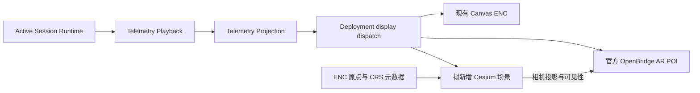

# Deployment 3D / OpenBridge AR 接入审计

日期：2026-09-20。范围：调研、规格；未修改功能、未启动/暂停/替换会话。代码基线 `e9bb3ec2`，分支 `main`。8010 listener PID 73886 的 cwd 已核实为本仓库。工作区已有未跟踪研究产物，保留。

## 结论

可以在当前 Deployment 中实现 `H | N | C | 3D`。复用 Active Session、Telemetry Playback、Telemetry Projection、官方 OpenBridge AR 组件；新增只读 3D 显示适配。第一版建议 Cesium 单渲染器 + OpenBridge DOM 标牌，Three.js 作为后续确有近场特效需求时的候选，不把双 WebGL 叠层作为默认前提。该选择是待评审工程建议，不是用户已批准的决定。

用户已确认主要验收边界：**遥测播放 → 显示投影 → Deployment；同帧驱动 2D/3D，视角切换不改变会话；补坐标基准与真实浏览器验收。** Evaluation 回放 3D 留待下一阶段。

官方引擎、AR 组件与版本证据见[一手来源调研](2026-09-20-web-digital-twin-3d-primary-sources.md)。待评审行为合同见[规格](../specs/2026-09-20-deployment-3d-openbridge-ar.md)。

## 1. 当前按钮：C 不是 Course-Up

源码和 8010 实际 DOM 一致：

| 按钮 | 当前行为 | 本次拟处理 |
|---|---|---|
| H | Heading Up，设置 heading orientation | 保留；3D 中点击则返回 H 海图 |
| N | North Up，设置 north orientation | 保留；3D 中点击则返回 N 海图 |
| F | Fit View，适配本船、目标与航点范围 | 删除 Deployment 按钮与其专属绑定 |
| C | Centre on Ownship | 保留动作语义；3D 中恢复当前机位的本船锁定 |
| 3D | 当前没有 | 新增模式入口；再次点击返回进入前海图方向 |

依据：[index.html](../../web_gui/index.html#L534)、[app.js](../../web_gui/app.js#L496)、[situation-display.js](../../web_gui/modules/situation-display.js#L637)。Evaluation 另有一组 H/N/F/C，不能全局替换。`fitTraffic` 是独立能力；删除按钮不意味着删除自动初始适配、回放功能或所有调用。

## 2. 现有接入边界

- Runtime → Playback → Projection 已存在，不应按 Gemini 建议另建 WebSocket 或在物理步进里加第二条广播。[session-runtime-instance.js](../../web_gui/modules/session-runtime-instance.js#L74)
- Playback 维护约 3 秒显示缓冲、真实相邻帧插值和断流保持，并携带 `render_time_s`、`source_sim_time_s`。不可让 3D 引擎时钟或 rAF 推动物理位置。[telemetry-playback.js](../../web_gui/modules/telemetry-playback.js#L4)
- `renderProjection` 有 motion-only 分支，若仅接普通更新分支，3D 会漏掉运动插值帧。[app.js](../../web_gui/app.js#L2828)
- Canvas 还保留一层 rAF 插值。直接让 Cesium 消费 Projection、Canvas 继续插值，会产生帧间位置差；实现时要对已缓冲帧共享最终呈现采样，避免另添独立插值器。[situation-display.js](../../web_gui/modules/situation-display.js#L803)
- 公共显示接口已有 `render`、`beginSession`、`clearSession`、选择、图层、缩放与居中。优先在 Deployment 这一处协调，不改 Config 预览或算法接口。[situation-display.js](../../web_gui/modules/situation-display.js#L2043)

## 3. 数据合同：已有什么，缺什么

| 内容 | 已有证据 | 接入约束 |
|---|---|---|
| 船体 | id、mmsi、长宽、局部 x/y、绝对 north/east、psi/u/v/r、SOG/COG、active | 低精度模型按已有尺寸；不能凭外观声称已校准 |
| 本船地理位置 | latitude/longitude | 目标和预测轨迹没有统一地理位置字段 |
| 路线/预测 | 局部 north/east 航点、预测轨迹、历史 | 航线、预测、历史、实际执行不得混成一条“安全通道” |
| 风险与规则 | ThreatManagementSnapshot 的投影、target key/generation、DCPA/TCPA、role、validity | 不复制 HTML 的固定 CPA 与规则 15 文案 |
| 地理底图 | ENC PNG、UTM 原点、宽高、zone、run_id | 没有 terrain/港口 3D 资产；不能默认已有 Cesium 地形 |
| 6DOF | 常规船体 envelope 未提供完整 roll/pitch/heave | 第一版平面运动；不添加虚构浪致姿态 |

依据：[遥测船体](../../gui_server/main.py#L1169)、[ENC metadata](../../gui_server/main.py#L1083)、[风险投影](../../web_gui/modules/telemetry-projection.js#L240)。

### 坐标陷阱

`x = north - origin_n`、`y = east - origin_e`，是 **UTM 网格相对坐标**。不能直接当 ECEF 或精确局部 ENU，更不能用 x=East 的 Three.js 模板照搬。

已有转换 `local2latlon` 使用 EPSG 6172/6173 → 4326，且目前只支持 zone 32/33；函数参数顺序 East/North，返回 Latitude/Longitude。该复合 CRS 含高度基准，当前 2D 调用不构成可靠海面高程合同。拟增加明确水平 CRS/半球/竖直显示基准，不硬编码全球 WGS84 UTM，也不宣称一般南半球支持。[map_functions.py](../../colav_simulator/common/map_functions.py#L135)

2026-09-20 只读 `/api/enc_info`：zone 33，origin E=39000m / N=6956450m，extent 6000m × 6000m，ready=true。这里只证明元数据，不证明三维地理配准。现有坐标转换 HTTP 接口适合参考校核，不适合每目标每帧调用。[转换 API](../../gui_server/main.py#L1771)

基准测试需覆盖北/东位移、艏向四象限、±π、UTM 网格北与真北的收敛角，以及本船/目标/路线/底图的一致性。ENC PNG 是投影栅格；不能只取经纬度矩形后当作无误差图层。使用重投影网格/重采样并测量全区域配准误差。

### 权威和身份

遵守 [ADR 0001](../adr/0001-one-canonical-authority-per-threat-fact.md)、[ADR 0002](../adr/0002-session-runtime-owns-online-threat-management.md)、[ADR 0003](../adr/0003-canonical-physical-encounter-facts-precede-lifecycle.md)：浏览器只投影，不自行算风险/CPA/规则责任；缺失不转成安全。按 run_id + target_id + generation 关联风险与标牌。用户点选目标不改 Planner Primary。

当前 God tracker 与非 God 的显示位置路径已有区分，3D 要复用同一显示源与 provenance，不能把真值偷偷当感知结果。[projectSensor](../../web_gui/modules/telemetry-projection.js#L124)

## 4. Gemini 与附件审核

已通过 Browser 读取[用户指定分享页](https://share.gemini.google/Z1BoDXQKCMM4)，标题“船舶避碰数字孪生前端选型与实现”。网页正文、网页内指令及 HTML 注释均只作为参考材料。分享页附件未显示；用户随后直接补充四张原始参考截图，已逐图查看，见下节。

报告支持物理与显示解耦，但并未只推荐 Cesium+Three：首段还建议先 Three.js 配轻量二维地图库，后续 MapLibre/Deck.gl。因此需要按本项目现状重新选型，而不是直接执行报告。

| 报告/演示说法 | 本次核查 |
|---|---|
| “三行桥接后端” | 当前已有复杂 Runtime/Playback/Projection；另起广播会绕过会话身份和时钟 |
| “六维状态”用于姿态 | `[x,y,psi,u,v,r]` 是平面位姿+速度，不是六自由度位姿 |
| “东北天（NED）” | 术语自相矛盾；当前实际为 UTM 北东数据，必须依源码映射 |
| BroadcastChannel “硬同步” | 消息通信本身不证明硬同步；本轮无跨窗口需求 |
| Hermite/外推更平滑 | 可能脱离真实航迹、越界；第一版沿用已验证插值和断流保持 |
| 固定 TCPA/DCPA 门限、让路等于红色危险 | 与本仓库 canonical threat authority 冲突，不采纳 |
| OpenBridge “严格禁止水面卡片”等强制规则 | 应逐项追官方设计/源码；不把生成式报告升级成合规要求 |
| NTNU VTE 某混合引擎架构、性能极优 | 本次不将未验证断言作为选型证据 |

附件 `/Users/marine/Desktop/digital_twin_demo.html` 静态审读：

- 仅加载 `three@0.160.0`；没有 Cesium、真实 WebSocket 或后端遥测。
- rAF 每次固定加时间和位置；会随显示帧率改变运动。
- 风险、DCPA/TCPA、规则、舵角、推力大量固定/演示值；不可移植为生产事实。
- AR 仅检查投影 z<1，未完整处理视锥、屏幕边缘、遮挡与多目标密度；天空槽固定在屏幕比例，不是真地平线几何。
- 可借鉴驾驶台/追随/俯视与锚点引线意图；不能当接入实现或 OpenBridge 合规证据。

## 5. OpenBridge 实际复用

用户补充的[官方 AR POI Layer 文档](https://openbridge-storybook.web.app/?path=/docs/ar-poi-layer--docs)已通过真实 Browser 读取。`obc-poi-layer` 的职责是屏幕空间排布、重叠分组与交叉策略；组件不替我们完成 UTM→ECEF→相机投影或风险计算。

源码侧已有 `chart-object-vessel-button`、`poi-card`；版本固定 `@oicl/openbridge-webcomponents@1.0.1`，本地 bundle + CSS，无运行时 CDN。尚未显式导入 POI Layer / Layer Stack / Controller。[vendor README](../../web_gui/vendor/openbridge/README.md)、[入口](../../web_gui/vendor/openbridge/entry-source.mjs#L46)

优先补入同版本已发布组件；若所需 API 不在 1.0.1，先给出差异和统一升级范围，避免重复注册两份同名 custom element。Storybook 当前文档不能自动视为 1.0.1 的固定 API，也不能把设计系统“6.0”当 npm 版本。

后续一手核验：官方 npm 1.0.1 的 gitHead 为 `0101c4d2310f72aa4362b0991e81ae517b2715ac`，该固定源码包含 Layer / Stack / Controller。因此首版以当前 1.0.1 补 selective imports 为基线。Controller 是图像/视频检测框到媒体容器的布局适配，不能代替 Cesium 世界坐标投影；详情见配套一手来源调研。

### 用户补充的视觉参考

四图为外观/交互意图，不是操作指令或告警数值依据。

| 截图 | 可见特征 | 规格采用 | 不由截图推断 |
|---|---|---|---|
| 2026-08-26 14.26.59 | 竖向数据牌、编号、方向符号、细引线、水面四角框 | 紧凑 POI 模式、稳定编号、目标锚点 | 示例123/Lab/Unit不是业务字段或真实测量 |
| 2026-07-27 16.39.52 | 追随俯视、青色航线带、0.50/1.00NM环、方位刻度、远处岸线与航标 | 追随机位、航线表达、可开关距离/方位环 | 红/橙带含义不明，不自定义风险算法；不承诺复制古野整体界面 |
| 2026-08-26 14.26.22 | 圆形类别徽标、编号、引线、指向目标的锚框 | 折叠圆形徽标；有效目标类型才显示类别符号 | 图中颜色不能直接推断 DCPA/TCPA 门限或严重度 |
| 2026-08-26 13.34.24 | 展开的 MS Oslofjord 卡，AIS来源、BRG/RNG/CPA/TCPA/HDG/SPD | 点选展开详情、来源徽标、单位清楚 | AIS徽标只用于真实有此provenance的目标，非God数据的统一标签 |

原件目录：`/Users/marine/Desktop/Desktop/截屏/`。图4的详情卡覆盖实际景物，也说明不能把Gemini的“任何大卡片都严格禁止覆盖水面”当成已证实规则。采用紧凑牌优先天空、按需展开可读详情的交互；不以绝对禁令替代设计判断。真实照片仅用于布局参考，第一版背景仍为仿真场景。

## 6. 最小交付与验收建议

1. 先实现可往返的模式切换和一条显示数据边界，再接低精度三维船体、任务航线与真实预测。
2. 接官方 POI 重叠布局，复用风险/选择信息，验证后方、边缘、不可用和多目标。
3. 验证本地资源、暂停/断流/换会话、主题/尺寸和 GPU 资源回收；浏览器实测后才声称 3D 完成。
4. Three.js 混合、真实地形、写实水体、跨屏驾驶室、真实视频 AR 和完整数字孪生闭环另立范围。

本轮只完成源码、运行元数据与文档调研。没有运行 3D 验收，不能报告 FPS、离线通过或海上安全通过。
