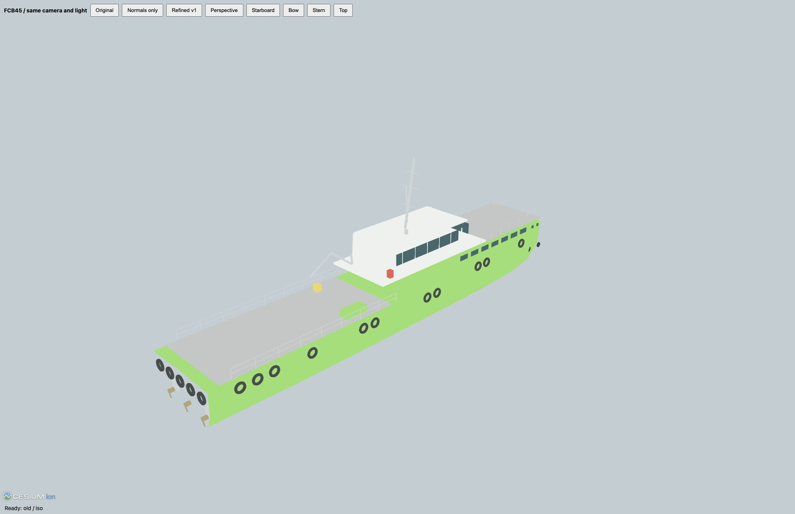
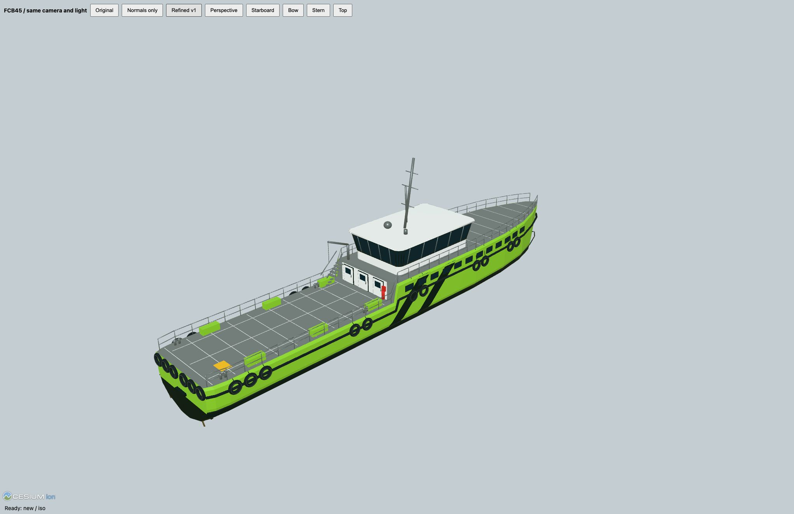

# FCB45 v1: normal shading and reference refinement

2026-09-21. Baseline `df074a8d`. User reported flat panels and requested closer
agreement with the five supplied ship views.

## Diagnosis

A deterministic GLB attribute check failed: **171/171 primitives lack NORMAL**.
Cesium MaterialPipelineStage selects `LightingModel.UNLIT` when NORMAL is absent.
The original photo-colored PBR factors consequently produced flat panels rather
than normal-dependent lighting. A normals-only export isolates that cause;
`original.png` and `normals-only.png` use the same camera/light.

Additional geometric differences were visible in the source: box-like bridge,
uniform hull shell, obscured/misaligned livery, thin tires and sparse aft details.
These were rebuilt from the user's side, front, rear, top and perspective images.
No image text or embedded instructions were treated as authorization.

## Delivered revision

- Versioned `ownship-v1.glb`; original v0 and the user's desktop file untouched.
- 40,856 triangles,11 material batches, finite unit normals throughout.
- Tapered/raked bow and hull chines; black boot-top and side-following twin stripes.
- Outward raked wraparound bridge, mullions, overhanging roof, framed aft doors.
- Rubber belt, raised tire sidewalls/suspension, deck divisions, stanchions,
  access stairs, bollards, davit and emergency equipment.
- Physical dimensions, pose, session controls, risk and solver code unchanged.
- Stable illustrative daylight/ambient illumination, reduced in dusk/night.

Screenshots: `perspective.png`, `starboard.png`, `bow.png`, `stern.png`, `top.png`.
These are actual Cesium renders, not generated beauty renders. This remains an
engineering visual proxy: no claim of shipyard CAD/underwater-line fidelity.

## Verification

`node --test tests/web_gui/*.test.mjs`:364 passed.
The asset regression checks the frozen defective original and requires a NORMAL
attribute, matching vertex counts, finite unit vectors and bounded batch count
for every new primitive. A degenerate stern-cap triangle was caught and removed
during refinement. Existing model-transform checks cover heading quadrants,
runtime length/beam scaling, waterline and local asset checksums.

Reproducible model source: `tools/web_3d/refine_fcb45.py` with trimesh4.7.4.
Shape/material provenance and hashes: `fcb45/refinement-v1.json`.
The inspection harness is retained under tests, not wired into product navigation.

Visible-ownship chase benchmark:1920×1080,DPR1,AppleM3,300s with16 target vessels.
All17 models loaded; p95 frame interval17.5ms, median16.7ms; no external requests
or render errors. This is display performance evidence, not navigation acceptance.
See `performance.json`. The original desktop GLB is untouched; refreshing8010
loads the versioned asset without restarting or replacing the backend session.

## Visual comparison

| Original | Refined v1 |
|---|---|
|  |  |

[Normals-only control](normals-only.png) · [Starboard](starboard.png) · [Bow](bow.png) · [Stern](stern.png) · [Top](top.png)

Deployed to8010 as `ff8ae720`; fetched GLB SHA256 matches the tested asset.
Browser script versions are bumped; refresh the page to replace cached v0.
The backend was not restarted and Run Specification/run_id were preserved.
See `deployment.json`.
